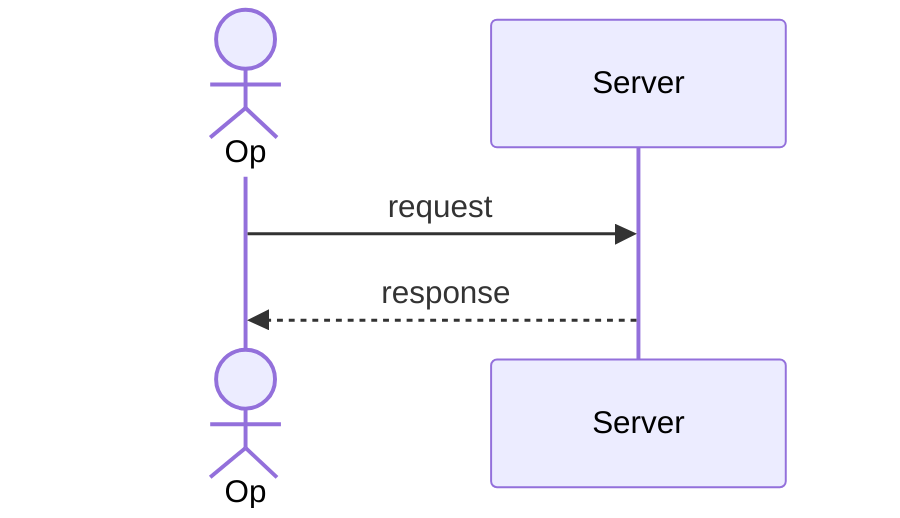

# Contributing to the Powernode System Extension

Thanks for your interest in improving this extension. This guide covers
the development workflow, including the slightly-tricky submodule layout
that exists because this extension is consumed by the parent
[Powernode platform](https://github.com/nodealchemy/powernode-platform).

## Submodule context

This repo is mounted into `powernode-platform` at `extensions/system/`. Most
real-world testing requires the parent platform running so the Rails
autoloader sees the extension's namespaces (`System::*`, `Api::V1::System::*`).

```
powernode-platform/                  ← parent (separate repo)
├── server/                          ← parent's Rails app
├── frontend/                        ← parent's React app
├── extensions/
│   └── system/                      ← THIS repo (submodule)
│       ├── server/                  ← extension's Rails models / services
│       ├── frontend/                ← extension's React components
│       ├── worker/                  ← extension's Sidekiq jobs
│       └── ...
```

## Setting up locally

```bash
# Clone the parent platform with submodules
git clone --recurse-submodules https://github.com/nodealchemy/powernode-platform.git
cd powernode-platform

# Or if already cloned without submodules:
git submodule update --init --recursive

# Set up the extension's dev branch in the submodule
cd extensions/system
git checkout develop        # canonical working branch (master is release-only)
git remote -v               # verify origin (Gitea) + github
```

## Running the extension's tests

From the parent platform's `server/` directory (so the autoloader sees
the parent's app code):

```bash
# Backend rspec
cd /path/to/powernode-platform/server
bundle exec rspec ../extensions/system/server/spec/

# Frontend type-check
cd ../extensions/system/frontend
# (or use the platform's tsconfig.check.json if you've created one)
npx tsc --noEmit

# Go agent
cd ../agent
go test ./...
```

## Committing

This is the part that bites everyone the first time:

1. **Always commit inside `extensions/system/` first.** From the parent
   platform's perspective, your changes look like a submodule pointer change
   until you've committed inside the submodule.

   ```bash
   cd extensions/system
   git checkout -b my-feature
   # ... make changes ...
   git add server/...
   git commit -m "feat: add foo"
   git push origin my-feature
   ```

2. **Then update the parent's submodule pointer:**

   ```bash
   cd ..    # back to parent platform root
   git add extensions/system
   git commit -m "Bump system extension to <sha>"
   ```

3. **Open a PR** in this repo (the system extension), and a separate PR in
   the parent platform pointing at your new SHA.

## Code style

| Layer | Rule |
|---|---|
| Ruby | `# frozen_string_literal: true` pragma, `Rails.logger` (no `puts`) |
| TypeScript | No `any`, no `console.log` in production code, theme classes only (`bg-theme-*`) |
| Go | `gofmt`, prefer the `internal/` layout for non-public packages |
| YAML | 2-space indent, no tabs |
| Migrations | Use `t.references` with built-in indexes; never `add_index` for FKs separately |

## TODO Discipline

Every standalone `# TODO` comment in `server/app/` or `worker/app/` Ruby source **must** use the labeled form:

```ruby
# TODO(<label>): <description>
```

Run the gate locally before pushing:

```bash
bash extensions/system/scripts/audit-todos.sh
```

Valid labels: `M<N>-<slug>` (milestone), `P<N>-<slug>` (phase), `security-review`, `refactor`, `unscheduled`. Inline TODOs embedded mid-prose inside contextful comments are not gated. Full convention + examples in [`docs/TODO_TAXONOMY.md`](docs/TODO_TAXONOMY.md). CI rejects bare TODOs via the `todo-audit` job in [`.gitea/workflows/ci.yaml`](.gitea/workflows/ci.yaml).

## Permission-based access control

**This is non-negotiable in the platform's frontend:** check permissions, never roles.

```typescript
// ✅ correct
currentUser?.permissions?.includes('system.modules.update')

// ❌ wrong — frontend doesn't see role objects
currentUser?.roles?.includes('admin')
```

Backend uses `current_user.has_permission?('name')`.

## Test requirements

- All new services + controllers need rspec coverage
- Frontend specs use Vitest + React Testing Library
- E2E flows go in `frontend/cypress/e2e/` (parent platform's cypress)

## Coverage tracking (opt-in)

Coverage tracking is opt-in via the `COVERAGE=1` environment variable. The extension ships a SimpleCov config at [`server/spec/support/simplecov.rb`](server/spec/support/simplecov.rb) and a wrapper script at [`scripts/run-coverage.sh`](scripts/run-coverage.sh).

**One-time setup** (parent platform changes — coordinate with the platform owner):

1. Add to `powernode-platform/server/Gemfile`:
   ```ruby
   gem 'simplecov', require: false, group: :test
   ```
2. Add to the top of `powernode-platform/server/spec/spec_helper.rb` (FIRST require, before anything else):
   ```ruby
   require_relative '../../extensions/system/server/spec/support/simplecov'
   ```
3. `bundle install` in `powernode-platform/server/`.

**Per-run:**

```bash
# Full extension suite with coverage
bash extensions/system/scripts/run-coverage.sh

# Subset
bash extensions/system/scripts/run-coverage.sh ../extensions/system/server/spec/controllers
```

Open `extensions/system/coverage/index.html`. The minimum-coverage gate is permissive (60%) while the test pyramid is being built — see audit plan P3.7d for the tightening schedule.

## Submitting a PR

PRs that touch FleetAutonomyService, the AI Skill executors, or anything in
`server/db/migrate/` get extra scrutiny:

- Migrations must be reversible (provide `down`)
- New autonomy actions need: `ACTION_PERMISSIONS` entry, intervention policy
  default, dedup_key_for case, ADVANCEMENT_ACTIONS membership decision
- New AI skills need a descriptor + a spec covering plan-vs-execute split

## Doc conventions

The `docs/` tree has a deliberate structure. Pick the right home for
new content; readers don't want to guess.

| Where | What goes there |
|-------|-----------------|
| `docs/tutorials/` | Numbered, dependency-aware learning sequence. Each tutorial declares `Builds on:` and `Sets you up for:` — link the chain. |
| `docs/runbooks/` | Day-2 operator procedures. One workflow per doc. Update [`docs/runbooks/README.md`](./docs/runbooks/README.md) with a row in the table when adding. |
| `docs/` (root) | Reference docs — architecture, subsystem deep-dives, design rationale. |
| `docs/federation/` | Federation-specific subsystem reference. |
| `docs/history/` | Archived phase plans + acceptance reports. Don't write new content here — move existing docs here when they become historical (see "Archive convention" below). |

### Mermaid convention

Diagrams in this repo render natively on both Gitea (≥ v1.17) and the
GitHub mirror. Always author Mermaid as text in fenced code blocks:

````markdown

````

**Never commit rendered images** (SVG, PNG) of diagrams. Text is reviewable
in PRs, evolves with code, and stays accessible to screen readers.

The [`docs/.verify/RENDER_PARITY.md`](./docs/.verify/RENDER_PARITY.md)
document captures which Mermaid features render identically on both
targets. When adding a diagram that uses an unusual feature, re-test
on both and update the parity doc.

### Auto-generated catalog

`docs/SKILL_EXECUTOR_CATALOG.md` is auto-generated by:

```bash
cd server && bundle exec rails system:skills:generate_catalog
```

**Never hand-edit this file.** Changes will be overwritten on the next
regeneration. To document a new skill, update the executor source +
re-run the catalog generator.

### Archive convention

Phase plans, acceptance reports, and shipped-backlog writeups go under
`docs/history/` once the work they describe is complete. Process:

1. `git mv` the doc to `docs/history/<original-subpath>` (preserves history)
2. Add the archived banner immediately after the title:

   ```markdown
   > **ARCHIVED — historical record only.**
   > This document captures point-in-time state from a prior phase and is no longer
   > maintained. For current state see <relative paths to current docs>.
   > _Archived YYYY-MM-DD as part of <reason>._
   ```

3. Update [`docs/history/README.md`](./docs/history/README.md) with a row
   in the table
4. Remove any active-doc links to the archived path (broken links inside
   `docs/history/` itself are fine — the shelf's README is meant to link
   into the archive)

Phase reports under `docs/history/federation/phase-reports/` move
automatically after the next major phase ships.

### Verification harness

Three read-only bash scripts under `docs/.verify/` check link correctness
+ code path references + MCP action names before pushing doc changes:

```bash
bash docs/.verify/check-links.sh        # every [text](path) resolves
bash docs/.verify/check-code-refs.sh    # every cited code path exists
bash docs/.verify/check-mcp-actions.sh  # every MCP action exists in registry
```

See [`docs/.verify/README.md`](./docs/.verify/README.md) for output format
and CI integration notes.

## Reporting issues

For bugs in the extension itself: open issues here on GitHub. For bugs in
the parent platform's integration with this extension: open in
[powernode-platform](https://github.com/nodealchemy/powernode-platform).

## License

By contributing, you agree your contributions are licensed under
MIT (see [LICENSE](./LICENSE)).
