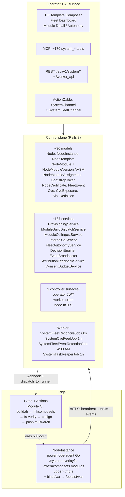
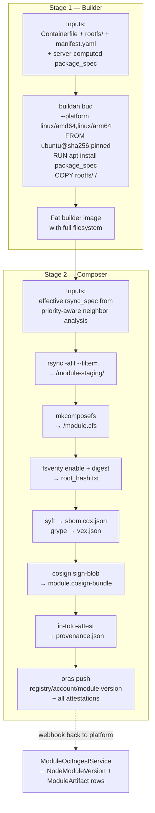
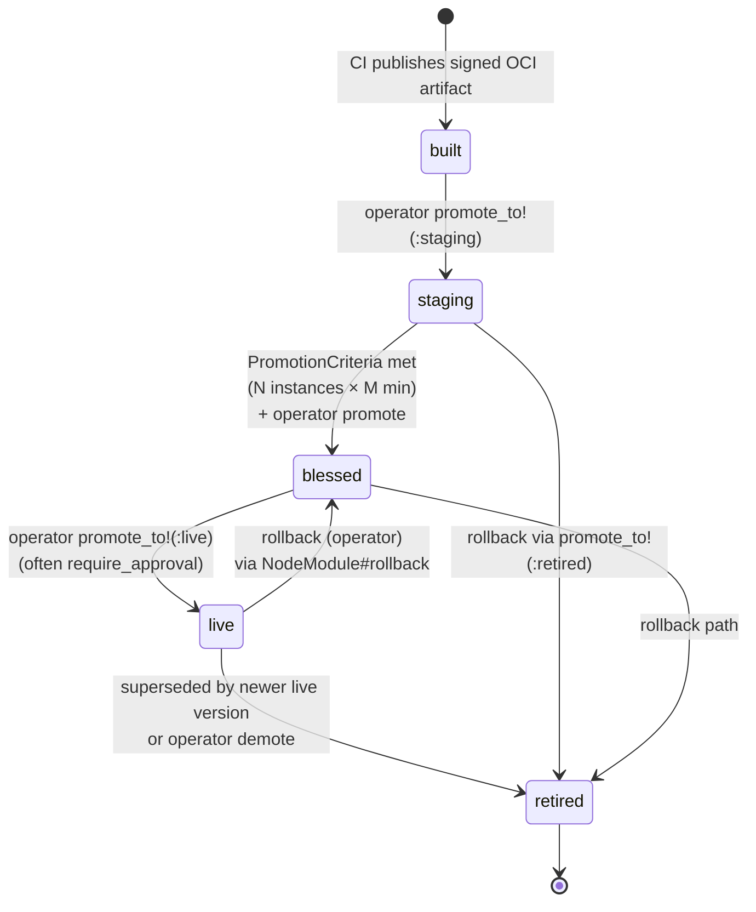
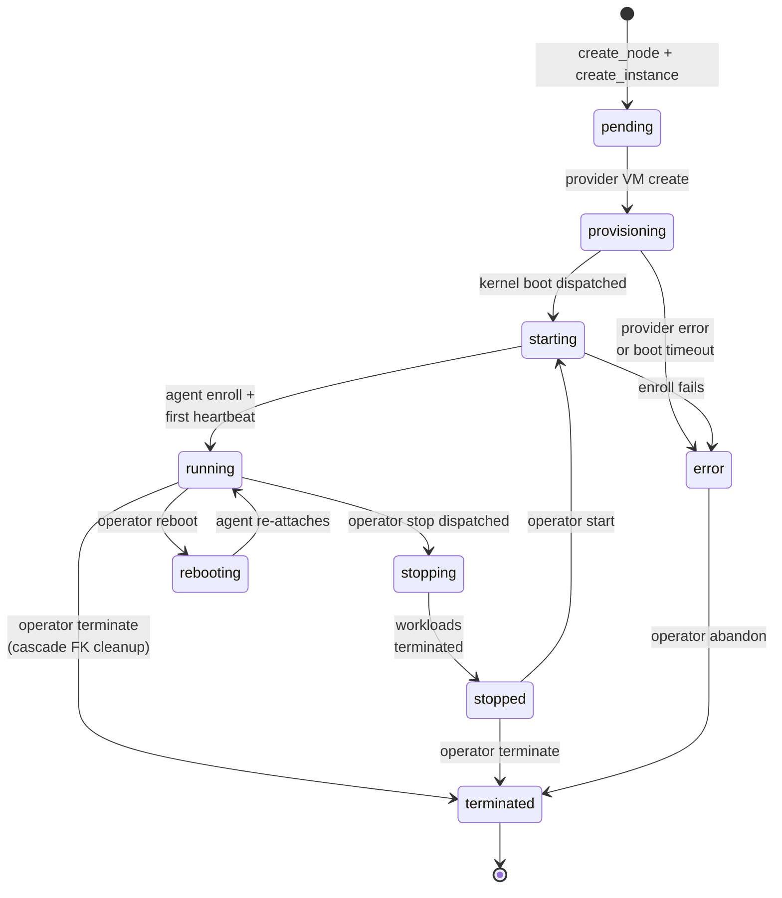
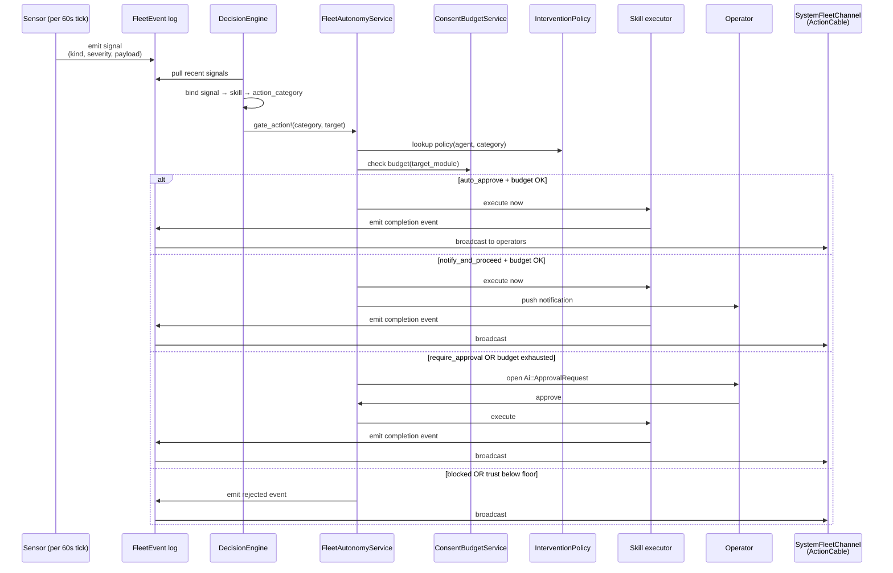
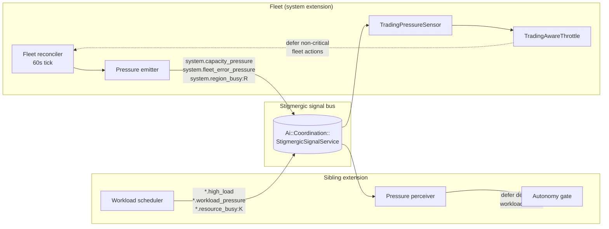
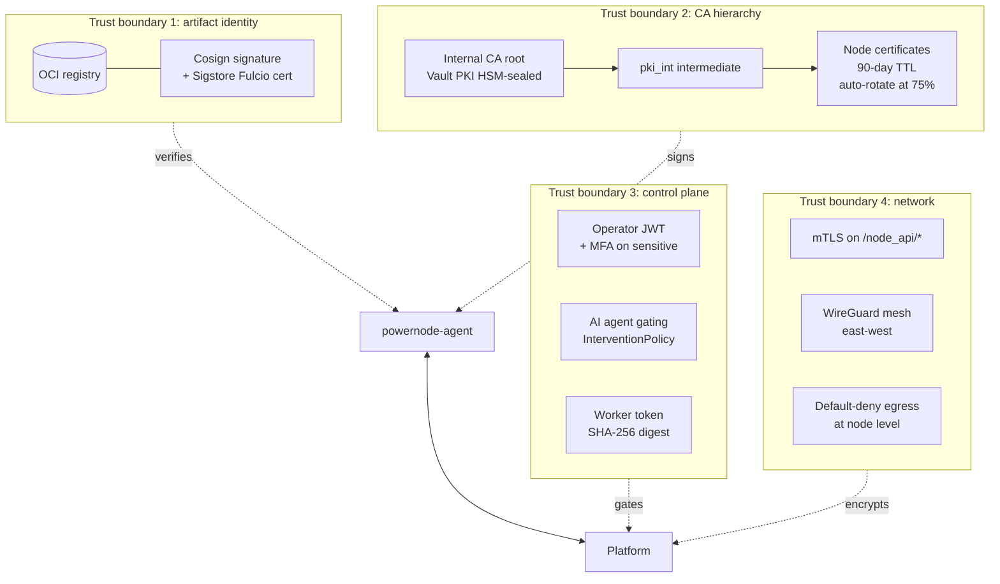

# Powernode System Extension — Architecture

This document is the canonical design reference for the system extension.
It complements [README.md](../README.md) (operator-facing summary) and
[CONTRIBUTING.md](../CONTRIBUTING.md) (development workflow).

---

## Three-tier model

---

## Subsystems

### 1. Module supply chain

Modules are the unit of deployable composition. A `NodeModule` row in the
control plane has many versions (`NodeModuleVersion`); each version
ultimately resolves to an OCI artifact in the registry, signed by cosign,
with an fs-verity root hash for tamper detection at file open.

**Two-stage CI pipeline** (preserves the legacy rsync-glob composition layer
while modernizing the underlying tools):

The webhook receiver at `POST /webhooks/gitea/module` ingests the artifact
into a new `NodeModuleVersion` row + `ModuleArtifact` row(s) — one
artifact per architecture.

**Promotion lifecycle** (`NodeModuleVersion#promote_to!`):
`built → staging → blessed → live → retired`, gated by `PromotionCriteria`
(N successful instances run version V for ≥ M minutes). Exposed to
operators via `POST /api/v1/system/node_module_versions/:id/promote`
(body: `target_state`) and rollback via
`POST /api/v1/system/node_modules/:id/rollback` (body: optional
`target_version_id`, `changelog`).

**Module assignment materialization** — how `NodeModule` rows end up
assigned to a `Node`. There are three live paths today, plus one
documented gap:

| Path | Trigger | Service | Sets `source_template_module` |
|---|---|---|---|
| On-node commit | `powernode-agent commit ... --push` | `ModuleCommitService#materialize_assignment!` (find_or_create_by!) | No |
| GitOps reconcile | `fleet.yaml` change → diff engine | `Gitops::ApplyService` | No |
| Operator UI — manual | "Assign module to node" UI action | direct `NodeModuleAssignment.create!` | No |
| Operator UI — apply template | `POST /api/v1/system/nodes/:id/apply_template` | `TemplateApplyService#apply!` → `TemplateExpansionService` → idempotent `create!` | Yes |

`TemplateApplyService` (`app/services/system/template_apply_service.rb`)
is the wired apply path. It computes the closure via
`TemplateExpansionService`, then for each module not already assigned
on the node creates a `NodeModuleAssignment` with
`source_template_module` set to the `TemplateModule` whose override
governed inclusion (`nil` for purely transitive modules pulled by
closure expansion — see `auto_resolved`). Operator-tuned priority/
config/enabled on prior assignments are preserved across re-apply.

Body params:
- `dry_run: true` — returns the planned diff without persisting
- `purge_stale: true` — removes assignments whose `source_template_module`
  is now disabled (or whose module left the closure). Hand-authored
  assignments (`source_template_module_id IS NULL`) are never touched.

Because the FK constraint on `system_node_module_assignments.source_template_module_id`
uses `on_delete: :nullify`, **destroying** a TemplateModule wipes the
back-reference and makes the assignment look hand-authored. To remove
a module from a template without losing track of its derived
assignments, disable the TemplateModule (`enabled: false`) instead of
destroying it — that keeps the FK intact so `purge_stale` can find
the orphans.

`NodeTemplatesController#compose_preview` uses `DependencyResolutionService`
directly (one layer below `TemplateExpansionService`) for the preview-
without-overrides path. The two services share the same dependency walk
but differ in whether per-template `recommends_override` is applied.

### 2. On-node runtime (`powernode-agent`)

A single static Go binary (~20 MB) replaces legacy bash. Embedded in the
initramfs, runs as a systemd service after switch_root.

**Identity discovery** is multi-cloud:
- AWS IMDS v2 (`169.254.169.254/latest/user-data`)
- GCP (`Metadata-Flavor: Google`)
- Azure (`Metadata: true`)
- DigitalOcean / Hetzner / KubeVirt / vSphere
- libvirt/QEMU virtio-fw-cfg (`/sys/firmware/qemu_fw_cfg/by_name/`)
- DMI SMBIOS UUID + kernel cmdline fallback

**Enrollment:** bootstrap token → CSR → `/node_api/enroll` → mTLS cert
(stored at `/persist/var/lib/powernode/pki/`, file mode 0600). Subsequent
calls authenticate via mTLS with certificate pinning.

**Module fetch:**
- `oras pull` via `github.com/oras-project/oras-go/v2`
- Cosign verify against per-module trust policy
  (`cosign_identity_regexp` + `cosign_issuer_regexp`)
- SLSA provenance verify
- fs-verity enable + verify root_hash matches `NodeModuleVersion.fsverity_root_hash`

**Mount orchestration:**
- composefs lower stack assembled from priority-ordered modules
- overlayfs (lower=composefs, upper=tmpfs, work=tmpfs)
- `/var` bind from `/persist/var` (LUKS-encrypted; key sealed to TPM
  where present, fallback to Vault-fetched unwrap)

**Long-lived service:**
- 30s heartbeat with `{boot_id, agent_version, module_digests, mount_state, load, mem}`
- Task lease via atomic `FOR UPDATE SKIP LOCKED` on `/node_api/tasks/lease`
- Cert auto-rotate at 75% of lifetime
- Event telemetry to `/node_api/events`
- Module-as-Skill registrar (declared skills register with `Ai::Skill`)

**NodeInstance lifecycle.** `NodeInstance` defines its own AASM (states + events distinct from the polymorphic Task model). The Task model carries provisioning-step state (`pending → provisioning → running`); NodeInstance carries instance-level state below. Note that `draining` belongs to operator-initiated drain workflow (a Task transition), not the NodeInstance state set.

### 3. Multi-arch initramfs builder

Six artifact families per architecture, both amd64 and arm64:

| Artifact | Use case |
|---|---|
| Kernel + initramfs.cpio.zst bundle | PXE/iPXE network boot, libvirt direct kernel boot |
| Raw disk image (`.img`) | USB / SD card / direct dd |
| ISO 9660 image (`.iso`) | DVD/USB, IPMI virtual media |
| iPXE chainload script (`.ipxe.erb`) | Network boot entry; rendered per-instance |
| Cloud `.qcow2` image | libvirt/QEMU pre-baked rootfs |
| OCI image (bootc-compatible) | Container-image-as-OS path |

Built by `extensions/system/initramfs/build.sh --arch {amd64,arm64}`. The
on-disk template `images/ipxe/template.ipxe.erb` is rendered server-side
by `System::NetbootService.render_ipxe_script` with a fresh
`BootstrapToken` per call.

### 4. Fleet autonomy

Eighteen sensors detect operational signals (16 are registered in the live tick loop via `FleetAutonomyService::SENSORS`; two on-disk sensors run via separate invocation paths). See [FLEET_SENSORS.md](./FLEET_SENSORS.md) for the full reference. Representative examples:

- `InstanceStatusSensor` — heartbeat older than 3 × interval → `system.instance_silent`
- `ModuleDriftSensor` — `running_module_digests` ≠ assigned digests → `system.module_drift`
- `CertificateExpirySensor` — cert within advisory/urgent window → `system.cert_expiring`
- `ModulePromotionSensor` — staging version meets PromotionCriteria → `system.module_promotion_ready`
- `ConfigDriftSensor` — assignment changed without dispatched task → `system.config_drift`
- `SloViolationSensor` / `ProjectSloSensor` — SLO target not met → `system.slo_violation` / `project.slo_violation`
- `HoneypotAccessSensor` — canary module accessed → `system.honeypot_access`
- `GitopsDriftSensor` — fleet.yaml-declared state vs effective fleet diverges → `gitops.drift_detected`
- `PackageDriftSensor` — package repository freshness → `system.package_drift_pressure`
- `InstanceStateDriftSensor` — DB-recorded status disagrees with provider truth → `system.instance_state_drift`
- `StorageAssignmentDriftSensor` — volume assignment freshness window expires → `system.storage_assignment_drift`
- `SdwanReachabilitySensor`, `SdwanDriftSensor`, `SdwanBgpSessionHealthSensor`, `SdwanVipReachabilitySensor`, `SdwanCredentialExpirySensor` — SDWAN-side reachability, drift, BGP, VIP, credential expiry
- `TradingPressureSensor` — cross-domain consumer of pressure signals emitted by sibling extensions (originally trading-specific; broader cross-domain refactor pending)

Each signal routes through `DecisionEngine` (binds signal → skill →
action_category) → `FleetAutonomyService.gate_action!` (consults
`Ai::InterventionPolicy` + `ConsentBudgetService` per-module ceiling) →
either auto-execute, notify-and-proceed, open `Ai::ApprovalRequest`, or
defer (for cross-domain pressure). 

Every step persists a `FleetEvent` row + ActionCable broadcast on
`SystemFleetChannel` for live UI consumption.

### 5. Cross-domain stigmergic coordination

Fleet ↔ sibling-extension bidirectional pressure exchange via the platform's
`Ai::Coordination::StigmergicSignalService`. The fleet doesn't care which
extension emits the signal — coordination happens purely through the signal
bus.

**Fleet emits** (after every reconcile tick):
- `system.capacity_pressure` — instance utilization too low (<50%) or too high (>90%)
- `system.fleet_error_pressure` — recent high/critical FleetEvent ratio
- `system.region_busy:<region_id>` — per-region instance saturation

**Fleet consumes:**
- External pressure signals (any extension's `*.high_load`, `*.workload_pressure`, `*.resource_busy:<key>`) → `TradingPressureSensor` aggregates → `TradingAwareThrottle` defers non-critical fleet actions when aggregate pressure ≥ 1.0 (naming preserved from initial trading integration; cross-domain refactor would unify these names)

**Sibling extension consumes** (when integrated):
- `system.capacity_pressure` → consumer-side pressure perceiver returns
  defer/block recommendation → other extension's autonomy gate defers
  its deferrable actions

**Sibling extension emits** (when integrated):
- `*.resource_busy:<key>` → consumed by either side via the
  `recommend_least_busy_key` shared utility

### 6. Observability

`System::FleetEvent` is the durable event log:
- Schema: `kind, severity, payload (jsonb), correlation_id, source, account_id, +optional resource refs`
- GIN index on payload, composite (account_id, emitted_at), correlation_id index
- Retention: 90 days for routine (low/medium severity), 365 days for critical (high/critical) — sweep nightly via `SystemFleetEventRetentionJob`

`SystemFleetChannel` (ActionCable) broadcasts to `system_fleet:<account_id>`
for live UI updates. Frontend's `FleetDashboardPage` subscribes + renders
correlation chains.

`AttributeFailureExecutor` walks recent FleetEvents + assignment changes +
promotions to rank likely causes of an instance failure. Operator
confirms/rejects via `AttributionFeedbackService` → `Ai::CompoundLearning`
→ next executor invocation boosts (1.5x) confirmed pairs, downweights
(0.7x) rejected.

### 7. Honeypot canaries

`System::Honeypot::CanaryModuleService.mark!` flips a config flag on a
NodeModule. Any subsequent access via `observe_access!` emits a
high-severity FleetEvent. `HoneypotAccessSensor` reads recent events,
emits `system.honeypot_access` (always `:critical`), DecisionEngine routes
to `system.instance_terminate` (`require_approval`).

Operator dashboard: `HoneypotCanaryTile` shows 24h + 7d access counts
with alert badge when 24h > 0.

### 8. Container runtimes (Phase 1 Docker, Phase 2 K3s, Phase 3 kubeadm)

Operator-managed container workloads on NodeInstances. Three runtime
modules in the catalog: `docker-engine`, `k3s-server`, `k3s-agent`.

- **Auto-registration**: assigning a runtime module to a Node triggers
  the agent to install the daemon, generate cert material (Docker) or
  capture k3s-generated state, and POST `runtime/handshake`. Platform
  creates the corresponding `Devops::DockerHost` (1:1 with NodeInstance)
  or `Devops::KubernetesCluster` (1:N — multiple NodeInstances per
  cluster via `Devops::KubernetesNode`).

- **Network binding**: all daemon API traffic flows over the SDWAN
  overlay `/128`. No public daemon sockets — encrypted by default.
  Docker binds `tcp://[<sdwan-/128>]:2376`; K3s binds
  `https://[<sdwan-/128>]:6443`.

- **Trust model**:
  - Docker — platform issues mTLS material via
    `System::InternalCaService` (90-day cert TTL); `Devops::DockerHost
    .encrypted_tls_credentials` stores client cert+key.
  - K3s — k3s ships its own CA + signs its own certs; platform
    captures the kubeconfig + tokens via the agent's `bootstrap`
    handshake phase. Operators download kubeconfig from the platform
    UI for kubectl access.

- **Dedicated agent**: `Runtime Manager` (monitor-type AI agent) owns
  container runtime autonomy with 7 intervention policies — separate
  trust score + approval queue from Fleet Autonomy. Allows
  per-domain policy tuning (e.g. `notify_and_proceed` for docker
  provisioning while keeping `kubernetes_cluster_decommission` gated).

- **Phase 3 kubeadm** uses the same shape — extends `RUNTIME_MODULES`
  in the runtime/handshake controller, adds parallel kubeadm
  provisioner service. Both flavors share the
  `Devops::KubernetesCluster` model with a `flavor` enum.

See `CONTAINER_RUNTIMES.md` for the operator workflow.

---

## API surfaces

### 1. Operator-facing JWT (`/api/v1/system/*`)

Standard Rails routes for CRUD on every System resource. Permission-gated
via `current_user.has_permission?('system.<resource>.<action>')`.

Notable non-CRUD endpoints:
- `POST /node_templates/compose_preview` — Visual Composer's live preview
- `GET /netboot/:instance_id/script.ipxe` — operator generates iPXE chainload
- `POST /fleet/signals` — recent FleetEvent log
- `POST /fleet/attribute_failure` — AttributeFailureExecutor wrapper
- `POST /fleet/attribution_feedback` — confirm/reject attribution
- `POST /node_modules/:id/mark_canary` + `unmark_canary` — honeypot toggle

### 2. Worker token (`/api/v1/system/worker_api/*`)

Authenticated via `X-Worker-Token` (SHA-256 digest comparison).

- `POST /worker_api/fleet/reconcile` — invoked by SystemFleetReconcileJob
- `POST /worker_api/cve/ingest` — invoked by SystemCveFeedJob
- `POST /worker_api/fleet/events` — agent-side telemetry batches
- `POST /worker_api/fleet/retention_sweep` — nightly retention sweep

### 3. Node mTLS (`/api/v1/system/node_api/*`)

Authenticated via mTLS subject CN matching the NodeInstance.id, with
fallback to instance JWT during transition.

- `POST /node_api/enroll` — bootstrap token → cert exchange (the only
  bootstrap-token-authenticated endpoint; everything else is mTLS)
- `POST /node_api/certificates/{rotate,revoke}`
- `GET  /node_api/{config,modules,status,ssh_keys,mount_points,puppet/resources,files/scripts/:id,files/modules/:id/:filename}`
- `POST /node_api/status/heartbeat`
- `GET  /node_api/tasks/lease?max=N`
- `POST /node_api/tasks/:id/{progress,complete,fail}`
- `POST /node_api/events`

### 4. MCP (`mcp__powernode__platform_system_*`)

170+ tool actions exposed via the platform's MCP server, callable from
any AI agent or Claude Code MCP client. The catalog is split into
`system_*` (102 actions) + `system_sdwan_*` (69) + `kubernetes_*` (5) +
`docker_*` (52). The auto-generated tool catalog lives at
`docs/platform/MCP_TOOL_CATALOG.md` in the **parent platform tree**
(gitignored — regenerate via `cd server && bundle exec rails mcp:generate_tool_catalog`
from parent root). For an operator-curated subset see
[`MCP_API_REFERENCE.md`](./MCP_API_REFERENCE.md) in this directory.

---

## Security architecture

### Trust boundaries

1. **OCI registry digest** — module identity is `oci_digest + cosign signature`
2. **Internal CA** — root signs node certs; ideally HSM-sealed via Vault PKI
3. **Control plane** — JWT for operators (with MFA on sensitive actions),
   InterventionPolicy gating for AI agents
4. **Zero implicit trust on network location** — mTLS for `/node_api/*`,
   WireGuard mesh for east-west, default-deny egress at node level

### Key custody

- **Internal CA root** in HashiCorp Vault PKI engine
- **Node certificates** issued by `pki_int`, 90-day TTL, auto-rotated
  at 75% lifetime by powernode-agent
- **Cosign signing identity** uses Sigstore Fulcio with ephemeral
  OIDC-bound certs (no long-lived signing keys)
- **Bootstrap tokens** SHA-256 hashed in DB, single-use, 1-hour TTL,
  bound to `intended_subject`

### Supply chain

- **SLSA Build Level 3+** for module CI (ephemeral runners, isolated
  build environment, signed in-toto provenance attestations)
- **Reproducible builds** as a CI gate (pinned base image digest, pinned
  Debian snapshot URLs, pinned package versions)
- **SBOM (CycloneDX) + VEX (grype)** attached to every artifact as OCI
  referrers
- **Per-module trust policy** pinning each module to its expected
  cosign identity + OIDC issuer

### On-node runtime

- **fs-verity** mandatory at file open on every composefs lower
- **Lockdown mode** (`lockdown=integrity`) on kernel cmdline by default
- **IMA/EVM** for additional file integrity (defense-in-depth)
- **Per-module SELinux/AppArmor profiles** loaded by powernode-agent on attach
- **Capability dropping** by default — modules declare required caps in
  manifest.yaml; everything else dropped
- **seccomp filter** on powernode-agent itself (highest-privilege process)
- **Egress filtering** at node level — default-deny outbound except
  platform endpoints + manifest.yaml allowlist

---

## Where to read more

- [README.md](../README.md) — user-facing summary
- [CONTRIBUTING.md](../CONTRIBUTING.md) — development workflow
- [docs/SMOKE_TEST.md](./SMOKE_TEST.md) — platform-level smoke catalog (18 seeds, 8 passes)
- [docs/tutorials/](./tutorials/) — numbered learning sequence
- [docs/history/](./history/) — archived phase plans + acceptance reports
- [Parent platform's CLAUDE.md](https://github.com/nodealchemy/powernode-platform/blob/master/CLAUDE.md) — full platform context
- [agent/README.md](../agent/README.md) — Go agent details
- [initramfs/README.md](../initramfs/README.md) — boot artifact builder details

---

*Last updated 2026-05-02 during the system extension extraction.*
