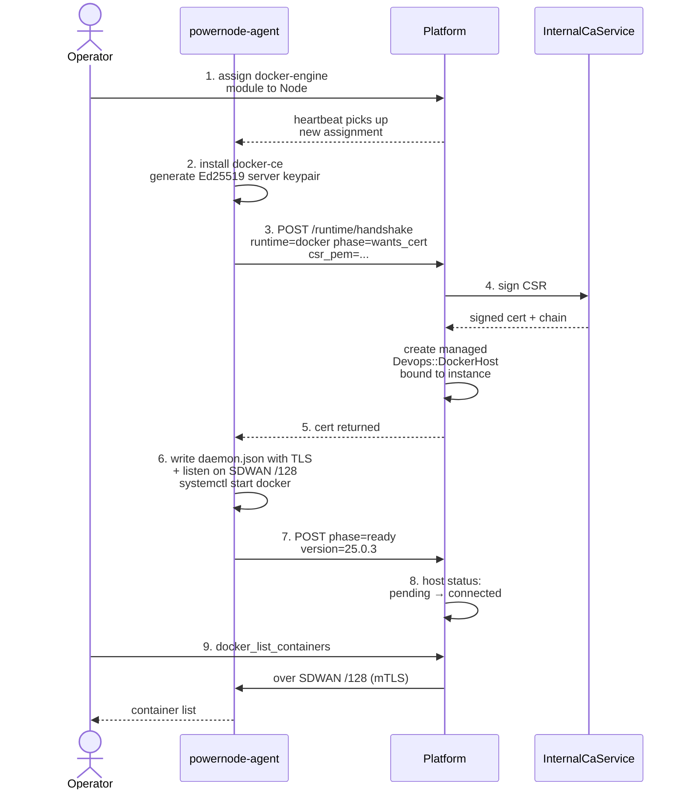
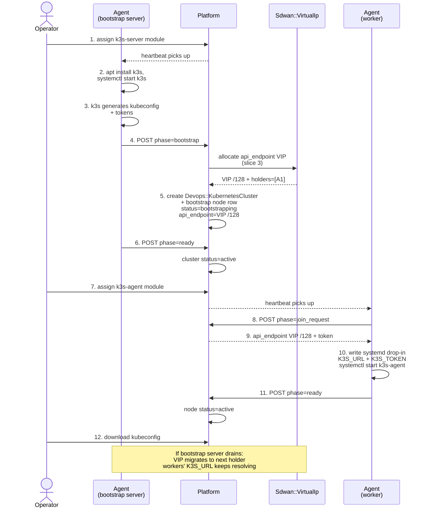
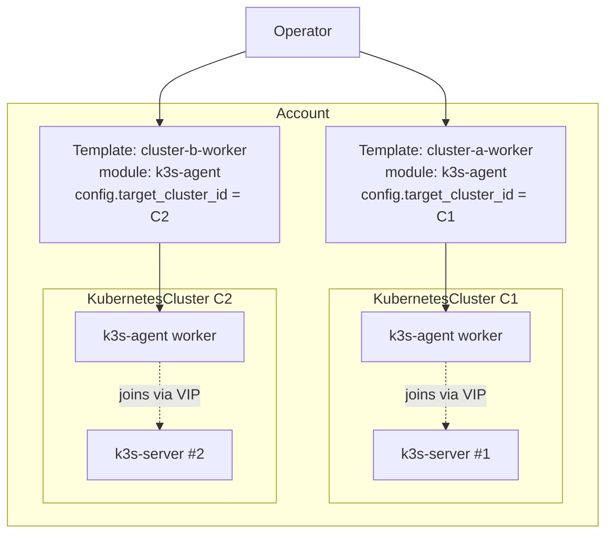

# Container Runtimes — Operator Guide

System extension support for managed Docker daemons (Phase 1) and K3s Kubernetes clusters (Phase 2). Phase 3 will add kubeadm + HA control plane.

## Architecture (one-paragraph summary)

A `NodeInstance` with the appropriate runtime module assigned (`docker-engine`, `k3s-server`, or `k3s-agent`) auto-bootstraps the daemon on the next agent heartbeat tick. The agent installs the binary, generates local TLS material (Docker) or captures k3s-generated state (K3s), and posts a `runtime/handshake` to the platform. The platform creates the corresponding `Devops::DockerHost` or `Devops::KubernetesCluster` row. All daemon API traffic flows over the SDWAN overlay /128 — no public daemon sockets.

## Lifecycle Diagram (Phase 1 Docker)



## Lifecycle Diagram (Phase 2 K3s with VIP failover)



### Multi-cluster routing via `target_cluster_id`

In accounts with more than one cluster, `k3s-agent` module assignments must
carry `metadata.target_cluster_id` so the agent joins the right cluster.



Without `target_cluster_id`, the agent picks the first cluster the API
returns — wrong in multi-cluster accounts.

## Module Catalog

| Module | Variety | Packages | Purpose |
|---|---|---|---|
| `docker-engine` | subscription | docker-ce, docker-ce-cli, containerd.io, docker-buildx-plugin, docker-compose-plugin | Docker Engine binary install |
| `k3s-server` | subscription | k3s (single binary; bundled containerd + runc) | K3s control plane |
| `k3s-agent` | subscription | k3s (same binary; agent mode) | K3s worker node |

All three live in the `Container Runtimes` `NodeModuleCategory` (position=70, between Network Overlay at 60 and userland at 90+).

## Provisioning a Docker Daemon

### Prerequisites

- NodeInstance must have at least one `Sdwan::Peer` with an assigned overlay `/128`. The daemon binds to that address only; provisioning errors with `MissingSdwanPeerError` if no peer is attached.
- The instance's `Node` must have the `docker-engine` module assigned.

### Operator Path A: assign module + wait

```bash
# 1. Assign the module via existing API (admin UI or MCP)
curl -X POST /api/v1/system/node_module_assignments \
  -H "Authorization: Bearer $JWT" \
  -d '{"node_id": "<node-uuid>", "node_module_name": "docker-engine"}'

# 2. Wait ~60s for agent reconcile loop. The managed host appears at:
curl /api/v1/system/managed_docker_hosts -H "Authorization: Bearer $JWT"
```

### Operator Path B: MCP action (single call)

```javascript
platform.system_provision_docker_runtime({
  node_instance_id: "0193cdef-..."
})
// → { success: true, host: { id, name, status, api_endpoint, ... } }
```

This path is what the System Concierge agent invokes when an operator chats "provision docker on instance X".

### Verifying

```bash
# Via REST
curl /api/v1/system/managed_docker_hosts/<host-id> -H "Authorization: Bearer $JWT"

# Via MCP — list managed hosts (excludes external operator-registered hosts)
platform.system_list_managed_docker_hosts()

# Inspect containers running on the host (uses encrypted SDWAN overlay)
platform.docker_list_containers({ host_id: "<host-id>" })
```

## Provisioning a K3s Cluster

### Step 1: Bootstrap the cluster

Assign `k3s-server` to the first NodeInstance. The agent installs k3s, captures kubeconfig + tokens from `/etc/rancher/k3s/k3s.yaml` + `/var/lib/rancher/k3s/server/node-token`, and posts `phase=bootstrap`. Cluster appears within ~60s.

```javascript
platform.kubernetes_list_clusters()
// → { clusters: [{ id, name, flavor: "k3s", status: "bootstrapping", ... }] }
```

### Step 2: Add workers

Assign `k3s-agent` to additional NodeInstances. The agent posts `phase=join_request`, gets the cluster's `api_endpoint` + `agent_token`, writes a systemd drop-in at `/etc/systemd/system/k3s-agent.service.d/override.conf` with `K3S_URL` + `K3S_TOKEN`, then starts `k3s-agent.service`.

### Step 3: Use kubectl

Download the kubeconfig from the platform:

```javascript
platform.kubernetes_get_kubeconfig({ cluster_id: "<id>" })
// → { kubeconfig: "apiVersion: v1...", api_endpoint: "https://[fd00::]:6443" }
```

Or via UI: `/app/devops/kubernetes` → cluster card → "kubeconfig" button.

```bash
# Save + use
echo "$KUBECONFIG_YAML" > ~/.kube/powernode-cluster.yaml
kubectl --kubeconfig ~/.kube/powernode-cluster.yaml get nodes
```

The kubectl traffic flows over the SDWAN overlay — operators must be on the same SDWAN network or have a federation route.

## Decommissioning

### Docker daemon

Three operator vectors:

```javascript
// 1. MCP — destroys managed host row + Vault TLS material
platform.system_decommission_docker_runtime({ host_id: "<host-id>" })

// 2. Unassign the docker-engine module from the Node
//    Agent sees module gone, stops dockerd, posts phase=stopped
//    Platform marks host status=disconnected (but keeps row)

// 3. Terminate the NodeInstance — cascade nullifies node_instance_id
//    Host row goes orphan; operator can clean via MCP
```

### K3s cluster

```javascript
platform.kubernetes_decommission_cluster({ cluster_id: "<id>" })
// → cascade-deletes all member KubernetesNode rows; underlying
//   NodeInstances are NOT terminated. Operator must separately
//   unassign k3s-server / k3s-agent modules to fully clean up.
```

## Troubleshooting

### "MissingSdwanPeerError" during provision

The NodeInstance has no SDWAN peer with an assigned `/128`. Attach one via:

```javascript
platform.system_sdwan_attach_peer({
  network_id: "<sdwan-net-id>",
  node_instance_id: "<instance-id>"
})
```

### Daemon stays in `pending` status

The agent has provisioned the host row but hasn't yet reported `phase=ready`. Common causes:
- `docker-ce` package install in progress (~30-60s on first run)
- TLS cert hasn't been written yet
- systemd unit fails to start (check via SSH: `journalctl -u docker.service -n 50`)

### K3s cluster stays in `bootstrapping` status

The bootstrap node has installed k3s but the agent hasn't captured + posted state yet. Common causes:
- K3s bootstrap takes ~30-60s; check `/etc/rancher/k3s/k3s.yaml` exists on the node
- Server token file `/var/lib/rancher/k3s/server/node-token` not yet populated
- The agent's heartbeat tick interval (default 30s) hasn't fired yet

### `kubernetes_get_kubeconfig` returns 422 "not yet available"

`encrypted_kubeconfig` is blank because the cluster is still bootstrapping. Wait for `cluster_status: active` before retrieving.

### Docker daemon TLS verification fails

Symptoms: `platform.docker_list_containers` returns `x509: certificate signed by unknown authority` or `tls: bad certificate`. Common causes:

- Operator's local truststore isn't the issue — the platform manages mTLS internally; the API call from the platform to the daemon uses Vault-stored client certs.
- Server cert was rotated but agent didn't pick it up: trigger `system.runtime_docker_tls_rotate` skill (auto-approved), then re-test after one heartbeat tick.
- Server cert was minted by a different InternalCaService root than the platform now trusts (rare; only happens after CA replacement). Decommission via `system_decommission_docker_runtime` and re-provision; the new host gets a fresh cert from the current CA.
- On the node itself: `journalctl -u docker.service | grep -i tls` shows the actual handshake error.

### Docker daemon listens on the wrong address

Symptoms: `system_provision_docker_runtime` succeeds but daemon connections fail. The `daemon.json` `hosts` array should contain `tcp://[<sdwan-/128>]:2376`. If it doesn't:

- Check the agent's reconciler state cache: `cat /var/lib/powernode-agent/reconciler.json` on the node.
- Verify the SDWAN peer is up: `wg show wg-pn` on the node should show a recent `latest handshake`.
- The `Sdwan::Peer.host_address` is the source of truth — confirm it via `platform.system_sdwan_get_peer({ id: '<peer-id>' })`.

### `daemon.json` overrides not applied (slice 10)

Slice 10 introduced config-variety dockerd modules with per-node + per-instance overrides. If overrides aren't being picked up:

- Verify the override module is **assigned to a higher-priority slot** than the base `docker-engine` module — overrides require greater `effective_priority` per the dependant-modules pattern.
- After assignment, the agent re-renders `daemon.json` on its next reconcile tick (~30 s). To force immediate: `systemctl restart powernode-agent` on the node.
- Layer ordering visible in `cat /etc/docker/daemon.json` after reconcile — keys present in the override module win over the base.

### K3s agent can't join cluster

Symptoms: agent posts `phase=join_request` but cluster fails to add it; agent log shows `K3S_URL connection refused` or `bad token`.

- `api_endpoint` mismatch: K3s api_endpoint uses an SDWAN VIP (slice 3). If the worker isn't on the same SDWAN network as the bootstrap node, the VIP is unreachable. Confirm with `system_sdwan_list_peers` that both peers are on the same network.
- Token mismatch (rare): platform regenerated the join token but the agent has a stale cache. Force re-fetch by removing the systemd drop-in `/etc/systemd/system/k3s-agent.service.d/override.conf` and restarting `powernode-agent`.
- Multi-cluster confusion: if `metadata.target_cluster_id` is set on the agent module assignment, validation rejects join requests for any other cluster ID. Set the right ID via `platform.system_assign_module_to_template` or remove the metadata to fall back to "join most recent active cluster."

### kubelet logs unavailable

To retrieve kubelet logs for a managed K3s node:

```bash
# Via SSH (node must be reachable on SDWAN /128)
journalctl -u k3s.service -n 200             # k3s-server
journalctl -u k3s-agent.service -n 200        # k3s-agent
```

Or via the agent task channel (no SSH required):

```javascript
// ⚠️ aspirational — use system_provision_instance / system_terminate_instance and platform.recent_events for task progress
platform.system_execute_task({
  node_instance_id: "...",
  command: ["journalctl", "-u", "k3s-agent.service", "-n", "200"]
})
```

The output streams back through the worker API and lands in the operator dashboard task pane.

### Pod-to-pod networking is unencrypted (slice 9 caveat)

K3s default flannel CNI uses VXLAN over the host's primary NIC, **not** the SDWAN overlay — pod-to-pod traffic between nodes is plaintext on the underlying network. This is a known gap (see `USE_CASE_MATRIX.md` use case 9). Workarounds until pod_subnet_prefix lands:

- Use `NetworkPolicy` to restrict pod-to-pod cross-namespace traffic.
- Layer a service mesh (Linkerd, Istio) for app-layer mTLS.
- For sensitive workloads, run them on the same node (anti-affinity off, affinity on) until pod traffic over SDWAN ships.

### Daemon can't pull from registry

Symptoms: `docker pull` fails with timeout or `connection refused`.

- Most operators use a registry mirror co-located on the SDWAN. Configure via dependant module override:
  ```yaml
  # daemon-json-override module
  hosts: ["tcp://[<sdwan-/128>]:2376", "unix:///var/run/docker.sock"]
  registry-mirrors: ["https://registry.<sdwan-domain>"]
  ```
- For pulls from `registry.example.com` (Powernode Gitea container registry), the agent injects credentials into `~/.docker/config.json` automatically when the node has a valid Vault token.

## Source Files

**Backend (parent repo):**
- `server/db/migrate/20260505000100_add_node_instance_to_devops_docker_hosts.rb`
- `server/db/migrate/20260505000200_create_kubernetes_cluster_management_tables.rb`
- `server/app/models/devops/docker_host.rb` (managed/external state machine)
- `server/app/models/devops/kubernetes_cluster.rb`, `kubernetes_node.rb`
- `server/app/services/ai/tools/docker_provisioning_tool.rb`
- `server/app/services/ai/tools/kubernetes_cluster_tool.rb`
- `server/app/services/ai/tools/kubernetes_provisioning_tool.rb`
- `server/app/controllers/api/v1/devops/kubernetes/clusters_controller.rb`

**Backend (system extension):**
- `extensions/system/server/app/services/system/docker_daemon_provisioner_service.rb`
- `extensions/system/server/app/services/system/kubernetes_cluster_provisioner_service.rb`
- `extensions/system/server/app/controllers/api/v1/system/node_api/runtime_controller.rb`
- `extensions/system/server/db/seeds/docker_runtime_module.rb`
- `extensions/system/server/db/seeds/k3s_modules.rb`
- `extensions/system/server/db/seeds/smoke_test_docker_runtime.rb` (live smoke)
- `extensions/system/server/db/seeds/smoke_test_k3s_runtime.rb` (live smoke)

**Agent (Go):**
- `extensions/system/agent/internal/dockerd/` — handshake.go, manager.go, applier.go, shell_applier.go, modules.go (Phase 1)
- `extensions/system/agent/internal/k3sd/` — handshake.go, server_manager.go, agent_manager.go, applier.go, shell_applier.go (Phase 2)
- `extensions/system/agent/internal/runtime/service.go` — chains both reconcilers into PostSend after sdwanMgr

**Frontend:**
- `frontend/src/features/devops/docker/pages/DockerHostsPage.tsx` (Managed badge)
- `frontend/src/features/devops/kubernetes/` (full hub)
- `frontend/src/pages/app/devops/KubernetesHubPage.tsx`

## Related Docs

- `extensions/system/docs/SKILL_EXECUTORS.md` — `docker_provision` + `provision_cluster` skill executors
- `extensions/system/docs/ARCHITECTURE.md` — Container Runtimes subsystem entry
- `docs/platform/MCP_TOOL_CATALOG.md` — full action reference
