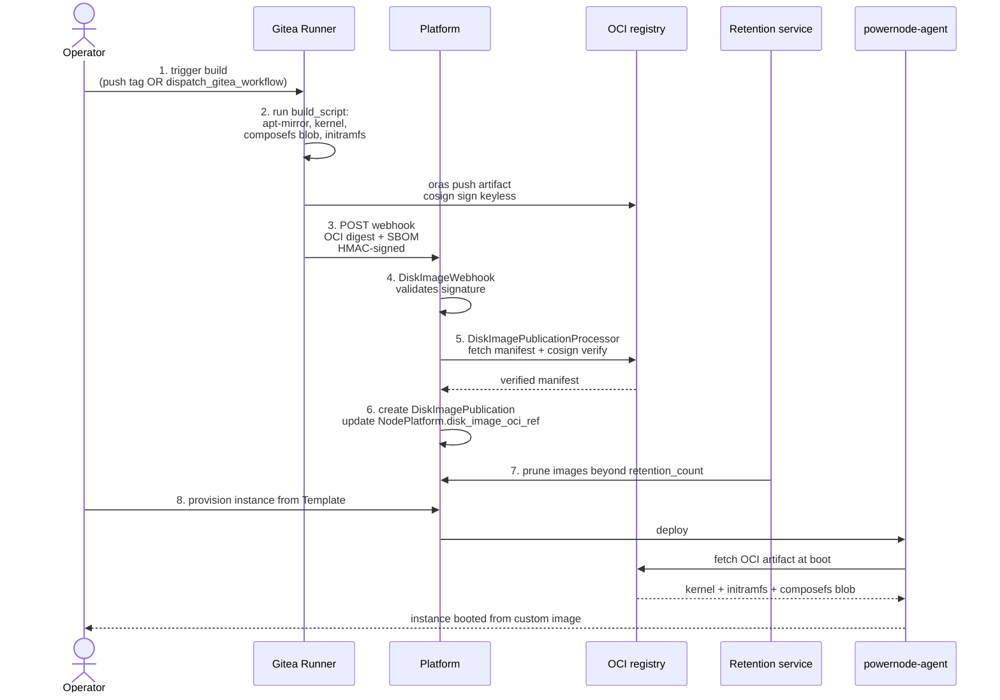
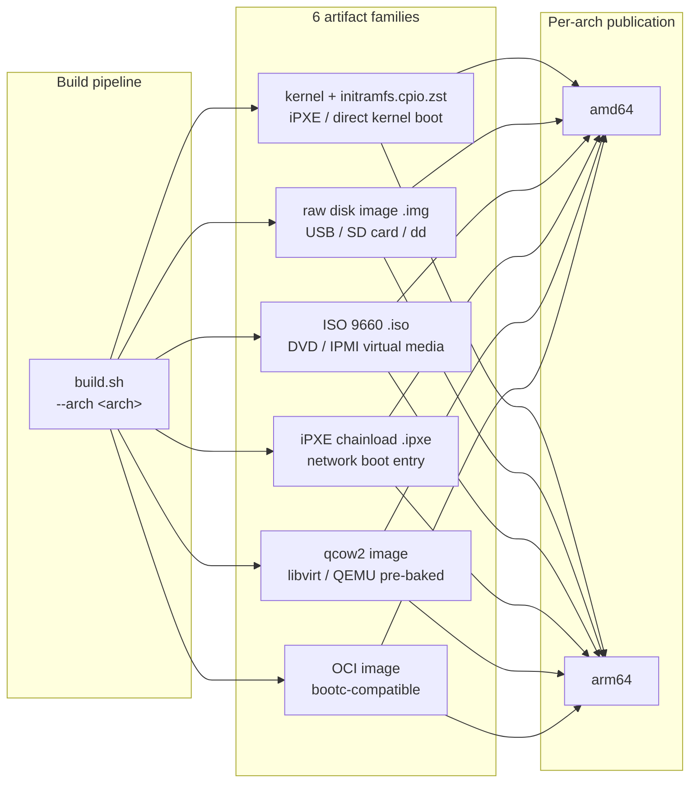

# Disk Image CI/CD — Operator Guide

End-to-end disk image build pipeline: NodePlatform → Gitea Actions → OCI ingest → publication. Uses the platform's GitOps + CI worker infrastructure with Cosign signing for supply-chain integrity.

## Architecture (one-paragraph summary)

A `System::NodePlatform` carries a `build_script` that produces a disk image (kernel + initramfs + composefs blob). The build runs on a self-hosted Gitea Actions runner (provisioned via `provision_ci_worker`) triggered by a webhook. After build, the runner pushes the artifact as an OCI blob (Cosign-signed via the platform's keyless identity), POSTs the webhook back to platform, which ingests via `DiskImagePublicationProcessor`. The resulting `DiskImagePublication` row links the OCI digest to the platform record + retention policy.

## End-to-End Flow



### Six artifact families × two architectures

The initramfs builder publishes six artifact families per architecture, each
suited to a different deployment context. The Disk Image Manager agent tracks
publications per `(NodePlatform, artifact_family, architecture)` triple.



## Setup: Initial CI Worker + Webhook

### Step 1: Bootstrap the CI worker for an account

```javascript
platform.bootstrap_disk_image_ci({
  owner: "<account>",                              // Gitea owner (account name)
  repo: "disk-images",                             // Gitea repo containing the build workflow
  label: "ubuntu-2404-amd64-builder",              // operator-chosen identifier; webhook + worker rows key off this
  platform_api_base: "https://platform.example.org", // optional; defaults to POWERNODE_PUBLIC_URL
  create_platform_read_token: true                 // mints a read-scoped JWT for the runner to call back
})
// → {
//     ok: true,
//     webhook_url: "https://platform.example.org/api/v1/system/webhooks/disk_image/built/<webhook_id>",
//     webhook_secret: "<one-time-displayed-secret>",   // HMAC key for the runner
//     ci_worker_token: "<token>",                       // runner registration token
//     gitea_secrets_set: ["POWERNODE_WEBHOOK_SECRET", "POWERNODE_WEBHOOK_URL", ...]
//   }
```

This action is **idempotent on `label`** (re-running rotates secrets + token without creating duplicates) and is a **one-shot setup**, not a build trigger. It creates:

- A `System::DiskImageWebhook` row (per-pipeline; the URL above embeds its UUID)
- A `Worker` row with role `ci_worker` (NOT a `System::Task`, and NOT a NodeInstance — the operator installs and registers a Gitea Actions runner against the returned token themselves)
- Gitea repo Actions secrets (webhook secret + URL + optional read token + OCI registry creds if configured)

Triggering an actual build is a separate action (`dispatch_gitea_workflow` — see "Triggering a build" below). `bootstrap_disk_image_ci` does not have `account_id`, `force`, or `ref`/`arches` parameters; those framings in earlier doc revisions were aspirational.

### Step 2: Provision the build webhook

When `bootstrap_disk_image_ci` provisions the webhook for you, you do not need this action — it returned the URL + secret already. To provision a webhook standalone (e.g., to attach a second build pipeline to the same account):

```javascript
platform.provision_disk_image_webhook({
  label: "ubuntu-2404-arm64-builder"   // operator-chosen identifier
  // platform_api_base optional; defaults to POWERNODE_PUBLIC_URL
})
// → {
//     webhook_id: "<uuid>",
//     webhook_url: "https://platform.example.org/api/v1/system/webhooks/disk_image/built/<webhook_id>",
//     webhook_secret: "<one-time-displayed-secret>"
//   }
```

Webhooks are **per-pipeline** (the URL embeds the webhook UUID), not per-NodePlatform. The action does **not** accept `node_platform_id`, `webhook_url`, or `shared_secret` — the URL is built server-side from `POWERNODE_PUBLIC_URL` + the issued webhook id; the secret is mint-once and returned.

Operator configures the webhook URL + secret in the build repo's CI workflow YAML so the runner can call back after a successful build.

## Operator Workflow

### Triggering a build

```javascript
// Direct dispatch
platform.dispatch_gitea_workflow({
  account_id: "<account>",
  repo: "<account>/disk-images",
  workflow: "build-disk-image.yml",
  inputs: { platform_slug: "ubuntu-2404-base" }
})

// Or via git push to the configured branch
```

### Monitoring a build

```javascript
// List recent runs
platform.list_gitea_workflow_runs({
  account_id: "<account>",
  repo: "<account>/disk-images"
})

// Tail a specific job's logs
platform.get_gitea_job_logs({ run_id: "<run-id>", job_id: "<job-id>" })
```

### Inspecting publications

```bash
# Via REST
curl /api/v1/system/disk_image_publications -H "Authorization: Bearer $JWT"

# Per-platform recent publications
curl "/api/v1/system/node_platforms/<id>/disk_image_publications" \
  -H "Authorization: Bearer $JWT"
```

Each publication carries (full row shape):
- `id` — publication UUID
- `node_platform_id` — owning NodePlatform
- `status` — one of `queued, awaiting_upload, verifying, published, failed, retired, purged`
- `arch` — `amd64` / `arm64`
- `git_sha` — source commit
- `oci_ref` — fully-qualified registry path (e.g. `registry.example.com/account/disk-images@sha256:...`)
- `sha256` — artifact content digest
- `size_bytes` — artifact size
- `published_at` — UTC timestamp when the publication transitioned to `published`
- `retired_at` — UTC timestamp when a newer publication superseded this one (nil while current)
- `error_message` — populated when `status = failed` (e.g. cosign verify failure detail)

Fields **not** in the serialized row: `built_at` (use `published_at`), `cosign_identity` (verification result is in `error_message` on failure; the identity used is recorded elsewhere), `sbom_url`, `version`, `signed_at`, `composefs_digest` (composefs verification is a future addition; the current pipeline verifies cosign signature + SHA256 over the OCI manifest). Doc revisions before 2026-05-19 listed those fields aspirationally.

### Promoting a publication

The latest publication is auto-promoted to `current` for its NodePlatform when ingest succeeds. To roll back:

```javascript
// ⚠️ aspirational rollback shorthand — use system_set_default_disk_image_publication with the previous publication id to revert
platform.system_revert_disk_image({
  node_platform_id: "<id>",
  to_publication_id: "<earlier-publication-id>"
})
```

The next NodeInstance provisioned from a Template using this Platform will fetch the rolled-back image.

## Retention Policy

`NodePlatform.disk_image_retention_count` (default: 3) controls how many publications are kept per platform. The `DiskImageRetentionService` (runs via Sidekiq cron) prunes older publications past the count, removing both the DB row + the OCI blob from the registry.

To change retention:

```bash
# Via API
curl -X PATCH /api/v1/system/node_platforms/<id> \
  -H "Authorization: Bearer $JWT" \
  -d '{"disk_image_retention_count": 5}'
```

## Secret Rotation

Three secret types in this pipeline:

1. **Cosign keyless identity** — Gitea Actions OIDC; rotates per-run automatically. No operator action.
2. **OCI registry credentials** — used by Gitea runner to push artifacts. Stored as Gitea Actions secret. Rotate via:
   ```javascript
   platform.set_gitea_action_secret({
     account_id: "<account>",
     repo: "<repo>",
     name: "OCI_REGISTRY_TOKEN",
     value: "<new-token>"
   })
   ```
3. **Webhook signing secret** — HMAC-shared between platform + build script. Rotate via `provision_disk_image_webhook` (issues a new pair; operator updates the runner's env).

## Troubleshooting

### Build succeeds but publication doesn't appear

The webhook didn't reach the platform (firewall? wrong URL?) or HMAC signature mismatch. Check:

```bash
# List webhook deliveries (filter to recent or by webhook id):
curl "/api/v1/system/disk_image_webhooks?recent=true" -H "Authorization: Bearer $JWT"

# Or via MCP:
# platform.system_list_disk_image_webhooks({ recent: true })
```

If signature mismatched, rotate the webhook secret.

### Cosign verification fails

`DiskImagePublicationProcessor` rejects ingests where Cosign verify fails. Likely causes:
- Build runner used a different Cosign identity than the platform's `cosign_identity_regexp` config on `NodePlatform`
- OCI artifact was tampered post-signing

Inspect:
```bash
curl /api/v1/system/disk_image_publications/<id> -H "Authorization: Bearer $JWT"
# Look for status="failed" + error_message containing the cosign failure detail.
# The publication's status enum is queued/awaiting_upload/verifying/published/failed/retired/purged
# (there is no separate cosign_verify_failed sub-status).
#
# The NodePlatform row also carries the last attempt:
#   disk_image_publication_status — overall publication state on the platform
#   disk_image_publication_error — last failure detail surfaced to operators
```

### Runner stuck in pending

Gitea Actions runner provisioned but not online. Check:

CI worker provisioning is synchronous in the MCP tool (no `System::Task` row is created), so a "pending" task wouldn't appear in `system_list_tasks`. Instead check the `Worker` row directly via the operator API:

```bash
curl "/api/v1/workers?role=ci_worker" -H "Authorization: Bearer $JWT"
```

If the worker exists but the Gitea Actions runner side hasn't registered, the operator's manual runner install is the missing step (the platform issues the token; the operator must install + register the runner against it). Reprovisioning the bootstrap (rotates secrets + issues a fresh worker token) — `force` is not a parameter; just re-run with the same `label`:

```javascript
platform.bootstrap_disk_image_ci({
  owner: "<account>",
  repo: "disk-images",
  label: "ubuntu-2404-amd64-builder"
})
// Idempotent on label — rotates secrets + token, returns fresh values.
```

## Source Files

**Models:**
- `extensions/system/server/app/models/system/disk_image_webhook.rb`
- `extensions/system/server/app/models/system/disk_image_publication.rb`

**Services:**
- `extensions/system/server/app/services/system/disk_image_publication_processor.rb` — webhook → ingest
- `extensions/system/server/app/services/system/disk_image_oci_ingest_service.rb` — OCI manifest fetch + Cosign verify
- `extensions/system/server/app/services/system/disk_image_direct_upload_ingest_service.rb` — fallback for non-CI uploads
- `extensions/system/server/app/services/system/disk_image_retention_service.rb` — prune past retention count

**Controllers:**
- `extensions/system/server/app/controllers/api/v1/system/disk_image_publications_controller.rb`
- `extensions/system/server/app/controllers/api/v1/system/disk_image_webhooks_controller.rb`
- `extensions/system/server/app/controllers/api/v1/system/webhooks/disk_image_built_controller.rb` — receives Gitea webhook
- `extensions/system/server/app/controllers/api/v1/system/worker_api/disk_image_publications_controller.rb` — runner-facing

**MCP tools:**
- `server/app/services/ai/tools/disk_image_operator_tool.rb` — `bootstrap_disk_image_ci`, `provision_disk_image_webhook`, `provision_ci_worker`
- `server/app/services/ai/tools/gitea_actions_tool.rb` — secrets, workflow dispatch, run monitoring

## Related Docs

- `extensions/system/initramfs/README.md` — multi-arch boot artifact build details
- `docs/system/threat-model.md` — supply-chain integrity rationale
- `extensions/system/docs/ARCHITECTURE.md` — disk image pipeline subsystem
