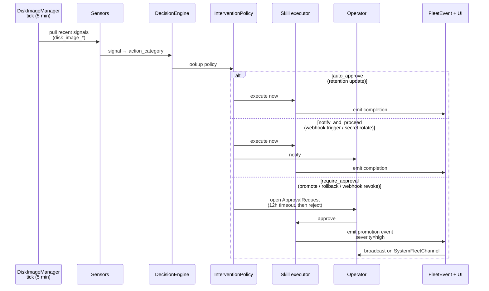

# Disk Image Manager Agent — Operator Guide

The **Disk Image Manager** is one of the autonomous agents seeded into every Powernode account. It owns the disk image CI publication lifecycle: build → verify → promote → retention. Carved out of Fleet Autonomy on 2026-05-10 so image-publishing automations have an independent queue (e.g., a nightly canary promotion can be paused independently of fleet ops).

Source of truth for this guide: `extensions/system/server/db/seeds/system_disk_image_manager_agent.rb`.

For the upstream CI pipeline (Gitea workflows, OCI artifact format, cosign signing), see [`DISK_IMAGE_CI.md`](./DISK_IMAGE_CI.md). This document covers the **operator-facing autonomy surface** that consumes those built artifacts.

---

## Charter

The Disk Image Manager is a **monitor** agent (no chat surface). It carries the intervention-policy table + approval chain below and runs deferred-operation executors when operators approve.

**Autonomy-tick status (2026-05-19):** the agent declares `interval_seconds: 300, scope: "disk_image"` in its seed, but the autonomy-tick loop in `FleetAutonomyService` does **not** currently route any `system.disk_image_*` signals to this agent — the policies + approval chain are live and gate operator-initiated actions correctly, but no sensor today emits the disk-image-scoped signals listed in the §"Sensor → Action Map" below (those signals are aspirational and will land alongside `DiskImagePublishedSensor` + `DiskImageWebhookSecretStaleSensor` work). For now, the agent's value is in the intervention-policy table: every operator-initiated promote/rollback/retention-update/webhook-revoke/webhook-rotate flows through this agent's chain rather than the Fleet Autonomy chain, keeping disk-image work routable separately.

What it owns:
- **Publication promotion** — moving a verified disk image from `staging` to `default` (the version new instances boot from)
- **Publication rollback** — reverting an active default back to a previous publication when issues surface
- **Retention sweeping** — enforcing per-platform retention (default 3 keep + 7-day grace before purge)
- **Webhook lifecycle** — accepting webhook triggers from upstream CI; rotating webhook secrets; revoking webhooks when CI integration is decommissioned

What it does **not** own:
- The build pipeline itself (that's the Gitea Actions workflow defined in `.gitea/workflows/build-disk-image.yaml`)
- CI worker provisioning (`system_provision_ci_worker` / `system_terminate_ci_worker` — operator-only MCP actions)
- OCI artifact storage (that's `System::DiskImagePublication`'s underlying object store)

---

## Intervention Policies

The agent ships with **6 intervention policies**:

| Action | Policy | Why |
|---|---|---|
| `system.disk_image_publication_promote` | `require_approval` | Production rollout — affects every new instance that boots |
| `system.disk_image_publication_rollback` | `require_approval` | Reverting changes the active fleet's boot path |
| `system.disk_image_retention_update` | `auto_approve` | GC config; reversible at any time |
| `system.disk_image_webhook_trigger` | `notify_and_proceed` | Webhook ingest — running the verify pipeline is safe |
| `system.disk_image_webhook_revoke` | `require_approval` | Cuts active CI integration; recovery requires re-enrollment |
| `system.disk_image_webhook_rotate_secret` | `notify_and_proceed` | Invalidates old secret, but the rotation is recoverable |

### Why these defaults

The agent skews to `require_approval` for any action that changes the active boot path because the blast radius is the whole fleet — a bad promotion can cascade across every NodeInstance that reboots next.

Retention updates and webhook triggers are `auto_approve` / `notify_and_proceed` because they're either GC config (no immediate effect on running instances) or read-write ingest of upstream CI signals (already gated by the webhook secret's signature verification).

### Tuning a policy

```ruby
# rails console
agent = Ai::Agent.find_by(name: "Disk Image Manager")
Ai::InterventionPolicy.find_by(
  ai_agent_id: agent.id, action_category: "system.disk_image_publication_promote"
).update!(policy: "notify_and_proceed")  # e.g., a staging-only environment may want lower friction
```

Re-seed (`cd server && rails db:seed`) to make the change durable across deploys.

---

## Approval Chain

Approval-required actions flow through the **Disk Image Manager Actions** approval chain:

- **Trigger type:** `autonomy_action`
- **Sequential:** yes (one step today)
- **Timeout:** **12 hours**, then auto-reject
- **Approvers:** any user with permission `system.infra_tasks.control`
- **Required approvals per step:** 1

The 12-hour timeout is longer than SDWAN Manager's 4-hour timeout because image promotions are often scheduled around business hours (e.g., "approve before end of day Friday") — a tighter window would auto-reject overnight promotions where the operator was simply asleep.

---

## Pause / Resume — Promotion Freeze Runbook

Use cases:
- A regression was just found in the latest image and you don't want any promotion attempts until it's investigated.
- You're in a change-freeze window before a release and want to keep the running fleet stable.

### Pause
```ruby
# rails console
agent = Ai::Agent.find_by(name: "Disk Image Manager")
agent.update!(status: "paused")
```

The agent skips its next 5-minute tick. Webhook ingest from Gitea will still land (the webhook receiver doesn't go through this agent), but no promotion/rollback decisions will fire.

### Verify paused
```bash
curl -s -H "Authorization: Bearer $JWT" http://localhost:3000/api/v1/ai/agents \
  | jq '.data[] | select(.name=="Disk Image Manager") | {name, status, last_tick_at}'
```

### Resume
```ruby
agent.update!(status: "active")
```

### Drain in-flight approvals first

If pause is happening because you just disputed the previous promotion: also reject any in-flight `ApprovalRequest`s tied to publication actions so they don't auto-approve when you flip the pause off later:

```ruby
Ai::ApprovalRequest
  .where(ai_agent_id: agent.id, status: "pending")
  .find_each { |req| req.update!(status: "rejected", rejection_reason: "operator-initiated freeze") }
```

---

## Sensor → Action Map

Disk Image Manager actions are triggered by:

| Trigger | Signal | Triggers action | Policy default |
|---|---|---|---|
| Webhook from Gitea CI | `system.disk_image_published` | `system.disk_image_webhook_trigger` | `notify_and_proceed` |
| Verify pipeline completes | `system.disk_image_verified` | `system.disk_image_publication_promote` | `require_approval` |
| Operator-initiated dispute / regression report | `system.disk_image_regression_reported` | `system.disk_image_publication_rollback` | `require_approval` |
| Time-based (per-platform retention age check) | `system.disk_image_retention_exceeded` | `system.disk_image_retention_update` | `auto_approve` |
| Secret age threshold | `system.disk_image_webhook_secret_stale` | `system.disk_image_webhook_rotate_secret` | `notify_and_proceed` |

See [`FLEET_SENSORS.md`](./FLEET_SENSORS.md) for sensor implementation details.

### Tick → Autonomy Gate



---

## Rollback / Revert Workflow

The `system_revert_disk_image` MCP tool is aspirational — see
[`.verify/ASPIRATIONAL_MCP.md`](./.verify/ASPIRATIONAL_MCP.md). Today's
rollback uses the existing `system_set_default_disk_image_publication`
action with the previous publication ID.

### Operator-driven (incident response)

1. List recent publications to identify the last known-good:
   ```javascript
   platform.system_list_disk_image_publications({ node_platform_id: "<id>" })
   ```
2. Pick the `publication_id` from the prior `status: "published"` row.
3. Swap the default back:
   ```javascript
   platform.system_set_default_disk_image_publication({
     node_platform_id: "<id>",
     publication_id: "<previous-pub-id>"
   })
   ```

New instances booting from this NodePlatform will use the previous image
on next netboot.

### Agent-driven (autonomy loop)

When a sensor emits `system.disk_image_regression_reported`, the policy
`system.disk_image_publication_rollback` (default `require_approval` per
the Sensor → Action Map above) opens an `ApprovalRequest` proposing the
previous publication as the new default. An operator confirms; the agent
then invokes `set_default_disk_image_publication` automatically.

### Why no dedicated revert wrapper today

`set_default_disk_image_publication` already atomically swaps the
NodePlatform's default. A `system_revert_disk_image` wrapper would need
to remember "previous default" server-side — adding persistent state for
ergonomics only. When the wrapper eventually ships (see audit plan
P2.16), it will preserve the existing semantics: it's a thin
look-up-and-swap on top of the existing action.

---

## Observability

Every Disk Image Manager decision lands in three places:

1. **FleetEvent log** — `System::FleetEvent` rows with `source: "disk_image_manager"`, queryable via `platform.recent_events` or the Fleet Dashboard. The payload includes the `DiskImagePublication` id and the previous + new active publication for promotions.
2. **ActionCable broadcast** — live UI updates on `SystemFleetChannel` (operators watching the dashboard see promotions stream in)
3. **Approval queue** — `Ai::ApprovalRequest` rows for `require_approval` actions, visible at `/ai/autonomy/approvals` in the operator UI

Promotion events are flagged `severity: "high"` so they pop in the dashboard's filtered views; retention sweeps are `severity: "low"` and stay in the background log.

---

## Common Questions

**Why are promotions gated by approval if the CI pipeline already verified the image?**

Verification confirms the image *builds and signs correctly*. It doesn't confirm the image *behaves correctly under your specific workload*. The approval gate gives the operator a moment to read the changelog (modules updated, kernel bumped, etc.) and decide whether to roll the fleet now or wait for a maintenance window. If your environment is in a phase where these checks are unnecessary (e.g., a pure dev environment), tune `system.disk_image_publication_promote` to `notify_and_proceed`.

**Why doesn't the agent auto-rollback when a sensor flags a regression?**

Rolling back rebooting nodes is itself disruptive — the rollback IS a fleet event. Forcing it through approval avoids cascading rollback storms where a flaky sensor triggers oscillation. If you want auto-rollback for a specific failure mode (e.g., "kernel panic on first boot"), wire the sensor to emit `system.disk_image_regression_reported` only on that specific signal, then consider lowering its policy.

---

## Related Documents

- [`DISK_IMAGE_CI.md`](./DISK_IMAGE_CI.md) — upstream CI pipeline (Gitea workflows, OCI artifact format, cosign signing)
- [`FLEET_SENSORS.md`](./FLEET_SENSORS.md) — the sensors that emit `system.disk_image_*` signals
- [`runbooks/disk-image-ci.md`](./runbooks/disk-image-ci.md) — operator runbook for the full CI flow
- [`SKILL_EXECUTOR_CATALOG.md`](./SKILL_EXECUTOR_CATALOG.md) — full skill executor catalog (auto-generated)
- [`CLAUDE.md`](../CLAUDE.md) — index of all extension agents, including this one
