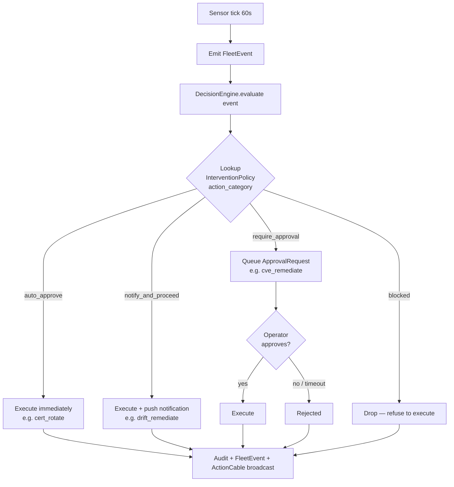

# Fleet Sensors — System Extension Reference

The system extension ships **12 concrete sensors** (plus a `BaseSensor` abstract class) at `extensions/system/server/app/services/system/fleet/sensors/`. Each sensor inspects a slice of fleet state on a recurring tick, emits typed `FleetEvent` signals when thresholds trip, and feeds the autonomy `DecisionEngine` which gates remediation actions per intervention policy.

## Architecture (one-paragraph summary)

The Fleet Autonomy reconciler runs every 60s (configurable via `autonomy_config.interval_seconds` on the Fleet Autonomy agent). Each tick:

1. All 12 sensors run in series (cheap; per-sensor work is bounded by the data it inspects)
2. Each sensor emits zero or more `FleetEvent` signals with `kind`, `severity`, `payload`, `correlation_id`
3. The DecisionEngine maps signals → action categories → intervention policy lookup
4. Policy = `auto_approve` → executor runs immediately
5. Policy = `notify_and_proceed` → executor runs + operator notified
6. Policy = `require_approval` → ApprovalRequest queued; executor blocked until operator clicks Approve

```mermaid
flowchart LR
    subgraph Sensors["12 sensors (per 60s tick)"]
        S1[instance_status]
        S2[module_drift]
        S3[module_promotion]
        S4[certificate_expiry]
        S5[config_drift]
        S6[sdwan_reachability]
        S7[sdwan_drift]
        S8[sdwan_bgp_session_health]
        S9[sdwan_vip_reachability]
        S10[honeypot_access]
        S11[slo_violation]
        S12[trading_pressure]
    end
    subgraph Signals["FleetEvent signal kinds"]
        Sig[instance.* / module.* / cert.* / config.*<br/>sdwan.* / honeypot.* / slo.* / fleet.trading_*]
    end
    subgraph Executors["Skill executors"]
        E1[drift_remediate]
        E2[cve_response]
        E3[rolling_module_upgrade]
        E4[sdwan_peer_remediate]
        E5[sdwan_vip_failover]
        E6[cert_rotate]
        E7[attribute_failure]
    end
    Sensors --> Signals
    Signals --> DE[DecisionEngine]
    DE --> FA[FleetAutonomyService<br/>gate_action!]
    FA --> Executors
```



## Sensor Reference

### `instance_status_sensor` — Heartbeat liveness

**Source:** `instance_status_sensor.rb`
**Watches:** `System::NodeInstance.last_heartbeat_at`
**Threshold:** Configurable per-template; default 5 minutes silent → `instance_silent` signal
**Signals:** `instance.silent`, `instance.recovered`
**Recommended remediation:** `attribute_failure` (skill) for diagnostics, then operator-initiated reprovision.

### `module_drift_sensor` — Module config drift

**Source:** `module_drift_sensor.rb`
**Watches:** `NodeInstance.running_module_digests` vs assigned module digests
**Threshold:** Any digest mismatch → `module_drift` signal
**Signals:** `module.drift_detected`, `module.drift_resolved`
**Recommended remediation:** `drift_remediate` skill (Fleet Autonomy auto-runs with `notify_and_proceed`).

### `module_promotion_sensor` — Promotion-ready modules

**Source:** `module_promotion_sensor.rb`
**Watches:** `NodeModuleVersion.lifecycle_state` transitions (staging → blessed)
**Threshold:** Module spends >24h in staging without operator promotion → `module_promotion_pending` signal
**Signals:** `module.promotion_ready`, `module.promotion_stalled`
**Recommended remediation:** None automated — operator promotes via UI or `system_promote_module_version` MCP action.

### `certificate_expiry_sensor` — TLS cert expiration

**Source:** `certificate_expiry_sensor.rb`
**Watches:** `NodeCertificate.not_after` (mTLS instance certs from `InternalCaService`)
**Threshold:** Cert expires within 14 days → `cert_expiring` signal; expired → `cert_expired` signal
**Signals:** `cert.expiring`, `cert.expired`, `cert.rotated`
**Recommended remediation:** Auto-rotate via `system.cert_rotate` action (Fleet Autonomy `auto_approve` policy). 90-day default lifetime.

### `config_drift_sensor` — On-node config drift

**Source:** `config_drift_sensor.rb`
**Watches:** Agent-reported config hash vs platform-computed config hash
**Threshold:** Hash mismatch → `config_drift` signal
**Signals:** `config.drift_detected`, `config.drift_resolved`
**Recommended remediation:** `drift_remediate` skill (same as module drift).

### `sdwan_reachability_sensor` — Hub reachability

**Source:** `sdwan_reachability_sensor.rb`
**Watches:** `Sdwan::Peer.last_handshake_at` for hub peers
**Threshold:** No handshake in 5 minutes from hub → `sdwan.hub_unreachable` signal
**Signals:** `sdwan.hub_unreachable`, `sdwan.hub_recovered`
**Recommended remediation:** `sdwan_failover` skill (planning-only in v1; operator manually flips `publicly_reachable`).

### `sdwan_drift_sensor` — Topology drift

**Source:** `sdwan_drift_sensor.rb`
**Watches:** Agent-reported wg interface state vs platform desired config
**Threshold:** Interface missing or wrong AllowedIPs → `sdwan.peer_drift` signal
**Signals:** `sdwan.peer_drift_detected`, `sdwan.peer_drift_resolved`
**Recommended remediation:** `sdwan_peer_remediate` skill — rotate keys + force tunnel re-establish.

### `sdwan_bgp_session_health_sensor` — iBGP session health

**Source:** `sdwan_bgp_session_health_sensor.rb`
**Watches:** `Sdwan::BgpSession.state` (Idle/Connect/Active/OpenSent/OpenConfirm/Established)
**Threshold:** Session non-Established for >10 minutes → `sdwan.bgp_unhealthy` signal
**Signals:** `sdwan.bgp_unhealthy`, `sdwan.bgp_recovered`
**Recommended remediation:** `sdwan_bgp_session_remediate` skill (planning-only; operator runs `vtysh` recommendation).

### `sdwan_vip_reachability_sensor` — VIP holder health

**Source:** `sdwan_vip_reachability_sensor.rb`
**Watches:** `Sdwan::VirtualIp.holder_peer_ids` against peer handshake health
**Threshold:** Single-holder VIP's holder is silent → `sdwan.vip_holder_silent` signal
**Signals:** `sdwan.vip_holder_silent`, `sdwan.vip_holder_recovered`
**Recommended remediation:** `sdwan_vip_failover` skill — promotes the next failover candidate.

### `honeypot_access_sensor` — Canary module access

**Source:** `honeypot_access_sensor.rb`
**Watches:** `CanaryModuleService` access logs on canary modules placed in the catalog
**Threshold:** Any access attempt → `honeypot.access` signal (high severity)
**Signals:** `honeypot.access_attempted`, `honeypot.access_blocked`
**Recommended remediation:** None automated — escalates to operator + governance pipeline.

### `slo_violation_sensor` — SLO breach detection

**Source:** `slo_violation_sensor.rb`
**Watches:** `Slo::Definition` rolling-window metrics
**Threshold:** SLO breach → `slo.violated` signal
**Signals:** `slo.violated`, `slo.recovered`
**Recommended remediation:** None automated — surfaces in operator dashboard for manual investigation.

### `external_pressure_sensor` — Cross-domain coordination

**Source:** `external_pressure_sensor.rb` (historically named `trading_pressure_sensor.rb` after the first integrated extension)
**Watches:** Stigmergic pressure signals emitted by sibling extensions on the platform-wide signal bus
**Threshold:** External aggregate pressure ≥1.0 → fleet defers non-critical actions
**Signals:** `fleet.external_pressure_high`, `fleet.external_pressure_normal`
**Recommended remediation:** Internal — no executor; the `ExternalAwareThrottle` consults this signal to defer Fleet Autonomy actions when sibling extensions are under load.

## Decision Engine Flow



Action executors live at:

- `extensions/system/server/app/services/system/ai/skills/*_executor.rb`

## Configuring Sensor Thresholds

Sensors read thresholds from `Fleet::SensorConfig` records (account-scoped). Operator-tunable via:

```javascript
// ⚠️ Sensor config MCP actions are aspirational — edit Fleet::SensorConfig via Rails console or REST today
// platform.system_get_sensor_config({ sensor: "instance_status" })      // aspirational
// platform.system_update_sensor_config({                                // aspirational
//   sensor: "instance_status",
//   silent_threshold_minutes: 10  // default 5
// })
```

Until those MCP wrappers ship, configure via Rails console:

```ruby
Fleet::SensorConfig.upsert_for(account: Account.find("<id>"), sensor: "instance_status",
  config: { silent_threshold_minutes: 10 })
```

If no `Fleet::SensorConfig` exists for an account, sensor defaults from constants in each sensor class apply.

## Adding a New Sensor

1. Create `extensions/system/server/app/services/system/fleet/sensors/<name>_sensor.rb` extending `Fleet::Sensors::BaseSensor`.
2. Implement `tick(account:)` returning an array of `FleetEvent` rows (or empty).
3. Register the sensor in `Fleet::Reconciler` so it runs on each autonomy tick.
4. Add an intervention policy entry in `fleet_autonomy_agent.rb` for the action category your sensor's recommendation maps to.
5. Add a corresponding skill executor (if remediation is automatable) — see `SKILL_EXECUTORS.md`.

## Intervention Policy Reference

Two AI agents seed intervention policies (action_category → policy mapping). Sourced from `db/seeds/fleet_autonomy_agent.rb` (19 policies) + `db/seeds/system_runtime_manager_agent.rb` (8 policies) = **27 total**.

**Policy semantics:**

| Policy | Behavior |
|---|---|
| `auto_approve` | Skill executes immediately on the next reconciler tick. Reversible / routine work only. |
| `notify_and_proceed` | Skill executes + operator notification fires. Operator opted in by upstream config. |
| `require_approval` | `ApprovalRequest` queued; skill blocked until operator clicks Approve. Sensitive / destructive work. |
| `blocked` | Action is disabled entirely. Reserved for incident response. |

All policies decay to the agent's `trust_tier_minimum: monitored` condition — agents below trust threshold are auto-blocked regardless of policy.

### Fleet Autonomy agent (19 policies)

Source: `db/seeds/fleet_autonomy_agent.rb`. Approval chain: `Fleet Autonomy Actions` (4-hour timeout, `*` approver, sequential).

| Action category | Default policy | Why |
|---|---|---|
| `system.cert_rotate` | `auto_approve` | Routine + reversible (90-day mTLS rotation) |
| `system.module_assign` | `notify_and_proceed` | Operator already opted-in by configuring template |
| `system.instance_reboot` | `notify_and_proceed` | Reversible — instance returns within ~60 s |
| `system.instance_reprovision` | `require_approval` | Destructive — wipes ephemeral state |
| `system.instance_terminate` | `require_approval` | Destructive — releases provider VM, cascade-FK deletes managed rows |
| `system.cert_revoke` | `require_approval` | Cuts active mTLS session |
| `system.module_promote_to_live` | `require_approval` | Promotes module across the fleet |
| `system.fleet_rolling_upgrade` | `require_approval` | Touches many instances; `rolling_module_upgrade` skill plans batches |
| `system.cve_remediate` | `require_approval` | Composes `cve_response` + `rolling_module_upgrade` |
| `system.region_expansion` | `require_approval` | Cost-bearing |
| `system.capacity_resize` | `require_approval` | Cost-bearing; `capacity_recommend` skill emits the proposal |
| `system.sdwan_peer_remediate` | `notify_and_proceed` | Reversible — re-issues config + bounces wg interface |
| `system.sdwan_key_rotate` | `auto_approve` | Periodic per-peer rotation; mirrors `cert_rotate` posture |
| `system.sdwan_failover` | `require_approval` | Promotes a backup hub; changes the network's reachability story |
| `system.sdwan_user_device_revoke` | `require_approval` | Cuts a user's VPN access |
| `system.sdwan_bgp_session_remediate` | `notify_and_proceed` | Slice 9f — planning-only in v1; no actual side effects until operator runs the recommended `vtysh` command |
| `system.sdwan_vip_failover` | `require_approval` | Single-holder VIPs flip `holder_peer_ids` order; visible to operators |
| `system.sdwan_route_policy_audit` | `auto_approve` | Surfaces findings (no side effects); auto-approves so report lands without a pending approval blocking the queue |
| `system.observation` | `auto_approve` | Pure observation — no remediation; collects events for dashboards |

### Runtime Manager agent (8 policies)

Source: `db/seeds/system_runtime_manager_agent.rb`. Approval chain: `Runtime Manager Actions` (4-hour timeout, `*` approver, sequential, separate from Fleet Autonomy chain).

| Action category | Default policy | Why |
|---|---|---|
| `system.runtime_docker_provision` | `notify_and_proceed` | Operator opted in by assigning `docker-engine` module; provisioning is the obvious follow-through |
| `system.runtime_docker_decommission` | `require_approval` | Destructive — destroys managed `Devops::DockerHost` row + Vault TLS material |
| `system.runtime_docker_tls_rotate` | `auto_approve` | Aligns with `system.cert_rotate` hands-off posture |
| `system.runtime_k8s_cluster_bootstrap` | `notify_and_proceed` | Operator opted in by assigning `k3s-server` module |
| `system.runtime_k8s_cluster_decommission` | `require_approval` | Destructive — cascade-deletes member node rows |
| `system.runtime_k8s_node_join` | `notify_and_proceed` | Operator opted in by assigning `k3s-agent` module |
| `system.runtime_k8s_node_drain` | `require_approval` | Affects running pods |
| `system.runtime_k8s_runtime_upgrade` | `require_approval` | Affects workloads |

### Override path

Operators can override any policy per-account via the AI Agents UI or by editing `Ai::InterventionPolicy` directly:

```javascript
// Tighten a default-auto policy
platform.update_intervention_policy({
  agent_id: "<fleet-autonomy-agent-id>",
  action_category: "system.cert_rotate",
  policy: "require_approval"
})
```

Policy changes take effect on the next reconciler tick (≤60 s).

### Consent budget (per-module ceiling)

In addition to per-policy gates, operators can set a per-module **consent budget** capping the daily count of autonomous decisions touching that module. Once exhausted, all autonomous actions on that module are forced to `require_approval` regardless of policy. See `app/services/system/fleet/consent_budget_service.rb`.

## Related Docs

- `extensions/system/docs/SKILL_EXECUTORS.md` — remediation actions invoked by sensor signals
- `extensions/system/docs/ARCHITECTURE.md` — autonomy + decision engine subsystem
- `extensions/system/docs/CONTAINER_RUNTIMES.md` — runtime-specific monitoring (Runtime Manager agent has its own policies)
- `extensions/system/docs/runbooks/cve-response.md` — operator runbook using `cve_remediate` policy chain
- `extensions/system/docs/runbooks/sdwan-network-setup.md` — operator runbook covering SDWAN policies
