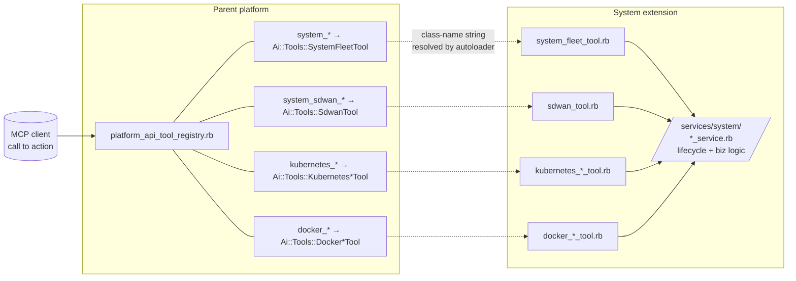

# MCP API Reference

Action catalog for the system extension's MCP surface. Lists every `system_*`, `system_sdwan_*`, `kubernetes_*`, and `docker_*` action callable via the Powernode MCP server.

**Audience:** AI Concierge prompt authors, external operators integrating with the platform's MCP server, contributors adding new actions.

## Where actions are registered (architecture note)

> **Architecture:** The MCP **registry** (action-name → tool-class mapping) lives in the **parent platform** at `server/app/services/ai/tools/platform_api_tool_registry.rb`. The **tool class implementations** live in the **extension** at `extensions/system/server/app/services/ai/tools/`. Rails autoloading resolves the class names across both locations.



To add a new MCP action: register the action-name → class-name mapping in the **parent's** registry file, then implement the action method in the corresponding tool class **inside the extension**. Both repos commit; bump the submodule pointer.

To regenerate the parent's full tool catalog with parameter schemas:

```bash
cd server && bundle exec rails mcp:generate_tool_catalog
# → writes to docs/platform/MCP_TOOL_CATALOG.md (gitignored)
```

This document is the **system-extension subset** of that catalog — manually curated, scannable for operator workflows.

## Permission model

Every action requires a permission grant on the calling user/agent. Permissions follow the schema `<resource>.<verb>` (e.g., `system.nodes.read`, `system.modules.write`). The mapping lives in `server/db/migrate/*_permissions.rb` (parent platform). Agents have permissions assigned via `Ai::AgentPermission`.

## Action catalog

### `system_*` — Fleet, lifecycle, modules (42 actions)

Backed by `Ai::Tools::SystemFleetTool` (parent platform) + `Ai::Tools::DockerProvisioningTool` (managed Docker runtimes).

#### Nodes + instances

| Action | What it does | Audience |
|---|---|---|
| `system_list_nodes` | List Node rows (filter by status, lifecycle_class, etc.) | operator, agent |
| `system_get_node` | Fetch a Node by id | operator, agent |
| `system_create_node` | Create a Node row (no provider VM yet) | operator, agent |
| `system_list_instances` | List NodeInstance rows | operator, agent |
| `system_get_instance` | Fetch NodeInstance details (status, last_heartbeat, running modules) | operator, agent |
| `system_provision_instance` | Trigger provider VM creation; creates Task; returns NodeInstance | operator, agent |
| `system_terminate_instance` | Destroy provider VM; cascade-FK cleanup | operator, agent |
| `system_drift_report` | Compare running module digests vs assigned modules | operator, agent |

#### Templates + modules

| Action | What it does |
|---|---|
| `system_list_templates` | List NodeTemplates |
| `system_get_template` | Fetch a Template + its module assignments |
| `system_assign_module_to_template` | Add a module to a Template (with optional metadata like `target_cluster_id`) |
| `system_list_modules` | List NodeModules |
| `system_get_module` | Fetch a Module + its categories + dependencies |
| `system_list_module_versions` | List versions of a module |
| `system_promote_module_version` | Move a version through lifecycle states (draft → staging → blessed → live) |

#### Tasks

| Action | What it does |
|---|---|
| `system_list_tasks` | List Tasks (filter by status, type) |
| `system_cancel_task` | Cancel a pending or in-flight Task |

#### Instance pools (slice 7)

| Action | What it does |
|---|---|
| `system_list_instance_pools` | List InstancePools |
| `system_get_instance_pool` | Fetch a pool + its members |
| `system_create_instance_pool` | Create a new pool (target_size, min, max, region, type, template) |
| `system_drain_instance_pool` | Stop replenishing + destroy/release members |
| `system_acquire_pooled_instance` | Atomic claim of a `ready` member |
| `system_replenish_instance_pool` | Manual trigger of the reaper for this pool |

#### Container runtimes

| Action | What it does |
|---|---|
| `system_provision_docker_runtime` | Phase 1 Docker daemon provisioning on a NodeInstance |
| `system_decommission_docker_runtime` | Destroy managed DockerHost row + Vault TLS material |
| `system_mark_docker_ready` | Agent-side ack endpoint (mostly internal) |
| `system_list_managed_docker_hosts` | List Powernode-managed Docker hosts (excludes externally-registered) |

#### Package repositories + catalog

Backed by `Ai::Tools::SystemPackageRepositoryTool`. Manages apt/rpm package repositories, browses the synced catalog with rich filtering, and materializes packages into NodeModules with full dependency closure.

| Action | What it does | Audience |
|---|---|---|
| `system_list_package_repositories` | List accessible apt/rpm repositories (account-scoped + shared); filter by `kind` and `node_platform_ids[]`. Each row carries `embedding_pending_count` for catalog coverage. | operator, agent |
| `system_get_package_repository` | Fetch one repository with detail (apt_config, rpm_config, linked NodePlatforms) | operator, agent |
| `system_create_package_repository` | Register a new apt/rpm/dnf repository (`visibility: shared` requires `system.package_repositories.manage_shared`) | operator |
| `system_update_package_repository` | Update repository config (architectures, enabled, priority, apt/rpm config) | operator |
| `system_delete_package_repository` | Delete a repository (only when no modules link to its packages) | operator |
| `system_sync_package_repository` | Trigger an immediate upstream sync (fetches index, upserts Package rows). Enqueues `SystemPackageEmbeddingJob` after successful sync. | operator, agent |
| `system_link_repository_platform` / `system_unlink_repository_platform` | M:N link/unlink between repository and NodePlatform | operator |
| **`system_search_packages`** | **Search the synced catalog. Hybrid trigram+embedding ranking (default), pure lexical, or pure semantic.** Filters: `q`, `mode` (lexical/semantic/hybrid), `repository_ids[]`, `kind`, `architectures[]` (canonical, cross-kind expanded), `sections[]`, `license`, `provides` (capability lookup), `sort`, `page`, `per_page`. Back-compat with singular `repository_id`/`architecture`/`section`. Response includes `similarity` (when mode ≠ lexical), `provides_names`, `license`, `applied_filters` echo. `total` is null under semantic/hybrid (exact COUNT prohibitive on vector-filtered sets). | operator, agent |
| **`system_discover_packages`** | **Intent-based semantic discovery — describe a capability ("reverse proxy", "distributed cache") and get ranked packages.** Pure cosine-distance ranking via pgvector. Inputs: `intent` (required), `repository_ids[]`, `kind`, `architectures[]`, `license`, `top_k` (1-50, default 10). Returns `{results: [{package_id, name, version, architecture, summary, similarity, repository_id, reason}], seed_count, confidence (high/medium/low)}`. Use `system_search_packages` instead when you already know the package name. | operator, agent |
| `system_get_package` | Fetch one Package row with full metadata (depends, recommends, provides, conflicts, license, maintainer) | operator, agent |
| `system_resolve_package_dependencies` | Preview the dependency closure of a package without writes — required + recommends candidates the operator can opt into | operator, agent |
| `system_create_module_from_package` | Materialize a package + transitive deps as NodeModule rows + ModuleDependency edges; dispatches CI build per architecture | operator, agent |
| `system_list_package_module_links` | Auditable provenance — which NodeModules came from which packages, top-level vs auto-generated | operator, agent |
| `system_refresh_package_module` | Re-materialize a NodeModule when upstream drifts (replays persisted `recommends_chosen` for deterministic refreshes) | operator, agent |
| `system_suggest_architectures_for_fleet` | T2.B — fleet-aware architecture suggestion for materialization; intersects repo's archs with NodePlatform coverage | operator, agent |

**Embedding pipeline:** `Package.embedding` (pgvector 1536-dim) is populated by `SystemPackageEmbeddingJob` (worker-side). The job is auto-enqueued after every sync that upserts ≥1 row, and can be manually run via `rake system:packages:backfill_embeddings`. Without embeddings, hybrid mode contributes only the trigram leg — search still works, just without semantic ranking.

**Permission map:**
- `system.package_repositories.{view,create,update,delete,sync,manage_shared}` — repository CRUD + sync
- `system.packages.{view,search}` — catalog read access (search covers both `search` and `discover`)
- `system.package_modules.{view,create,refresh}` — materialization + provenance
- `system.packages.embed` (worker-only) — embedding writeback
- `system.packages.reembed` (operator) — manual re-embed campaigns

### `system_sdwan_*` — SDWAN networking (52 actions)

Backed by `Ai::Tools::SdwanTool`. Comprehensive network management.

#### Networks

| Action | What it does |
|---|---|
| `system_sdwan_list_networks` | List Networks in account |
| `system_sdwan_get_network` | Fetch a Network + its topology summary |
| `system_sdwan_create_network` | Create a Network with prefix + routing_mode |
| `system_sdwan_update_network` | Edit metadata (description, routing_mode toggle) |
| `system_sdwan_delete_network` | Destroy a Network and all its peers/VIPs/rules |

#### Peers

| Action | What it does |
|---|---|
| `system_sdwan_list_peers` | List Peers on a Network |
| `system_sdwan_get_peer` | Fetch a Peer + its current handshake state |
| `system_sdwan_attach_peer` | Add a NodeInstance as a Peer; allocates `/128` |
| `system_sdwan_detach_peer` | Remove a Peer from a Network |
| `system_sdwan_get_topology` | Network-wide reachability + handshake summary |

#### Firewall rules

| Action | What it does |
|---|---|
| `system_sdwan_list_firewall_rules` | List rules on a Network |
| `system_sdwan_get_firewall_rule` | Fetch a rule by id |
| `system_sdwan_create_firewall_rule` | Create a rule (selector + action + protocol + port_range) |
| `system_sdwan_update_firewall_rule` | Edit a rule |
| `system_sdwan_delete_firewall_rule` | Remove a rule |

#### Access grants + user devices

| Action | What it does |
|---|---|
| `system_sdwan_list_access_grants` | List active access grants |
| `system_sdwan_create_access_grant` | Issue a single-use bootstrap URL for a user device (15-min default expiry) |
| `system_sdwan_revoke_access_grant` | Invalidate an unused grant |
| `system_sdwan_list_user_devices` | List active UserDevices on a Network |
| `system_sdwan_issue_user_device` | Convert an access grant + user-side public key into a UserDevice |
| `system_sdwan_revoke_user_device` | Remove a UserDevice (cuts off VPN access) |

#### Federation peers (slice 11 acceptance flow in active sweep)

| Action | What it does |
|---|---|
| `system_sdwan_list_federation_peers` | List federation peers on a Network |
| `system_sdwan_get_federation_peer` | Fetch a federation peer |
| `system_sdwan_propose_federation_peer` | Account A proposes peering with Account B |
| `system_sdwan_revoke_federation_peer` | Cancel a federation relationship |
| `system_sdwan_federation_scan` | Scan for proposed-but-not-accepted peers (for operator review) |

#### Routing + iBGP

| Action | What it does |
|---|---|
| `system_sdwan_update_peer_lan_subnets` | Declare LAN subnets a peer advertises over iBGP |
| `system_sdwan_update_network_routing_mode` | Toggle network between `static` and `ibgp` |
| `system_sdwan_list_subnet_advertisements` | List active subnet advertisements |
| `system_sdwan_get_routing_summary` | Network-wide routing table summary |

#### Virtual IPs (slice 3)

| Action | What it does |
|---|---|
| `system_sdwan_create_virtual_ip` | Allocate a VIP with primary + failover holders |
| `system_sdwan_list_virtual_ips` | List VIPs on a Network |
| `system_sdwan_get_virtual_ip` | Fetch a VIP + its assignments |
| `system_sdwan_update_virtual_ip` | Edit VIP metadata (failover candidates, name) |
| `system_sdwan_delete_virtual_ip` | Free a VIP back to the network |
| `system_sdwan_failover_virtual_ip` | Promote next failover candidate (manual or scripted via skill) |
| `system_sdwan_list_vip_assignments` | List assignment history (audit trail) |

#### BGP

| Action | What it does |
|---|---|
| `system_sdwan_get_account_bgp` | Fetch per-account ASN + BGP global config |
| `system_sdwan_update_account_as_number` | Set the account's ASN (private 64512–65534) |
| `system_sdwan_get_bgp_sessions` | List iBGP sessions on a Network with their states |
| `system_sdwan_get_bgp_config_for_peer` | Fetch FRR config snippet for a peer (debugging) |

#### Route policies (slice 9)

| Action | What it does |
|---|---|
| `system_sdwan_list_route_policies` | List policies on a Network |
| `system_sdwan_get_route_policy` | Fetch a policy by id |
| `system_sdwan_create_route_policy` | Create a JSONB-statement policy |
| `system_sdwan_update_route_policy` | Edit a policy |
| `system_sdwan_delete_route_policy` | Remove a policy |
| `system_sdwan_compile_route_policy` | Render the FRR route-map + aux objects (audit) |

#### Port mappings

| Action | What it does |
|---|---|
| `system_sdwan_list_port_mappings` | List port mappings on a Network |
| `system_sdwan_get_port_mapping` | Fetch a mapping |
| `system_sdwan_create_port_mapping` | Map an external `:port` → internal `[<peer-/128>]:port` |
| `system_sdwan_update_port_mapping` | Edit a mapping |
| `system_sdwan_delete_port_mapping` | Remove a mapping |

### `kubernetes_*` — Phase 2 K3s clusters (5 actions)

Backed by `Ai::Tools::KubernetesClusterTool` + `KubernetesProvisioningTool`. Phase 2 ships read + decommission + kubeconfig retrieval; cluster creation is implicit (assigning `k3s-server` module to a NodeInstance creates a cluster).

| Action | What it does |
|---|---|
| `kubernetes_list_clusters` | List clusters in the account |
| `kubernetes_get_cluster` | Fetch cluster details (status, flavor, api_endpoint, node count) |
| `kubernetes_list_nodes` | List KubernetesNodes for a cluster (control-plane + workers) |
| `kubernetes_decommission_cluster` | Cascade-delete cluster + its KubernetesNodes (NodeInstances NOT terminated) |
| `kubernetes_get_kubeconfig` | Retrieve kubeconfig YAML + api_endpoint VIP |

### `docker_*` — Docker daemon management (52 actions)

Backed by 7 tool classes: `DockerContainerTool`, `DockerServiceTool`, `DockerStackTool`, `DockerClusterTool`, `DockerHostTool`, `DockerImageTool`, `DockerNetworkVolumeTool`. Works on **both managed** (Powernode-provisioned) and **external** (operator-registered) hosts. Per memory `powernode.docker_mcp_tools`.

#### Containers

| Action | What it does |
|---|---|
| `docker_list_containers` | List containers on a host |
| `docker_get_container` | Detailed info on one container |
| `docker_create_container` | Create from an image |
| `docker_start_container` / `docker_stop_container` / `docker_restart_container` | Lifecycle |
| `docker_delete_container` | Remove (force flag available) |
| `docker_container_logs` | Retrieve logs (tail + since filters) |
| `docker_container_stats` | Live CPU/mem/network I/O stats |
| `docker_container_exec` | Execute a command in a running container |

#### Services (Swarm)

| Action | What it does |
|---|---|
| `docker_list_services` / `docker_get_service` / `docker_create_service` / `docker_update_service` | Lifecycle |
| `docker_scale_service` | Scale to N replicas |
| `docker_rollback_service` | Rollback to previous version |
| `docker_delete_service` | Remove a service |
| `docker_service_logs` | Aggregated logs across all tasks |
| `docker_service_tasks` | List tasks with status + node placement |

#### Stacks (Swarm)

| Action | What it does |
|---|---|
| `docker_list_stacks` / `docker_get_stack` | Inspection |
| `docker_deploy_stack` | Deploy/redeploy from Compose YAML |
| `docker_delete_stack` | Remove all services in a stack |
| `docker_adopt_stack` | Adopt an externally-deployed stack into Powernode |

#### Cluster (Swarm)

| Action | What it does |
|---|---|
| `docker_list_clusters` / `docker_get_cluster` / `docker_cluster_health` | Inspection |
| `docker_list_nodes` | List nodes with role + availability |
| `docker_node_promote` / `docker_node_demote` | Worker ↔ manager |
| `docker_node_drain` / `docker_node_activate` | Drain/resume scheduling |
| `docker_list_secrets` / `docker_create_secret` / `docker_delete_secret` | Swarm secrets |
| `docker_list_configs` / `docker_create_config` / `docker_delete_config` | Swarm configs |

#### Hosts

| Action | What it does |
|---|---|
| `docker_list_hosts` | List all Docker hosts (managed + external) |
| `docker_get_host` | Detailed host info (OS, resources, Docker version) |
| `docker_sync_host` | Refresh containers/images from daemon |
| `docker_test_host` | Test connection to a host |

#### Images

| Action | What it does |
|---|---|
| `docker_list_images` | List images with tags + size |
| `docker_pull_image` | Pull from registry |
| `docker_delete_image` | Remove (force flag available) |
| `docker_tag_image` | Tag with new repo + tag |

#### Networks + volumes

| Action | What it does |
|---|---|
| `docker_list_networks` / `docker_create_network` / `docker_delete_network` | Network lifecycle |
| `docker_list_volumes` / `docker_create_volume` / `docker_delete_volume` | Volume lifecycle |

## Backlog status

All 16 actions previously listed as Phase 1 runbook gaps — lifecycle (`system_drain_instance`, `system_get_silent_instances`), disk image CI (publications/retention/CI worker/webhooks set), module authoring (`system_validate_module_manifest`), instance pools (`system_return_pooled_instance`, `system_delete_instance_pool`), CVE (`system_create_cve`, `system_get_cve_exposure`, `system_get_cve`), and vault (`system_rotate_vault_transit_pepper`) — are now registered in `system_fleet_tool.rb` and reachable via the MCP surface. Operator runbooks under `docs/runbooks/` reference current registry actions; cross-validate before adding new runbook steps.

## How to add a new action

1. Pick the right tool class in `server/app/services/ai/tools/` (parent) — extend if it fits a domain; create new if introducing a new resource family.
2. Implement the action method on the tool class. Return a `{ success: bool, data: hash, error: string }` shape.
3. Add an entry to `platform_api_tool_registry.rb` — `"my_new_action" => "Ai::Tools::MyTool"`.
4. Add `action_definitions` for the new action describing `description`, `parameters`, `permission`. The MCP server uses these to advertise the tool to clients.
5. Add a permission row in a migration (`db/migrate/<timestamp>_add_<name>_permission.rb`).
6. Run `bundle exec rails mcp:generate_tool_catalog` — regenerates `docs/platform/MCP_TOOL_CATALOG.md` (gitignored).
7. Update this `MCP_API_REFERENCE.md` with the new action — the manually-curated subset for operators.

## Counts

| Prefix | Unique actions | Tool classes |
|---|---|---|
| `system_*` (excl. sdwan) | 119 | `SystemFleetTool` + `SystemArchitectureCatalogTool` + `SystemPackageRepositoryTool` + `DockerProvisioningTool` |
| `system_sdwan_*` | 69 | `SdwanTool` |
| `kubernetes_*` | 5 | `KubernetesClusterTool` + `KubernetesProvisioningTool` |
| `docker_*` | 52 | 7 tool classes (Container, Service, Stack, Cluster, Host, Image, NetworkVolume) |
| **Total** | **~245** | |

## Related docs

- [`SKILL_EXECUTORS.md`](./SKILL_EXECUTORS.md) — 40 skill executors (compose multiple MCP actions into orchestrations)
- [`FLEET_SENSORS.md`](./FLEET_SENSORS.md) — 12 sensors (signals → autonomy actions → MCP action invocation)
- [`runbooks/`](./runbooks/) — operator runbooks (use these MCP actions in concrete workflows)
- `server/app/services/ai/tools/platform_api_tool_registry.rb` (parent platform) — source of truth for action-to-tool mapping
