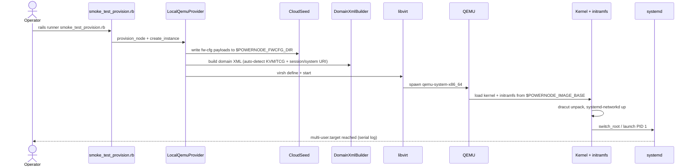
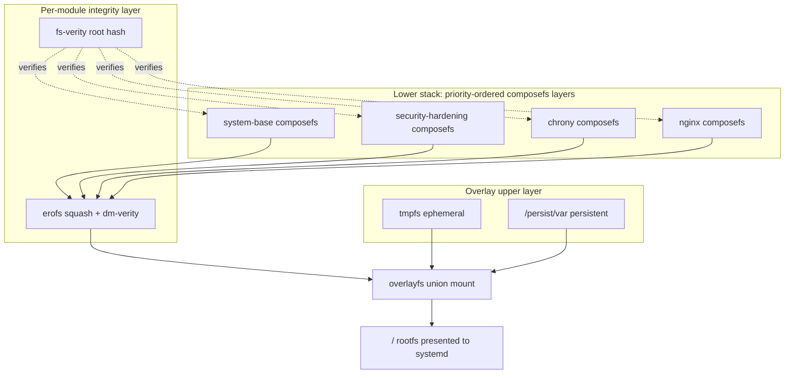

# System Extension Smoke Test

End-to-end validation that the System extension can boot a node, attach a
runtime, build an overlay network, federate, issue certs, provision
storage, exercise hardware / CI publication paths, and run a full
K3s lifecycle smoke — exercised through 28 seeded smoke scripts grouped
into nine passes. Each pass is independently runnable; a clean run of
all nine means the platform's primary capability surface works against
your local environment.

## What this validates — and what it doesn't

**Validates** (platform-side correctness):
- Catalog + provider + libvirt + kernel + initramfs + systemd boot chain
- Container runtime backend wiring (Docker daemon handshake, K3s control plane bootstrap, CNI plugin selection)
- SDWAN topology compilation (host bridges, OVS profiles, OVN models, multi-VRF, IPFIX collectors)
- Federation control flow (Powernode Hub provisioning, cluster_member HA with PG physical replication)
- ACME DNS-01 certificate lifecycle (preflight + live issuance against Let's Encrypt staging)
- Storage assignment shapes (self-hosted via SDWAN; gateway-proxied for external NFS)
- Membership credential lifecycle (issue / verify / refresh / revoke)

**Does NOT validate** (operator-side concerns):
- Real-hardware boot (x86 bare-metal + arm64 SBC + arm64 server) — see **Hardware verification** below
- Production Vault PKI integration — see **Vault PKI state** below
- Real CDN / edge / external-LB integration — out of scope for in-tree smokes
- Long-running fleet behavior (week+ uptime, drift accumulation, cert rotation under load)

## Quick start

If you just want to confirm the boot chain works on your hardware, run the
single-node QEMU smoke and stop there:

```bash
cd server
POWERNODE_LIBVIRT_MODE=real \
POWERNODE_LIBVIRT_URI=qemu:///session \
POWERNODE_IMAGE_BASE=$(realpath ../extensions/system/initramfs/build) \
POWERNODE_FWCFG_DIR=/tmp/powernode-fwcfg \
POWERNODE_SERIAL_LOG_DIR=/tmp/smoke-serial \
bundle exec rails runner \
  "load Rails.root.join('../extensions/system/server/db/seeds/smoke_test_provision.rb')"

# In another shell, watch the kernel boot:
tail -f /tmp/smoke-serial/domain-serial.log
```

Expected outcome: VM reaches `multi-user.target` in ~3–5 s with KVM,
~30 s under TCG (software emulation, no `/dev/kvm`).

For broader validation, work through Pass 1 → Pass 8. Each pass below
states what it adds beyond the previous.

---

## Smoke test catalog

All 28 smoke seeds, grouped by pass. Each is idempotent and DB-level
unless marked **VM**; VM-spawning seeds require the boot prerequisites
listed in [Pass 1](#pass-1--single-node-qemu).

| Seed | Pass | Phase | Validates | Spawns VM? |
|------|------|-------|-----------|------------|
| `smoke_test_provision.rb` | 1 | M4 | Catalog → LocalQemuProvider → libvirt → kernel → initramfs → systemd `multi-user.target` | **VM** |
| `smoke_test_agent_overhaul.rb` | 1 | M5 | On-node Go agent runtime update + reconciliation cycle | no |
| `smoke_test_docker_runtime.rb` | 2 | Phase 1 | Managed `Devops::DockerHost` provisioning, mTLS handshake, daemon config | no |
| `smoke_test_k3s_runtime.rb` | 2 | Phase 2 | K3s server bootstrap, agent reconciler state machine, multi-cluster `target_cluster_id` | no |
| `smoke_test_ovn_k8s_cni.rb` | 2 | O4 | K3s bootstrap config per `cni_plugin` with profile-based auto-defaults | no |
| `smoke_test_host_bridge.rb` | 3 | O1 | HostBridge allocation, BridgeApplier resolver, per-host topology payload | no |
| `smoke_test_ovs_profile.rb` | 3 | O2 | `network_profile` → bridge-kind selection (heavyweight vs lightweight) | no |
| `smoke_test_ovn_models.rb` | 3 | O3 | OVN models + compiler + topology integration; `ovn_control` payload | no |
| `smoke_test_multi_vrf.rb` | 3 | N1a | Multi-network VRF allocation, FRR config compilation, route-leak rendering | no |
| `smoke_test_ipfix_telemetry.rb` | 3 | O5 | IPFIX block stamped on ovs-kind HostBridge entries when collector exists | no |
| `smoke_test_powernode_hub.rb` | 4 | P8.3 | Powernode Hub template (8 modules) end-to-end on local_qemu | **VM** |
| `smoke_test_cluster_member_ha.rb` | 4 | P8.4 | `cluster_member` spawn flow, PG physical replication slot, federation peer | **VM** |
| `smoke_test_acme_preflight.rb` | 5 | P2.5.7 | ACME plumbing audit (Sidekiq cron entries, Traefik dirs, dependent services) | no |
| `smoke_test_acme_issuance.rb` | 5 | P2.5 | End-to-end DNS-01 issuance against Let's Encrypt staging; renew + revoke | no |
| `smoke_test_storage_assignment_self_hosted.rb` | 6 | S7a | `FileManagement::Storage` → SDWAN attachment → assignment materialization | no |
| `smoke_test_storage_assignment_gateway.rb` | 6 | S7b | External NFS proxied through SDWAN-peered gateway | no |
| `smoke_test_membership_credentials.rb` | 7 | N0 | Membership credential issue / verify / refresh / revoke | no |
| `smoke_test_bare_metal_claim.rb` | 8 | P3.5 | Bare-metal physical-device claim flow: `record_discovery!` → `confirm_claim!` → `poll_status` returns bootstrap token | no |
| `smoke_test_disk_image_build_to_publication.rb` | 8 | P2.15c | Disk-image CI webhook round-trip: HMAC-signed POST → DiskImagePublication upserted with matching git_sha + sha256; bad-sig correctly rejected with 200 status=error | no |
| `smoke_test_flannel_over_sdwan.rb` | 8 | K3s overlay | Sdwan::Network pod_subnet_prefix + flannel cluster bootstrap → cluster.metadata["pod_cidr"] stamped + SubnetAdvertisement(source: "pod_subnet") created + bootstrap_config returns flannel_iface/flannel_backend=host-gw/cluster_cidr | no |
| `smoke_test_k3s_site_bootstrap.rb` | 9 | K3s lifecycle ph.1 | SDWAN network + pod_subnet_prefix + k3s-server bootstrap + VIP + SubnetAdvertisement; site-parameterizable via `SMOKE_K3S_SITE=a\|b` | site+ (db tier: synth) |
| `smoke_test_k3s_ha_control_plane.rb` | 9 | K3s lifecycle ph.2 | 3-server HA cluster + VIP failover candidates + synthetic `VirtualIp#failover!` | site+ (db tier: synth) |
| `smoke_test_k3s_agent_join.rb` | 9 | K3s lifecycle ph.3 | 2 k3s-agents join via target_cluster_id + CniProfileMismatch negative test | site+ (db tier: synth) |
| `smoke_test_k3s_pod_plane.rb` | 9 | K3s lifecycle ph.4 | runtime bootstrap_config payload + (site+) nginx deploy + tcpdump on wg-sdwan-* | site+ (db tier: contract only) |
| `smoke_test_k3s_federation.rb` | 9 | K3s lifecycle ph.5 | Sdwan::FederationPeer propose/accept (Site A ↔ Site B) + (site+) cross-site API plane | full (db tier: skip-clean) |
| `smoke_test_k3s_rolling_upgrade.rb` | 9 | K3s lifecycle ph.6 | rolling_module_upgrade executor descriptor + plan synthesis (canary-first batch sequencing) | site+ (db tier: plan only) |
| `smoke_test_k3s_cve_drill.rb` | 9 | K3s lifecycle ph.7 | Synthetic CVE → CveResponseExecutor triage + CveRunbookGenerateExecutor runbook | no |
| `smoke_test_k3s_drain_reprovision.rb` | 9 | K3s lifecycle ph.8 | drain (mark_node_stopped) → terminate → reprovision → re-join → node_count restored | site+ (db tier: synth) |

Most seeds run in **DB-level** mode and complete in under a minute. The VM-spawning
seeds (Pass 1 + Powernode Hub + cluster_member HA) require the boot prerequisites and
run for several minutes per invocation. Pass 9 seeds are tier-gated via
`SMOKE_K3S_LEVEL` (`db` | `single` | `site` | `full`); at db tier each phase runs in
operator-driven mode synthesizing the agent-side state transitions, at site+ tiers
the phases boot real VMs and let the on-node agent drive the lifecycle.

---

## Pass 1 — Single-node QEMU

The boot chain. Validates that an empty database + an initramfs build produces
a running VM that reaches `multi-user.target`.

### Sequence



### Prerequisites

| Requirement | How |
|---|---|
| QEMU + libvirt | `sudo apt install qemu-system-x86 libvirt-daemon-system libvirt-clients virtinst` |
| dracut | `sudo apt install dracut dracut-network` |
| Boot tools | `sudo apt install mmdebstrap fsverity xorriso skopeo erofs-utils` |
| Sigstore tools | `~/.local/bin/{cosign,syft,grype,oras}` (download from upstream releases) |
| Go toolchain | `sudo apt install golang-go` (≥1.22) |
| dracut module symlink | `sudo ln -sfn $PWD/extensions/system/initramfs/modules.d/90powernode /usr/lib/dracut/modules.d/90powernode` |
| `qemu-bridge-helper` capability (only `POWERNODE_NETWORK_MODE=bridge`) | Auto-installed by `scripts/systemd/powernode-installer.sh` via `powernode-qemu-bridge-cap.service`. Manual: `sudo setcap cap_net_admin+ep /usr/lib/qemu/qemu-bridge-helper`. Without this, `virsh start` fails with `failed to create tun device: Operation not permitted`. |

`/dev/kvm` is **optional** — without it the domain XML uses `<domain type='qemu'>`
(TCG software emulation; slower but functional).

### Setup steps

```bash
# 1. Build the agent
cd extensions/system/agent
go mod tidy
make build-amd64
mkdir -p ../initramfs/scripts
cp dist/powernode-agent-linux-amd64 ../initramfs/scripts/powernode-agent-amd64

# 2. Build the kernel + initramfs
cd ../initramfs
bash build.sh --arch amd64 --variants kernel-initrd
# → build/amd64/kernel-initrd/{kernel,initramfs.cpio.zst,SHA256SUMS}

# 3. Seed the node-module catalog (idempotent)
cd ../../../server
bundle exec rails runner \
  "load Rails.root.join('../extensions/system/server/db/seeds/node_module_catalog.rb')"

# 4. Run the smoke seed (real mode)
POWERNODE_LIBVIRT_MODE=real \
POWERNODE_LIBVIRT_URI=qemu:///session \
POWERNODE_IMAGE_BASE=$(realpath ../extensions/system/initramfs/build) \
POWERNODE_FWCFG_DIR=/tmp/powernode-fwcfg \
POWERNODE_SERIAL_LOG_DIR=/tmp/smoke-serial \
SMOKE_NODE_NAME=smoke-real-1 \
SMOKE_INSTANCE_NAME=smoke-real-1-vm \
bundle exec rails runner \
  "load Rails.root.join('../extensions/system/server/db/seeds/smoke_test_provision.rb')"

# 5. Watch the kernel boot
tail -f /tmp/smoke-serial/domain-serial.log

# 6. Cleanup
virsh -c qemu:///session list --all
virsh -c qemu:///session destroy powernode-smoke-<XXXXXXXX>
virsh -c qemu:///session undefine powernode-smoke-<XXXXXXXX> --nvram
```

The serial log shows the kernel cmdline (`lockdown=integrity ima_appraise=enforce powernode.boot=1`),
dracut unpacking, systemd-networkd configuring the virtio NIC, and systemd reaching
`multi-user.target`.

### Two-mode runner

`POWERNODE_LIBVIRT_MODE=local` runs the `RecorderRunner` — no VM starts, but
the bootstrap token issues, domain XML builds, and the adapter chain returns
success. Use this for fast iteration on the platform-side code path without
waiting for boot. Set `=real` for the actual libvirt boot.

### Environment variables

| Var | Default | Purpose |
|---|---|---|
| `POWERNODE_LIBVIRT_MODE` | `local` (dev) / `real` (prod) | `real` → LibvirtRunner; `local` → RecorderRunner; `disabled` → error fast |
| `POWERNODE_LIBVIRT_URI` | `qemu:///system` | `qemu:///session` skips libvirt group / sudo dance |
| `POWERNODE_LIBVIRT_NETWORK` | `default` | name of libvirt network (system-mode only) |
| `POWERNODE_NETWORK_MODE` | `user` (session) / `network` (system) | `user` (slirp NAT), `network` (libvirt virbr0+dnsmasq), or `bridge` (true LAN bridge) |
| `POWERNODE_BRIDGE_NAME` | `br0` | name of the host bridge interface when mode=bridge |
| `POWERNODE_IMAGE_BASE` | `/var/lib/powernode/images` | dir containing `<arch>/kernel-initrd/{kernel,initramfs.cpio.zst}` |
| `POWERNODE_FWCFG_DIR` | `/var/run/powernode-fwcfg` | where CloudSeed writes virtio-fw-cfg payloads |
| `POWERNODE_SERIAL_LOG_DIR` | (unset) | when set, redirects domain serial console to a per-domain log file |
| `POWERNODE_DISK_DIR` | `/var/lib/libvirt/images` | dir containing pre-staged `<domain>.qcow2` (skipped when not present) |
| `POWERNODE_PLATFORM_URL` | `http://localhost:3000` | URL the agent dials for `/node_api/enroll` |
| `POWERNODE_CA_PEM` | fixture PEM | inline CA chain (until `InternalCaService.public_chain` lands via Vault PKI — see **Vault PKI state**) |

---

## Pass 2 — Container runtimes

Three DB-level smokes that exercise the container-runtime backend stack without
requiring a live `dockerd` or `k3s` install. Validates that the platform
correctly assembles per-host runtime configuration and that operator API +
worker API + MCP surface align.

| Seed | Validates |
|---|---|
| `smoke_test_docker_runtime.rb` | Phase 1 Docker — managed `Devops::DockerHost`, `InternalCaService` TLS provisioning, daemon config + cascade-FK decommission |
| `smoke_test_k3s_runtime.rb` | Phase 2 K3s — cluster provisioner, agent reconciler state machine, multi-cluster `metadata.target_cluster_id` join validation |
| `smoke_test_ovn_k8s_cni.rb` | Phase O4 — K3s bootstrap config per `cni_plugin` (flannel/cilium/ovn-kubernetes) with profile-based auto-defaults |

```bash
cd server
for seed in docker_runtime k3s_runtime ovn_k8s_cni; do
  bundle exec rails runner \
    "load Rails.root.join('../extensions/system/server/db/seeds/smoke_test_${seed}.rb')"
done
```

Companion runbook for live operator workflow: [`docs/CONTAINER_RUNTIMES.md`](./CONTAINER_RUNTIMES.md).

---

## Pass 3 — SDWAN topology compilation

Five DB-level smokes for the SDWAN slice 9 / Phase O network topology
pipeline. Validates that operator intent (network profile + collectors +
peers + VRFs) compiles to correct per-host payloads delivered via
`/node_api/topology`.

| Seed | Validates |
|---|---|
| `smoke_test_host_bridge.rb` | Phase O1 — HostBridge allocation, BridgeApplier resolver round-trip |
| `smoke_test_ovs_profile.rb` | Phase O2 — heavyweight hosts get OVS bridges, Pi-class hosts get Linux bridges |
| `smoke_test_ovn_models.rb` | Phase O3 — OVN logical switch/router/ACL/port models + `ovn_control` per-host payload |
| `smoke_test_multi_vrf.rb` | Phase N1a — VRFs allocated across networks; FRR config + route-leak directives |
| `smoke_test_ipfix_telemetry.rb` | Phase O5 — IPFIX collector stamped on ovs-kind bridges, skipped for linux-kind |

```bash
cd server
for seed in host_bridge ovs_profile ovn_models multi_vrf ipfix_telemetry; do
  bundle exec rails runner \
    "load Rails.root.join('../extensions/system/server/db/seeds/smoke_test_${seed}.rb')"
done
```

Companion runbook: [`docs/runbooks/sdwan-network-setup.md`](./runbooks/sdwan-network-setup.md).

---

## Pass 4 — Federation

Two VM-spawning smokes that exercise the federation control plane. Both
require the same boot prerequisites as Pass 1.

| Seed | Validates |
|---|---|
| `smoke_test_powernode_hub.rb` | P8.3 — provisions the `powernode-hub` template (all 8 platform modules) on local_qemu; waits for agent enroll + heartbeat; exercises each module's expected service surface |
| `smoke_test_cluster_member_ha.rb` | P8.4 — cluster_member spawn flow end-to-end: parent platform creates federation peer in `cluster_member` mode, replica setup service materializes PG physical replication slot |

```bash
cd server
POWERNODE_LIBVIRT_MODE=real \
POWERNODE_LIBVIRT_URI=qemu:///session \
POWERNODE_IMAGE_BASE=$(realpath ../extensions/system/initramfs/build) \
bundle exec rails runner \
  "load Rails.root.join('../extensions/system/server/db/seeds/smoke_test_powernode_hub.rb')"
```

Companion runbooks: [`docs/runbooks/federation-setup.md`](./runbooks/federation-setup.md),
[`docs/runbooks/federation-troubleshooting.md`](./runbooks/federation-troubleshooting.md).

---

## Pass 5 — ACME

Two smokes for the certificate lifecycle. Preflight audits plumbing (no
external calls); issuance exercises real DNS-01 against Let's Encrypt
staging.

| Seed | Validates | External deps |
|---|---|---|
| `smoke_test_acme_preflight.rb` | Sidekiq cron entries registered, Traefik dirs exist, ACME models present, schema columns aligned | none |
| `smoke_test_acme_issuance.rb` | DNS-01 issuance against Let's Encrypt staging; manual renew; revoke + on-disk cleanup | DNS provider token (Cloudflare / Hetzner / DigitalOcean), test domain |

```bash
cd server
# Preflight first (no external calls)
bundle exec rails runner \
  "load Rails.root.join('../extensions/system/server/db/seeds/smoke_test_acme_preflight.rb')"

# Then live issuance (needs DNS token in env)
ACME_DNS_PROVIDER=cloudflare \
ACME_DNS_TOKEN=$CF_TOKEN \
ACME_TEST_DOMAIN=dev.example.com \
bundle exec rails runner \
  "load Rails.root.join('../extensions/system/server/db/seeds/smoke_test_acme_issuance.rb')"
```

Companion runbook: [`docs/runbooks/acme-smoke.md`](./runbooks/acme-smoke.md)
(operator-side: 6 scenarios — issue, renew, dual-NAT, LAN-preference, failover, revoke).

---

## Pass 6 — Storage assignment

Two DB-level smokes for the two storage shapes the System extension supports.

| Seed | Validates |
|---|---|
| `smoke_test_storage_assignment_self_hosted.rb` | Phase S7a Shape 1 — `FileManagement::Storage` creation → SDWAN attachment → per-instance assignment materialization |
| `smoke_test_storage_assignment_gateway.rb` | Phase S7b Shape 2 — external NFS upstream proxied through SDWAN-peered gateway |

```bash
cd server
for seed in storage_assignment_self_hosted storage_assignment_gateway; do
  bundle exec rails runner \
    "load Rails.root.join('../extensions/system/server/db/seeds/smoke_test_${seed}.rb')"
done
```

---

## Pass 7 — Membership credentials

One DB-level smoke that exercises the credential lifecycle.

| Seed | Validates |
|---|---|
| `smoke_test_membership_credentials.rb` | Phase N0 — issue / verify / refresh / revoke against live database |

```bash
cd server
bundle exec rails runner \
  "load Rails.root.join('../extensions/system/server/db/seeds/smoke_test_membership_credentials.rb')"
```

A companion VM-mesh smoke that spawns nodes and exercises mTLS handshakes
across the mesh is a future addition (the file is not present on disk
today; the seed header for `smoke_test_membership_credentials.rb` reserves
the name `smoke_test_membership_credentials_vm.rb` for when the VM
companion lands). Until it ships, this in-tree DB-level pass is the only
in-tree exerciser for the credential lifecycle.

---

## Pass 8 — Hardware / CI extras

Two DB-level smokes that exercise the hardware-claim path (without
requiring real hardware) and the disk-image CI publication round-trip
(without requiring a Gitea runner). Both are recent additions covering
P3.5 (bare-metal claim) and P2.15c (disk image CI publication).

| Seed | Validates |
|---|---|
| `smoke_test_bare_metal_claim.rb` | P3.5 — bare-metal physical-device claim flow: `record_discovery!` → `confirm_claim!` → `poll_status` returns bootstrap token |
| `smoke_test_disk_image_build_to_publication.rb` | P2.15c — disk image CI webhook round-trip: HMAC-signed POST → `DiskImagePublication` upserted with matching `git_sha` + `sha256`; bad-signature requests correctly rejected with HTTP 200 status `error` (the inbound-webhook never-500 rule per parent CLAUDE.md) |
| `smoke_test_flannel_over_sdwan.rb` | K3s overlay (2026-05-19) — `Sdwan::Network.pod_subnet_prefix` set + flannel cluster bootstrap stamps `cluster.metadata["pod_cidr"]` + creates `Sdwan::SubnetAdvertisement(source: "pod_subnet")` + bootstrap_config returns `flannel_iface` / `flannel_backend=host-gw` / `cluster_cidr` for the agent |

```bash
cd server
for seed in bare_metal_claim disk_image_build_to_publication; do
  bundle exec rails runner \
    "load Rails.root.join('../extensions/system/server/db/seeds/smoke_test_${seed}.rb')"
done
```

Pass 8 is the lightest by runtime (each completes in <10 s) and the highest
operational leverage for confirming that the bare-metal onboarding and
disk-image publication paths still resolve against current code as
operator-visible APIs evolve.

---

## Pass 9 — K3s full-lifecycle smoke

Tier-gated end-to-end smoke that exercises the full K3s + SDWAN capability
surface: bootstrap, HA control plane with VIP failover, agent join,
flannel-over-SDWAN pod plane, cross-site federation, rolling module
upgrade, CVE drill, and drain + reprovision. Operates in operator-driven
mode at db tier (no VMs, ~5 min) and agent-driven mode at single+ tiers
(real VM boot + on-VM agent → runtime_controller handshake).

| Phase | Seed | Min tier | Validates at db tier |
|-------|------|----------|----------------------|
| 1 | `smoke_test_k3s_site_bootstrap.rb` | db | bootstrap + pod_cidr + VIP + SubnetAdvertisement |
| 2 | `smoke_test_k3s_ha_control_plane.rb` | db | 3-server cluster + synthetic VIP failover |
| 3 | `smoke_test_k3s_agent_join.rb` | db | target_cluster_id join + CniProfileMismatch negative |
| 4 | `smoke_test_k3s_pod_plane.rb` | site | bootstrap_config contract; full kubectl/tcpdump at site+ |
| 5 | `smoke_test_k3s_federation.rb` | full | (skipped at db; requires both sites + federation) |
| 6 | `smoke_test_k3s_rolling_upgrade.rb` | db | executor descriptor + plan synthesis (canary-first) |
| 7 | `smoke_test_k3s_cve_drill.rb` | db | synthetic CVE → triage + runbook generation |
| 8 | `smoke_test_k3s_drain_reprovision.rb` | db | drain → terminate → reprovision → node_count restored |

### Quick invocation (db tier, ~5 min, no VMs)

```bash
cd server
export SMOKE_K3S_AUTO_CLEAN=1 SMOKE_K3S_LEVEL=db
for phase in site_bootstrap ha_control_plane agent_join pod_plane federation \
             rolling_upgrade cve_drill drain_reprovision; do
  bundle exec rails runner \
    "load Rails.root.join('../extensions/system/server/db/seeds/smoke_test_k3s_${phase}.rb')"
done
```

Expected outcome: phases 1, 2, 3, 4, 6, 7, 8 print `✅ Phase N complete`;
phase 5 (federation) prints `⊘ skipped (phase requires SMOKE_K3S_LEVEL >= full)`.

### Higher tiers

For `single` / `site` / `full` tiers (real VM boot via LocalQemuProvider),
see [`runbooks/k3s-smoke-full-lifecycle.md`](runbooks/k3s-smoke-full-lifecycle.md)
for the full env template + per-phase invocation + troubleshooting.

State sidecar at `/tmp/smoke-k3s-state.json` accumulates cluster IDs across
phases; delete it to start over from phase 1. Setting `SMOKE_K3S_PAUSE=1`
adds checkpoints between phase sections for step-through debugging.

---

## Observability — what each pass emits

Every smoke pass emits `FleetEvent` rows persisted to the
`System::FleetEvent` table (90-day routine retention, 365-day critical
retention) and broadcasts them on `SystemFleetChannel` for live UI updates.

Each event has a `kind` (event type), `severity` (`info` / `warn` / `error` / `critical`),
`payload` (JSONB), and `correlation_id` (links events to the same operation).

| Pass | Notable event kinds |
|---|---|
| 1 — single-node QEMU | `system.instance.provisioned`, `system.bootstrap_token.issued`, `system.libvirt.domain_started`, `system.kernel.booted`, `system.agent.enrolled`, `system.heartbeat.received` |
| 2 — container runtimes | `system.docker.provisioned`, `system.k3s.cluster_bootstrapped`, `system.k3s.agent_joined`, `system.cni.configured` |
| 3 — SDWAN | `system.sdwan.topology_compiled`, `system.sdwan.host_bridge.allocated`, `system.sdwan.ovn.applied`, `system.sdwan.vrf.routed`, `system.sdwan.ipfix.collector_attached` |
| 4 — federation | `system.federation.hub_provisioned`, `system.federation.peer.cluster_member.spawned`, `system.federation.replication.slot_created` |
| 5 — ACME | `system.acme.preflight_passed`, `system.acme.certificate.issued`, `system.acme.certificate.renewed`, `system.acme.certificate.revoked` |
| 6 — storage | `system.storage.assignment.materialized`, `system.storage.gateway.proxied` |
| 7 — credentials | `system.credential.issued`, `system.credential.refreshed`, `system.credential.revoked` |
| 8 — hardware / CI extras | `system.physical_device.discovered`, `system.physical_device.claimed`, `system.bootstrap_token.issued`, `system.disk_image_published`, `system.disk_image_publish_failed` |
| 9 — K3s lifecycle | `system.cluster_bootstrap.pod_subnet_prefix_ignored` (ovn-K8s warning), `system.federation.peer.proposed`, `system.federation.peer.accepted`. Cluster-level diagnostic also persists to `cluster.metadata["bootstrap_events"]` (capped at most-recent 50) with phase/status/message entries for each lifecycle transition. |

Inspect after a smoke run:

```bash
cd server
bundle exec rails runner '
  puts System::FleetEvent.where("created_at > ?", 1.hour.ago).order(:created_at).map { |e|
    [e.created_at.iso8601, e.kind, e.severity, e.correlation_id&.first(8)].join(" | ")
  }.join("\n")
'
```

---

## Vault PKI state

**Honest current state** (per `project_vault_pki_state` memory):

- Vault is deployed via `docs/infrastructure/vault-example/` and uses manual
  Shamir unseal + KV v2 + AppRole authentication.
- **Vault's PKI engine is NOT mounted** in any current dev environment. The
  `InternalCaService.VaultCaAdapter` was implemented as part of M0.N but is
  blocked from production use until `pki_int` is mounted + a `node` role is
  defined + auto-unseal is configured.
- `LocalCaAdapter` (the fixture-PEM path) works for dev + smoke. Set the
  `POWERNODE_CA_PEM` env var to override the bundled fixture chain.
- Production deployments must mount `pki_int` and the `node` role **before**
  agent enrollment will work against real Vault-issued certificates. The
  fixture path is intentionally not production-grade.

**What this means for the smokes:**

- Pass 1 / Pass 4 / Pass 5 all use the LocalCaAdapter today. Agent enrollment,
  module pull, and ACME issuance all succeed against the fixture CA chain.
- The transition to Vault-issued certs is a deployment-side change, not a
  code-side change. The smokes will continue to pass as the platform moves
  to production Vault PKI.

For DR scenarios + the orchestrated `CredentialRestorationService`, see
[`docs/runbooks/vault-credential-restoration.md`](./runbooks/vault-credential-restoration.md)
and the design reference [`docs/credential-restoration.md`](./credential-restoration.md).

---

## Overlay-union root composition

The booted VM in Pass 1 / Pass 4 doesn't ship a monolithic root filesystem —
it composes one from priority-ordered, per-module composefs layers, each
backed by erofs+dm-verity for tamper detection.



- **composefs** is the lower-layer file-tree assembler; each module supplies
  a content-addressed blob set + a metadata-only "compose" file that
  references blobs by hash.
- **erofs + dm-verity** wrap each module's content blobs in a read-only,
  cryptographically-verified mount. Tampering with a module's bytes after
  publication is detected at file-open time.
- **overlayfs** composes the priority-ordered lowers into a unified rootfs.
  The upper layer is `tmpfs` for ephemeral instances or a bind-mount of
  `/persist/var` for persistent instances.
- **fs-verity** root hashes match `NodeModuleVersion.fsverity_root_hash`
  recorded at module publication. Per-instance attestation: the agent
  reports observed hashes via heartbeat; the platform compares against the
  recorded value and emits `system.module_drift` events on mismatch.

The agent's `internal/mount/` package implements this composition logic;
its `internal/oci/` package pulls module artifacts; its `internal/verify/`
package performs the hash chain validation before activating any module.

---

## Hardware verification (M3.5)

What the in-tree smokes **cannot** validate:

| Real-hardware concern | Why QEMU smokes don't cover it | Status |
|---|---|---|
| x86 bare-metal iPXE chainload | QEMU UEFI firmware behaves subtly differently than real OVMF + signed bootloader chain | M3.5 blocked on hardware |
| arm64 SBC boot (Raspberry Pi 4, Pi 5) | RPi firmware + device tree are non-UEFI; needs rpi4-firmware module on real hardware | M3.5 blocked on hardware |
| arm64 server UEFI boot | Server-grade EDK2 firmware paths differ from RPi-class boot | M3.5 blocked on hardware |
| Real LUKS keyslot + TPM sealing | QEMU's swtpm is functional but not architecturally identical to a discrete TPM | Deferred |
| Real bridge frame forwarding (non-nested-virt) | Nested L1 KVM guests have asymmetric MAC handling; see cookbook below | Cookbook documented; real hardware untested |

Recommend covering these via a dedicated hardware test rig that boots one
amd64 + one arm64 + one Pi-class node per release candidate, runs the
in-tree smokes through `/node_api/enroll`, and signs off via
`acceptance/hardware-<release>.md`.

---

## Cookbook recipes

Useful real-world incantations that don't fit into the catalog above.

### Watch the boot live

```bash
mkdir -p /tmp/smoke-serial
POWERNODE_SERIAL_LOG_DIR=/tmp/smoke-serial   # …run smoke_test_provision.rb
tail -f /tmp/smoke-serial/domain-serial.log
```

### Inspect fw-cfg from inside the VM (when agent is running)

```sh
cat /sys/firmware/qemu_fw_cfg/by_name/opt/com.powernode/instance_uuid
cat /sys/firmware/qemu_fw_cfg/by_name/opt/com.powernode/bootstrap_token
```

### Re-define after fixing code (no full rerun needed)

```bash
virsh -c qemu:///session destroy <domain> && \
virsh -c qemu:///session undefine <domain> --nvram
# …re-run smoke_test_provision.rb
```

### Force VM to use TCG even if /dev/kvm exists (for cross-arch testing)

```ruby
# extensions/system/server/app/services/system/providers/local_qemu/domain_xml_builder.rb
domain_type = ENV["POWERNODE_FORCE_TCG"] == "1" ? "qemu" : (File.exist?("/dev/kvm") ? "kvm" : "qemu")
```

(not yet wired — TODO if cross-arch testing becomes needed)

### Bridged networking with upstream LAN DHCP

Three modes are supported via `POWERNODE_NETWORK_MODE`:

| Mode | VM IP source | Host setup | When to use |
|---|---|---|---|
| `user` | qemu slirp (10.0.2.15) | none | quick smoke; VM-to-host via 10.0.2.2 NAT |
| `network` | libvirt dnsmasq (192.168.122.x) | virbr0 active (already is on this host) | DHCP w/ stable IPs but still NAT'd |
| `bridge` | upstream router DHCP (LAN address) | a Linux bridge with the host's NIC enslaved | VM is a peer on the LAN |

**Host bridge setup (NetworkManager renderer):**

```bash
# 1. Find the existing wired connection name
nmcli -g NAME,DEVICE con show --active | grep enp6s18

# 2. Create the bridge
sudo nmcli con add type bridge ifname br0 con-name br0
sudo nmcli con modify br0 ipv4.method auto ipv6.method auto

# 3. Move the wired NIC into the bridge (replace <wired-con-name> with output from step 1)
sudo nmcli con add type bridge-slave ifname enp6s18 master br0 con-name br0-slave-enp6s18
sudo nmcli con down "<wired-con-name>"      # WARNING: drops your SSH session if remote
sudo nmcli con up br0
sudo nmcli con modify "<wired-con-name>" autoconnect no    # prevent revert on reboot

# 4. Verify the bridge has the host's IP and the upstream gateway
ip -br addr show br0
ip route show default
```

**Allow `qemu:///session` VMs to attach** (qemu-bridge-helper is setuid root and
consults this allowlist):

```bash
sudo mkdir -p /etc/qemu
echo 'allow br0' | sudo tee -a /etc/qemu/bridge.conf
sudo chmod 0640 /etc/qemu/bridge.conf
sudo chgrp kvm /etc/qemu/bridge.conf      # so the helper can read it
```

**Run the smoke provision in bridge mode:**

```bash
cd server
POWERNODE_LIBVIRT_MODE=real \
POWERNODE_LIBVIRT_URI=qemu:///session \
POWERNODE_NETWORK_MODE=bridge \
POWERNODE_BRIDGE_NAME=br0 \
POWERNODE_IMAGE_BASE=$(realpath ../extensions/system/initramfs/build) \
POWERNODE_FWCFG_DIR=/tmp/powernode-fwcfg \
POWERNODE_SERIAL_LOG_DIR=/tmp/smoke-serial \
SMOKE_NODE_NAME=smoke-bridge-1 \
SMOKE_INSTANCE_NAME=smoke-bridge-1-vm \
bundle exec rails runner \
  "load Rails.root.join('../extensions/system/server/db/seeds/smoke_test_provision.rb')"

# Verify the VM got a real LAN lease
sudo arp -an | grep 52:54:00     # qemu virtio MACs prefix
ip neigh | grep 52:54:00
```

**Caveats specific to nested-virt hosts:**

If your dev box is itself a KVM L1 guest (`systemd-detect-virt=kvm`), a true LAN
bridge requires the L0 hypervisor to allow MAC spoofing on the L1 vNIC. Otherwise,
frames originating from the VM's MAC are silently dropped.

- **Proxmox**: VM → Network → check "MAC filtering: off" or set "trunk" mode.
- **libvirt L0**: remove any `<filterref filter='clean-traffic'/>` from the L1 domain XML.
- **KubeVirt**: add `spec.template.spec.networks[].pod.macAllowance: All` (or use `multus` with a bridge that doesn't filter).
- **VMware ESXi**: enable "Promiscuous mode: Accept" + "MAC address changes: Accept" + "Forged transmits: Accept" on the L1 portgroup.

If the bridge is up but VM packets don't get DHCP responses, check
`tcpdump -i br0 port 67 or port 68` from the host — if you see DHCPDISCOVER
going out but no DHCPOFFER coming back, that's the L0 dropping foreign-MAC frames.

### Post-VMX (KVM-enabled) sanity check

After a cold boot with VMX enabled at L0:

```bash
# 1. Verify the kernel sees CPU virt extensions
grep -m1 -oE 'vmx|svm' /proc/cpuinfo

# 2. Verify the KVM modules loaded
lsmod | grep -E 'kvm_intel|kvm_amd|^kvm '

# 3. Verify the device file exists
ls -la /dev/kvm

# 4. Check libvirt picks it up
sudo virsh -c qemu:///system capabilities | grep -A 1 '<domain'

# 5. Re-run the smoke provision (same env vars as before)
cd server
POWERNODE_LIBVIRT_MODE=real \
POWERNODE_LIBVIRT_URI=qemu:///session \
POWERNODE_IMAGE_BASE=$(realpath ../extensions/system/initramfs/build) \
POWERNODE_FWCFG_DIR=/tmp/powernode-fwcfg \
POWERNODE_SERIAL_LOG_DIR=/tmp/smoke-serial \
SMOKE_NODE_NAME=smoke-kvm-1 \
SMOKE_INSTANCE_NAME=smoke-kvm-1-vm \
bundle exec rails runner \
  "load Rails.root.join('../extensions/system/server/db/seeds/smoke_test_provision.rb')"

# 6. Verify the auto-detected domain type
virsh -c qemu:///session dumpxml smoke-kvm-1-vm | grep -E "domain type|cpu mode"
# Expected: <domain type='kvm' …> and <cpu mode='host-passthrough' …>

# 7. Watch boot — should reach multi-user.target in ~3–5s instead of ~30s
tail -f /tmp/smoke-serial/domain-serial.log
```

If `/dev/kvm` is still missing after a warm `reboot`, do a full `poweroff` +
power-on. Some hypervisors only re-evaluate guest CPU feature flags on cold boot.

---

## Tutorial cross-reference

Each smoke pass validates a platform-level capability; each tutorial in
[`docs/tutorials/`](./tutorials/) walks the matching operator-facing
workflow.

| Pass | Capability | Tutorial |
|---|---|---|
| 1 | Single-node QEMU boot | [`tutorials/01-first-boot.md`](./tutorials/01-first-boot.md) |
| 2 | Container runtime — Docker | [`tutorials/03-docker-runtime.md`](./tutorials/03-docker-runtime.md) |
| 2 | Container runtime — K3s | [`tutorials/04-k3s-cluster.md`](./tutorials/04-k3s-cluster.md), [`tutorials/05-multi-cluster-k3s.md`](./tutorials/05-multi-cluster-k3s.md) |
| 3 | SDWAN | [`tutorials/05-multi-cluster-k3s.md`](./tutorials/05-multi-cluster-k3s.md) (per-tenant network), [`tutorials/11-federation.md`](./tutorials/11-federation.md) |
| 4 | Federation | [`tutorials/11-federation.md`](./tutorials/11-federation.md) |
| 5 | ACME | [`docs/runbooks/acme-issuance.md`](./runbooks/acme-issuance.md) |
| 6 | Storage | covered inline within [`tutorials/03-docker-runtime.md`](./tutorials/03-docker-runtime.md) when persistent volumes are introduced |
| 7 | Membership credentials | covered inline within [`tutorials/11-federation.md`](./tutorials/11-federation.md) |

All 12 tutorials are live; the seed catalog above remains the
authoritative source for platform-level smoke validation, while the
tutorials cover the operator-facing workflows that exercise the same
capabilities. Pass 8 (hardware / CI extras) has no dedicated tutorial yet
— the bare-metal claim flow is exercised inline within
[`tutorials/12-disk-image-ci.md`](./tutorials/12-disk-image-ci.md) when
the operator publishes a platform image.
