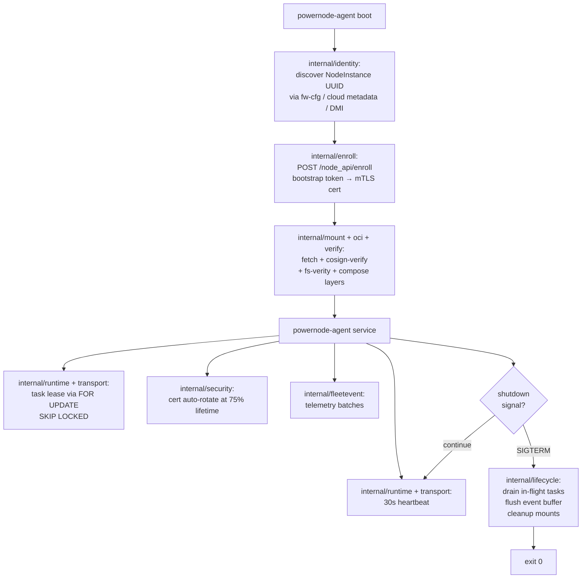
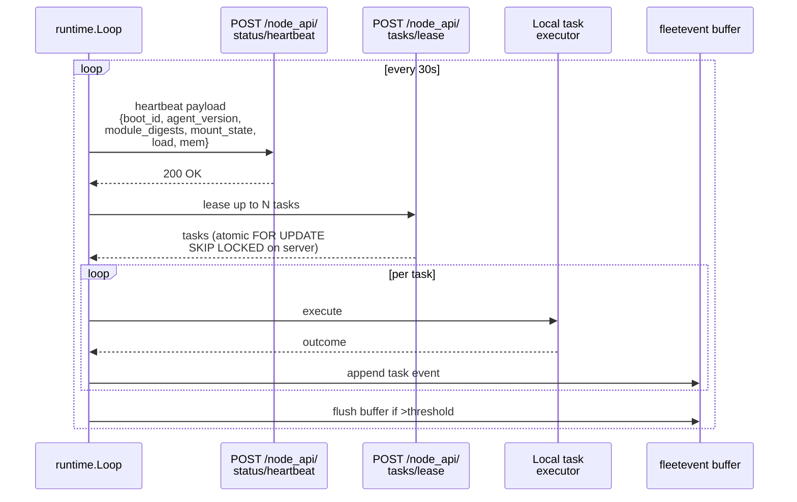
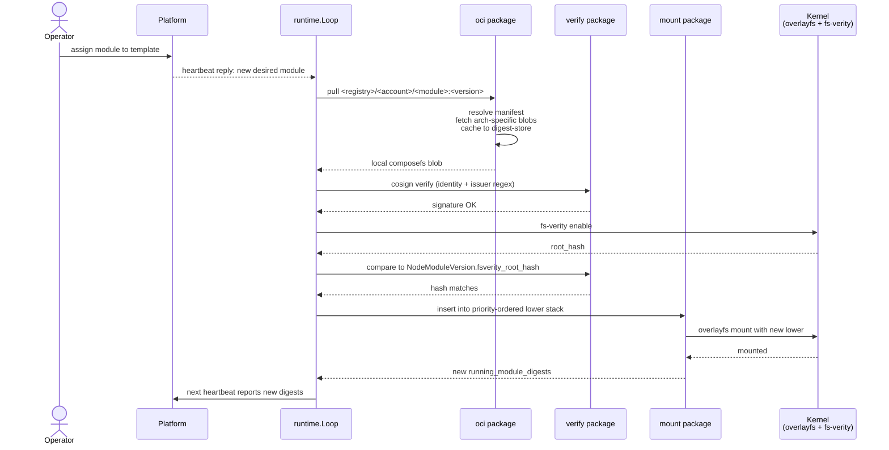
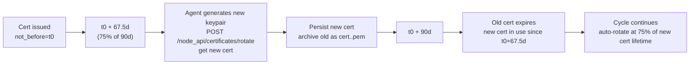

# Powernode Agent — Internals Reference

The `powernode-agent` Go binary is the on-node runtime — a single static
binary (~20MB), embedded in the initramfs, runs as PID 1's child via
systemd after switch_root. This document is the package-by-package
reference for contributors hacking on the agent and operators debugging
production issues.

**Audience:** Go contributors to the System extension, SREs debugging
agent behavior on running nodes.

**Companion docs:**
- [`agent/README.md`](../agent/README.md) — build / test / lint reference
- [`ARCHITECTURE.md`](./ARCHITECTURE.md) §2 — design-level agent overview
- [`SMOKE_TEST.md`](./SMOKE_TEST.md) Pass 1 — boot chain validation

## Lifecycle



## Package map — 23 internal packages

The agent's `internal/` directory contains 23 packages. Each is a tight
domain unit with focused responsibilities; no cross-package state.

### Identity + enrollment

| Package | Responsibility |
|---------|----------------|
| `identity` | NodeInstance UUID discovery cascade: kernel cmdline → virtio-fw-cfg → cloud metadata (AWS IMDSv2 / GCP / Azure / DO / Hetzner / KubeVirt / vSphere) → DMI SMBIOS → local `identity.cfg` fallback. Returns a `Resolver` with chained strategy fallthrough. |
| `enroll` | Bootstrap token → mTLS cert exchange via POST `/node_api/enroll`. Generates Ed25519 keypair, builds CSR, persists cert at `/persist/var/lib/powernode/pki/` (mode 0600). |

### Transport + security

| Package | Responsibility |
|---------|----------------|
| `transport` | mTLS HTTP client for `/node_api/*`. Certificate pinning, automatic CA chain refresh, exponential backoff on platform unreachable. |
| `security` | Capability dropping, seccomp filter application to the agent process itself, per-module SELinux/AppArmor profile loading on attach, IMA/EVM integration. |
| `verify` | Cosign signature verification (per-module trust policy: `cosign_identity_regexp` + `cosign_issuer_regexp`), fs-verity root hash verification against `NodeModuleVersion.fsverity_root_hash`. |

### Storage + mounting

| Package | Responsibility |
|---------|----------------|
| `fsutil` | Low-level filesystem operations (overlayfs mount calls, tmpfs setup, bind mount helpers). |
| `mount` | High-level mount orchestration. Composes priority-ordered composefs lowers into an overlayfs union mount. Upper layer is `tmpfs` (ephemeral) or `/persist/var` bind (persistent). |
| `oci` | OCI artifact fetch via `github.com/oras-project/oras-go/v2`. Manifest resolution + per-arch blob pull + local digest-store cache. |
| `storage` | LUKS keyslot management, TPM2 unsealing, /persist partition orchestration. Falls back to Vault-fetched unwrap when TPM absent. |

### Runtime services

| Package | Responsibility |
|---------|----------------|
| `runtime` | The long-lived `service` subcommand main loop. 30s heartbeat tick, task lease, cert rotation timer, event buffer flush. |
| `lifecycle` | Graceful shutdown path. SIGTERM → drain in-flight tasks, flush event buffer, unmount cleanly, exit 0. |
| `boot` | First-boot path (initramfs init-bottom hook). Discovers identity, runs enroll, mounts initial modules, hands off to systemd. |
| `systemd` | Generation + installation of the `powernode-agent-boot.service` systemd unit baked into initramfs (M3 follow-up — replaces the dracut hook approach). |

### Module + manifest handling

| Package | Responsibility |
|---------|----------------|
| `manifest` | Parses `manifest.yaml` from each module artifact: identity, package_spec, file_spec, dependency_spec, cosign trust policy, declared skills. |
| `migration` | On-node data migration for module version bumps. Hooks into the rolling upgrade flow when a module's new version requires schema or data changes inside the module's persistent state. |

### Runtime integrations

| Package | Responsibility |
|---------|----------------|
| `dockerd` | Phase 1 Docker runtime handshake. Generates Ed25519 server keypair, posts CSR via `runtime/handshake` phase=`wants_cert`, receives signed cert, writes `daemon.json` binding to SDWAN /128, starts `docker.service`. |
| `k3sd` | Phase 2 K3s runtime handshake. Manages `k3s-server` vs `k3s-agent` mode based on assigned module; captures k3s-generated kubeconfig + tokens; posts via `bootstrap` / `join_request` phases. |

### Networking

| Package | Responsibility |
|---------|----------------|
| `sdwan` | Local WireGuard interface configuration based on platform-issued topology payload. Bridge / VRF / OVN port wiring. Handles topology refresh when the platform updates desired state. |
| `tcpfwd` | Local port forwarding (DNAT) for SDWAN port mappings. Implements `sdwan.port_mapping_*` actions at the kernel level via `iptables` / `nftables`. |

### Federation + peering

| Package | Responsibility |
|---------|----------------|
| `agent_peer` | NodeInstance-as-Agent peering: `Announce` to platform on first heartbeat, expose declared skills, receive remote task delegations from operators. See [`docs/agent-peering.md`](./agent-peering.md). |
| `federation` | Cross-platform federation client. Sovereign auth handshake (sovereign-instance certs with URI SAN), bridge negotiation, grant verification on incoming federation_api requests. See [`docs/federation/NETWORK_TRUST.md`](./federation/NETWORK_TRUST.md). |

### Operator-facing services

| Package | Responsibility |
|---------|----------------|
| `acme` | On-node DNS-01 challenge runner. Drives `powernode-acme` per-provider adapters (Cloudflare / Hetzner / DigitalOcean). Stamps + cleans up TXT records during cert issuance. See [`docs/runbooks/acme-issuance.md`](./runbooks/acme-issuance.md). |
| `fleetevent` | Local event buffer + batched POST to `/node_api/events`. Reliably delivers events even across platform outages (event buffer persists across agent restarts). |

## Subcommand surface

The agent exposes 16 subcommands via `powernode-agent <command>`:

```
powernode-agent boot             # first-boot (initramfs init-bottom path)
powernode-agent service          # long-lived loop (30s heartbeat + task lease)
powernode-agent enroll           # token → mTLS cert exchange
powernode-agent verify <path>    # cosign + fs-verity verification
powernode-agent introspect       # print agent's view of self (identity + modules + state)
powernode-agent attach <id>      # mount module into union (legacy ipn -a)
powernode-agent detach <id>      # unmount module (legacy ipn -d)
powernode-agent update           # reconcile with /node_api/modules (legacy ipn -u)
powernode-agent commit <id>      # capture live delta + push (legacy ipn -c)
powernode-agent status           # module attach/detach state (legacy ipn -s)
powernode-agent exec <id>        # fetch + run NodeScript (legacy ipn -e)
powernode-agent sync             # reconcile cycle (legacy ipn -S)
powernode-agent init <id> <act>  # module init action (legacy ipn -I)
powernode-agent volume-setup     # partition disks (legacy ipn -X)
powernode-agent puppet apply     # puppet integration (legacy ipn -p)
powernode-agent version          # build info (git SHA + go version)
```

Operator runbooks (`docs/runbooks/`) cover when to use which subcommand
in production scenarios.

## fw-cfg + cloud metadata discovery cascade

The `identity` package walks discovery strategies in order; first
successful resolution wins.

```mermaid
flowchart TD
    Start[Agent starts] --> Cmdline{powernode.id=&lt;uuid&gt;<br/>in kernel cmdline?}
    Cmdline -->|yes| Done1[Use cmdline UUID]
    Cmdline -->|no| FWCFG{virtio-fw-cfg<br/>/sys/firmware/qemu_fw_cfg/<br/>by_name/opt/com.powernode/<br/>instance_uuid?}
    FWCFG -->|yes| Done2[Use fw-cfg UUID]
    FWCFG -->|no| AWS{AWS IMDSv2<br/>token + instance-id?}
    AWS -->|yes| Done3[Use IMDS instance-id<br/>map via account_provider_metadata]
    AWS -->|no| GCP{GCP metadata<br/>Metadata-Flavor: Google?}
    GCP -->|yes| Done4[Use GCP instance-id]
    GCP -->|no| Azure{Azure metadata<br/>Metadata: true?}
    Azure -->|yes| Done5[Use Azure VM ID]
    Azure -->|no| DO{DigitalOcean / Hetzner /<br/>KubeVirt / vSphere<br/>metadata?}
    DO -->|yes| Done6[Use provider VM ID]
    DO -->|no| DMI{DMI SMBIOS UUID<br/>/sys/class/dmi/id/product_uuid?}
    DMI -->|yes| Done7[Use SMBIOS UUID]
    DMI -->|no| Local{Local identity.cfg<br/>at /persist/var/lib/powernode/identity.cfg?}
    Local -->|yes| Done8[Use local UUID<br/>(persists across reboots)]
    Local -->|no| Fail[Fail boot with<br/>UnresolvableIdentityError]
```

## Heartbeat + task lease protocol



## Module fetch + verify + mount sequence



## Cert rotation timeline



If rotation fails (platform unreachable for >22.5 days — the remaining
25% of cert lifetime), the agent emits `system.cert.rotation_failed`
critical events on every heartbeat. Operator can manually rotate via
`powernode-agent` CLI or platform-side `POST
/node_api/certificates/rotate` proxy.

## Build / test / lint

Requires Go 1.22+. CGO disabled (static binary).

```sh
cd extensions/system/agent

go mod tidy                # update go.sum
make build                 # cross-compile amd64 + arm64 to dist/
make build-amd64           # amd64 only (faster local iteration)
make test                  # go test -race ./...
make lint                  # golangci-lint run

# Per-package test
go test -race ./internal/identity/...
go test -race ./internal/agent_peer/...
```

CI builds via `.gitea/workflows/build.yaml` on push + PR; releases on tag
push (signed with cosign keyless via Sigstore Fulcio).

## Adding a new package

1. Create `internal/<package>/` with a focused responsibility (avoid
   cross-package state)
2. Add a `<package>_test.go` with table-driven tests using
   `github.com/stretchr/testify`
3. Update this doc's package map table
4. If exposed as a subcommand: add to `cmd/powernode-agent/main.go`
   subcommand dispatch + this doc's subcommand surface
5. If touched by initramfs: update `extensions/system/initramfs/build.sh`
   to bake the new behavior

## Cross-references

- [`agent/README.md`](../agent/README.md) — short build/test reference
- [`ARCHITECTURE.md`](./ARCHITECTURE.md) §2 — design-level agent
- [`SMOKE_TEST.md`](./SMOKE_TEST.md) Pass 1 — single-node QEMU boot
- [`agent-peering.md`](./agent-peering.md) — NodeInstance-as-Agent (`agent_peer`)
- [`CONTAINER_RUNTIMES.md`](./CONTAINER_RUNTIMES.md) — Phase 1 Docker + Phase 2 K3s handshake (`dockerd` + `k3sd`)
- [`federation/NETWORK_TRUST.md`](./federation/NETWORK_TRUST.md) — sovereign auth (`federation`)
- [`runbooks/acme-issuance.md`](./runbooks/acme-issuance.md) — DNS-01 issuance (`acme`)
- [`initramfs/README.md`](../initramfs/README.md) — how the agent gets embedded
