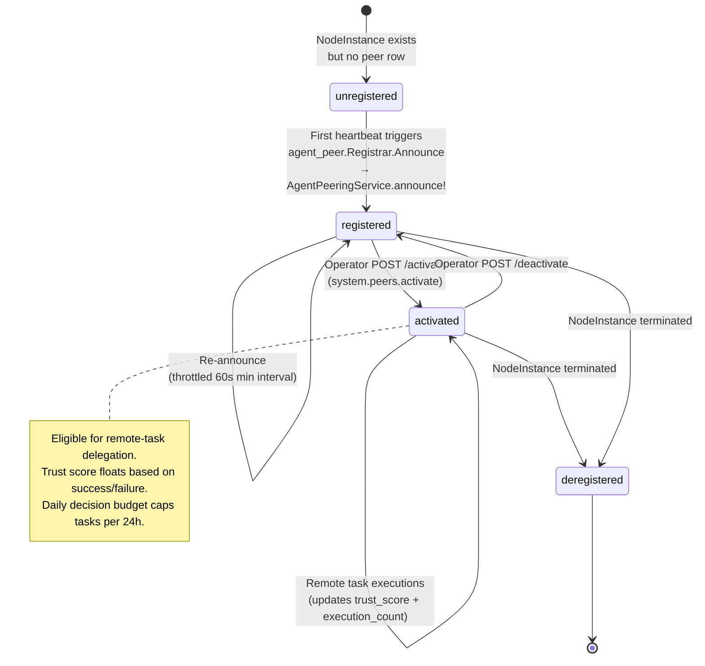
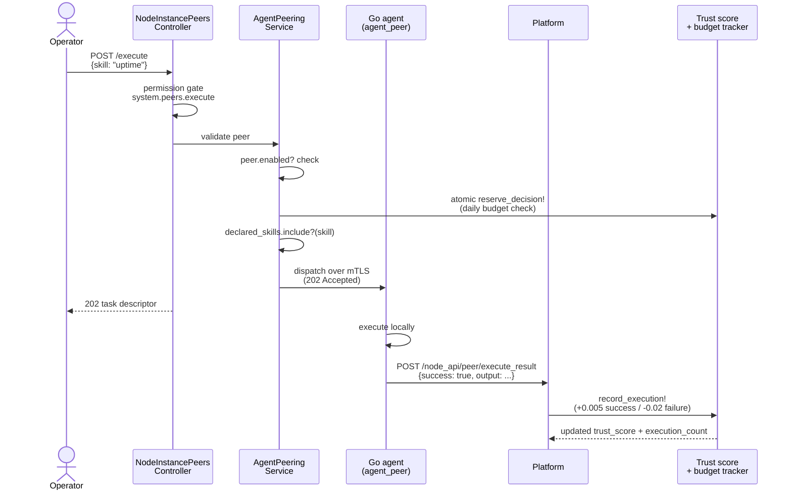

# NodeInstance-as-Agent Peering

**Status:** Active stabilization sweep, Phase 6 (~80% complete). Target close: Q3 2026.
Core implementation present in `extensions/system/server/app/services/system/agent_peering_service.rb`
plus `extensions/system/agent/internal/agent_peer/registrar.go` (with `registrar_test.go` companion).
Remaining work is documented under "Known limitations / future work" below.

This document describes the protocol by which a running NodeInstance
auto-registers as a peer in the platform's agent graph. Registered peers
are addressable by handle (`@instance-abc12345`) and can have remote
tasks delegated to them — pattern-mirror of the Module-as-Skill registrar
already shipped under Track F-4.

---

## Why peers?

Once a fleet contains many running instances, operators want to address
specific ones for ad-hoc inspection ("what's `@instance-app01` doing?")
without going through manual SSH or task creation. The Go agent already
runs on every instance and has a mTLS-authenticated channel to the
platform; we exploit that channel for bidirectional remote-task
delegation.

Each peer carries:

- **handle** — short stable identifier (`instance-<8-hex>` derived from
  the NodeInstance UUID's first 8 characters), used for human
  addressing and audit logs.
- **capabilities** — JSON describing hardware (CPU/RAM/disk/GPU/etc.),
  loaded modules, OS/arch/kernel/agent version. Used by the operator
  UI to filter peers by feature.
- **declared_skills** — names + schemas of skills the peer can execute.
  Sourced from each loaded module's `manifest.yaml#skills` block.
- **addresses** — primary IPs / DNS names the peer can be reached at
  (informational; mTLS connection is via the existing platform→agent
  channel, not direct).
- **trust_score** — per-peer reliability score (0.0..1.0). Starts at
  0.5; bumped up on successful executions, down on failures.
- **daily_decision_budget** — per-peer ceiling on remote tasks per 24h
  window. Defaults to 10. Operator-tunable.

---

## Peer Lifecycle



## Operator Delegation Flow



---

## Endpoints

### Operator-facing

| Method | Path | Permission |
|--------|------|------------|
| GET | `/api/v1/system/node_instance_peers` | `system.peers.read` |
| GET | `/api/v1/system/node_instance_peers/:id` | `system.peers.read` |
| POST | `/api/v1/system/node_instance_peers/:id/activate` | `system.peers.activate` |
| POST | `/api/v1/system/node_instance_peers/:id/deactivate` | `system.peers.activate` |
| POST | `/api/v1/system/node_instance_peers/:id/execute` | `system.peers.execute` |

### Instance-side (mTLS)

| Method | Path | Note |
|--------|------|------|
| POST | `/api/v1/system/node_api/peer/announce` | Self-announce / re-announce |
| POST | `/api/v1/system/node_api/peer/execute_result` | Report task outcome |

---

## Operator workflow

### 1. Verify a peer auto-registered

After an instance enrolls and heartbeats, list peers:

```bash
curl -H "Authorization: Bearer $JWT" \
  http://localhost:3000/api/v1/system/node_instance_peers
```

Expected: each running NodeInstance has a corresponding peer in
`status: "registered"` and `enabled: false`.

### 2. Activate the peer

```bash
curl -X POST -H "Authorization: Bearer $JWT" \
  http://localhost:3000/api/v1/system/node_instance_peers/<peer-id>/activate
```

Permission: `system.peers.activate`. Sets `enabled: true`. The peer is
now eligible for remote-task delegation.

### 3. Delegate a task

```bash
curl -X POST -H "Authorization: Bearer $JWT" \
  -H "Content-Type: application/json" \
  -d '{"skill":"uptime"}' \
  http://localhost:3000/api/v1/system/node_instance_peers/<peer-id>/execute
```

Returns 202 Accepted with the dispatched task descriptor. The agent
fulfills the task asynchronously via its local executor and posts the
result to `/node_api/peer/execute_result`.

---

## Safety mechanisms

### Operator-activation gate

Peers auto-register `enabled: false`. A NodeInstance can self-announce
its capabilities, but operators must explicitly activate before remote
delegation works. This prevents accidental capability disclosure
("oh, that newly-spun instance is exposing GPU access" surprises).

### Daily decision budget

`daily_decision_budget` (default 10) caps remote tasks per 24h window.
Operators can raise on a per-peer basis for high-throughput automation.
The window auto-rolls over.

### Trust score

Trust starts at 0.5; each success bumps +0.005, each failure -0.02. A
peer hitting 0.0 should be investigated — either the on-node executor
is broken, the network is flaky, or a malicious peer is being
intentionally lossy. Future enhancement: auto-suspend peers below a
trust floor.

### Capability sanitization

`AgentPeeringService.sanitize` caps depth (5 levels) + size (1KB strings,
50 keys, 64 array elements). Resource-constrained or hostile peers can't
DoS the platform with deeply-nested or huge announce payloads.

### Permission scoping

Remote task delegation enforces:
1. The peer is `enabled`
2. The skill is in `declared_skills`
3. Operator has `system.peers.execute` permission
4. (Future) Operator has the underlying skill's permission as well — so
   delegation can't escalate beyond the operator's own permission set.

### Body-size cap on agent side

`agent_peer.MaxAnnounceBodyBytes = 16 KB` caps the agent's announce
payload. Resource-constrained ARM SBCs won't accidentally emit huge
JSON; malicious modules that try to inflate capabilities are blocked.

### Re-announce throttle on agent side

`agent_peer.MinReannounceInterval = 60s` throttles identical
re-announces. Capability-delta announces (different payload hash) bypass
the throttle so legitimate module changes propagate quickly.

---

## Implementation files

| Concern | File |
|---|---|
| Go peer registrar | `extensions/system/agent/internal/agent_peer/registrar.go` |
| Go tests | `extensions/system/agent/internal/agent_peer/registrar_test.go` |
| Server-side service | `extensions/system/server/app/services/system/agent_peering_service.rb` |
| Operator API | `extensions/system/server/app/controllers/api/v1/system/node_instance_peers_controller.rb` |
| Instance API | `extensions/system/server/app/controllers/api/v1/system/node_api/peer_controller.rb` |
| Model | `extensions/system/server/app/models/system/node_instance_peer.rb` |
| Migrations | `db/migrate/20260503040600_create_system_node_instance_peers.rb`, `_040700_seed_peer_permissions.rb` |
| Permissions | `system.peers.read`, `.activate`, `.execute`, `system.peer.announce` |

---

## Known limitations / future work

- **Mention picker integration** — workspace `@instance-abc` mentions
  are not yet wired into the chat extension. v1 surface is the operator
  UI list + REST API. Mention picker integration requires extending the
  chat extension's search to include `NodeInstancePeer` rows.
- **Synchronous remote task dispatch** — the operator's `execute` API
  returns 202 immediately and the agent fulfills out-of-band. v1 does
  not support `wait_for_result`; callers poll the peer's
  `last_executed_at` or wait for a webhook (future).
- **Auto-suspension on trust floor** — peers can hit 0.0 trust without
  being suspended. Future: background sweeper that flips
  `enabled: false` once `trust_score < 0.1` for 24h+.
- **Peer mention search** — no full-text search across capabilities yet.
  Operators can only filter by `enabled`. Future: filter by
  `capabilities.os`, `capabilities.arch`, `declared_skills.name`, etc.

---

## Reference

- Active sweep plan: `~/.claude/plans/perform-comprehensive-examination-of-glistening-perlis.md`
- Golden Eclipse plan: `~/.claude/plans/we-are-working-on-golden-eclipse.md` (F-3)
- Threat model: `docs/system/threat-model.md`
- Module-as-Skill (parallel pattern): `extensions/system/server/app/services/system/module_skill_registrar.rb`
