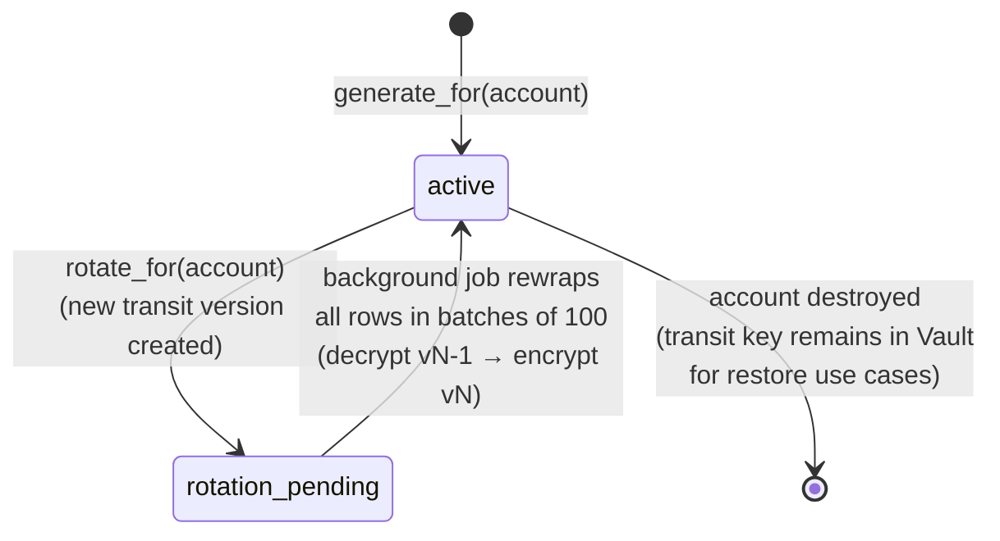
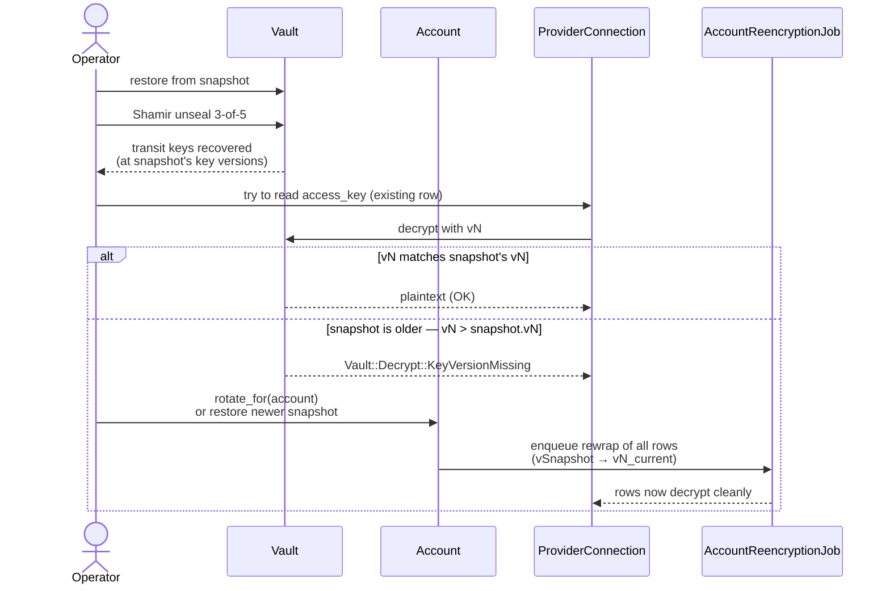

# Credential Restoration

**Status:** Living design + operator runbook. Last revised 2026-05-03.
**Implementation:** active stabilization sweep, Phase 3 (full).

This document describes the per-account encryption key restoration path —
the mechanism by which Powernode encrypts sensitive operator-supplied data
(provider connection access keys, future credential models) such that:

- A single Vault snapshot + per-account row is sufficient to restore the
  account's secrets after disaster.
- Compromise of the platform database (without Vault transit) does NOT
  expose plaintext credentials.
- Compromise of Vault transit (without the platform database) ALSO does NOT
  expose plaintext credentials.

Two-layer protection: **Rails `encrypts`** at rest (Postgres-side ciphertext
column) + **Vault transit pepper** keyed per account (transparent to consumers
via the `AccountPepperedEncryption` concern).

---

## 1. Lifecycle overview

```mermaid
sequenceDiagram
    actor Op as Operator / system
    participant Acct as Account
    participant AEKS as AccountEncryption<br/>KeyService
    participant Vault as Vault transit
    participant Conn as ProviderConnection<br/>(consumer)
    participant Rails as Rails encrypts<br/>(at-rest layer)

    Op->>Acct: account created
    Acct->>AEKS: generate_for(account)
    AEKS->>Vault: create transit/encrypt/account-&lt;id&gt;
    Vault-->>AEKS: keypair created
    AEKS->>Acct: persist Vault path on<br/>accounts.encryption_key_vault_path

    Op->>Conn: write access_key (plaintext)
    Conn->>AEKS: peppered(account, plaintext)
    AEKS->>Vault: encrypt
    Vault-->>AEKS: ciphertext blob
    AEKS-->>Conn: ciphertext blob
    Conn->>Rails: at-rest encrypt of ciphertext blob
    Rails-->>Conn: persisted

    Op->>Conn: read access_key
    Conn->>Rails: decrypt at-rest layer
    Rails-->>Conn: ciphertext blob
    Conn->>AEKS: decrypt(account, ciphertext)
    AEKS->>Vault: decrypt
    Vault-->>AEKS: plaintext
    AEKS-->>Conn: plaintext
```



---

## 2. Components

### 2.1 Migration

`server/db/migrate/<ts>_add_encryption_key_vault_path_to_accounts.rb`:

```ruby
add_column :accounts, :encryption_key_vault_path, :string
add_index :accounts, :encryption_key_vault_path,
  unique: true, where: "encryption_key_vault_path IS NOT NULL"
```

The column is nullable so existing accounts work pre-migration; the
`Security::AccountEncryptionKeyService.generate_for` call backfills any
account missing a path on first peppered write.

### 2.2 Service

`server/app/services/security/account_encryption_key_service.rb` — public
interface:

```ruby
Security::AccountEncryptionKeyService.generate_for(account)
# -> { vault_path: String, key_version: Integer }
# Idempotent; if account already has a path, returns existing.

Security::AccountEncryptionKeyService.peppered(account, plaintext)
# -> ciphertext_blob (String)
# Encrypts plaintext via Vault transit.

Security::AccountEncryptionKeyService.decrypt(account, ciphertext)
# -> plaintext (String)
# Decrypts blob via Vault transit. Raises if key/blob mismatch.

Security::AccountEncryptionKeyService.rotate_for(account)
# -> { old_version: Integer, new_version: Integer, queued_rows: Integer }
# Issues new transit key version; queues background re-encrypt job.

Security::AccountEncryptionKeyService.fetch_key(account)
# -> Vault::Secret (transit key handle)
# Internal — used by tests. Production code should call peppered/decrypt.
```

### 2.3 Vault transit client

`server/app/services/security/vault_transit_client.rb` — wraps
`Vault::Logical#write/read/list` for transit operations. Mirrors
`Security::VaultCredentialProvider`:

- Connection pooling (one HTTP connection per process)
- Retry with backoff (3 retries, 100ms → 200ms → 400ms)
- `VaultUnavailableError` for circuit breaking
- Uses AppRole authentication with 1h TTL token cache

### 2.4 ActiveRecord concern

`server/app/models/concerns/account_peppered_encryption.rb`:

```ruby
class System::ProviderConnection < ApplicationRecord
  include AccountPepperedEncryption

  peppered_attribute :access_key
  peppered_attribute :secret_key
end
```

The concern:
- Defines a setter that calls `peppered(account, value)` before persistence.
- Defines a getter that calls `decrypt(account, value)` on read.
- Falls back to plain Rails `encrypts` for the at-rest column when the
  concern's `peppered_attribute` macro is invoked.

Account access is via the model's existing `belongs_to :account` (or
through `delegate :account, to: :node` for instance-bound models).

### 2.5 Consumer migration

For each consumer model (starting with `System::ProviderConnection`):

1. Add `include AccountPepperedEncryption`.
2. Add `peppered_attribute :foo` for each existing `encrypts :foo` (replaces
   the call but keeps the column).
3. Backfill: existing `encrypts`-only rows get re-wrapped via a one-off
   migration that:
   - Reads each row's plaintext via Rails `encrypts`.
   - Calls `Security::AccountEncryptionKeyService.peppered(account, plaintext)`.
   - Writes the new ciphertext back via the new `peppered_attribute` setter.
   - Verifies round-trip equality before committing.
4. After backfill: deploy new model code.

For tables with > 10K rows, the backfill is a background job iterating in
batches; for `provider_connections` (typically < 100 per account), inline
in the migration is fine.

---

## 3. Production prerequisites

Before this can be deployed:

1. **Vault transit engine must be mounted.** As of 2026-05-03 the production
   Vault deployment (per `docs/infrastructure/vault-example/`) has only KV v2
   + AppRole. Transit needs:
   ```bash
   vault secrets enable transit
   vault write -force transit/keys/test-config exportable=false
   ```
2. **AppRole policy** must permit transit operations against
   `transit/encrypt/account-*` and `transit/decrypt/account-*` for the
   server's role.
3. **Vault audit backend** SHOULD be enabled before going live so transit
   operations are logged. (Optional; degrades to "no audit" if absent.)
4. **Auto-unseal** SHOULD be in place — if Vault seals during a transit
   operation, the platform's circuit breaker triggers `VaultUnavailableError`
   and consumers degrade gracefully, but operations stall until unseal.
   Manual Shamir 3-of-5 still works, just adds operator-availability risk.

If Vault transit is unmounted at deploy time, the system degrades:
- New writes that try to use `peppered_attribute` raise `VaultUnavailableError`.
- The error is caught by `ApplicationController` and returned as 503 with a
  clear "credential service unavailable" message.
- Existing rows continue to work because Rails `encrypts` handles the
  at-rest layer independently.

---

## 4. Operator runbook

### 4.1 First-time setup

```bash
# In Vault
vault secrets enable transit
vault policy write powernode-server-transit - <<'EOF'
path "transit/encrypt/account-*" { capabilities = ["update"] }
path "transit/decrypt/account-*" { capabilities = ["update"] }
path "transit/keys/account-*"    { capabilities = ["read", "create", "update"] }
path "transit/keys/account-*/rotate" { capabilities = ["update"] }
EOF

vault write auth/approle/role/powernode-server policies=powernode-server-kv,powernode-server-transit
```

```ruby
# Rails console — backfill missing keys for existing accounts
Account.where(encryption_key_vault_path: nil).find_each do |account|
  Security::AccountEncryptionKeyService.generate_for(account)
end
```

### 4.2 Rotation

Rotation policy (recommended): every 90 days, OR after any suspected
compromise of the Vault audit log (which would suggest the operator with
audit access is suspect).

```ruby
# Single account
result = Security::AccountEncryptionKeyService.rotate_for(account)
# => { old_version: 3, new_version: 4, queued_rows: 47 }

# Watch the re-encrypt job complete
Security::AccountReencryptionJob.status(account_id: account.id)

# All accounts (cron candidate)
Account.find_each(&:rotate_encryption_key!)
```

### 4.3 Restoration from Vault snapshot

**Scenario:** platform database lost; restoring from yesterday's PG dump.

1. Restore PG: `pg_restore` from the snapshot. Account rows now have
   `encryption_key_vault_path` populated, but the ciphertext blobs at-rest
   reference Vault transit keys.
2. Verify Vault is up + transit engine still has the same keys (transit
   keys are persisted in Vault's storage backend; if Vault was also wiped,
   restore Vault from its snapshot first).
3. Verify a known credential round-trips:
   ```ruby
   conn = System::ProviderConnection.first
   conn.access_key  # should decrypt cleanly
   ```
4. If decryption fails: the Vault transit key version on disk is older than
   the version that originally encrypted the row. Either:
   - Restore Vault from a newer snapshot.
   - OR: if you have a Vault transit key export from a recent backup,
     re-import the missing version: `vault transit/restore/...`.

**Scenario:** Vault lost; PG database intact.



1. Restore Vault from snapshot (Shamir unseal + transit key persistence).
2. If snapshot is older than some account's last rotation:
   - Unrotated accounts work normally.
   - Rotated accounts with reads against old-version blobs hit
     `Vault::Decrypt::KeyVersionMissing` — re-rotate the affected account
     to bring all rows to the current key version, OR restore a more recent
     Vault snapshot.

**Scenario:** both lost, no recent Vault snapshot.

This is data-loss territory. The peppered-encryption design makes
unrecoverable plaintext unrecoverable. Mitigation: nightly Vault snapshots
shipped to offsite cold storage with the same retention policy as PG.

### 4.4 Migrating away from peppered encryption (downgrade)

Reverse migration (e.g., for an extension being migrated to a different
platform that lacks Vault transit):

```ruby
# Decrypt every row + write plaintext-then-encrypts
System::ProviderConnection.find_each do |conn|
  plaintext = conn.access_key  # decrypts via pepper
  conn.update_columns(access_key_ciphertext: nil) # clear the peppered blob
  conn.access_key = plaintext  # writes via Rails `encrypts` only
  conn.save!
end
```

After all rows migrated, remove `include AccountPepperedEncryption` from
the model and run the schema migration to drop
`accounts.encryption_key_vault_path`.

---

## 5. Implementation reference (for engineers)

Files to look at when extending this system:

| Concern | File |
|---|---|
| Service entrypoint | `server/app/services/security/account_encryption_key_service.rb` |
| Vault wrapper | `server/app/services/security/vault_transit_client.rb` |
| ActiveRecord concern | `server/app/models/concerns/account_peppered_encryption.rb` |
| Migration | `server/db/migrate/<ts>_add_encryption_key_vault_path_to_accounts.rb` |
| Sample consumer | `extensions/system/server/app/models/system/provider_connection.rb` |
| Backfill job | `server/app/jobs/security/account_reencryption_job.rb` |
| Specs | `server/spec/services/security/account_encryption_key_service_spec.rb` |
| Threat model | `docs/system/threat-model.md` |

To add a new peppered attribute on an existing model:

1. `include AccountPepperedEncryption` (if not already)
2. `peppered_attribute :new_field`
3. Add migration to add the at-rest column (`add_column :model, :new_field_ciphertext, :text`)
4. Test round-trip in spec

To add a new model with peppered attributes:

1. Inherit from `ApplicationRecord` (or `BaseRecord` for system extension models)
2. `include AccountPepperedEncryption`
3. `belongs_to :account` (or `delegate :account, to: :parent`)
4. Mark sensitive columns with `peppered_attribute`
5. Migrations follow `*_ciphertext` pattern

---

## 6. Open questions

- **Multi-region Vault**: if we expand to multiple regions with their own
  Vault clusters, do we replicate transit keys, or do we maintain per-region
  account keys (forcing regional pinning)? Decision deferred until multi-region
  is on the roadmap.
- **Hardware HSM**: at sufficient scale, transit keys ought to live in an
  HSM (for FIPS or sovereignty reasons). Vault transit-with-HSM is supported;
  evaluate when the customer profile demands it.
- **Customer-supplied keys**: bring-your-own-key (BYOK) flow where customer
  provides their own transit master. Plan-time consideration; not in active
  sweep.

---

*For DR procedure see [`runbooks/vault-credential-restoration.md`](./runbooks/vault-credential-restoration.md);
for historical sweep tracking see [`history/TASKS.md`](./history/TASKS.md).*
