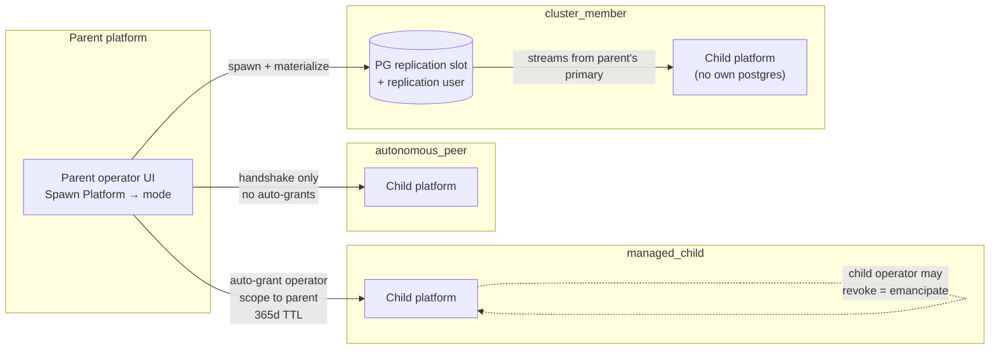

# Powernode Spawn Modes — Operator Guide

**Status:** v1 (lands in P6 of the Decentralized Federation plan)
**Audience:** platform operators provisioning child platforms
**Plan reference:** Decentralized Federation §H + Locked Decision #4 + P6.

---

## What is a "spawn"?

A spawn is when an existing Powernode platform (the **parent**) provisions
a brand-new Powernode platform (the **child**) as a NodeInstance and
completes the federation handshake at boot time, so the child comes online
already federated with its parent. This contrasts with **out-of-band
peering**, where two pre-existing platforms manually exchange tokens.

Spawning is a first-class operation in Powernode. The operator clicks
**Spawn Platform** from `/app/system/federation` → Children tab, picks
a mode, and the platform handles the rest: NodeInstance provisioning,
single-use acceptance token generation, virtio-fw-cfg payload
injection, and (per mode) the auto-issuance of cross-peer grants or
the materialization of replication slots.

---

## The three spawn modes

The operator picks one of three modes at spawn time. Each mode is a
**different social + operational relationship** between the parent and
the child once the handshake completes. The mode is recorded on the
parent-side `System::FederationPeer` row at
`spawn_role: "parent"` / `spawn_mode: <mode>` and ships in the
virtio-fw-cfg payload so the child knows how to configure itself.



| Mode | Relationship | Auto-grant from child to parent | Shared infrastructure | Use case |
|---|---|---|---|---|
| `managed_child` | Parent-administered child | **Yes** — operator-scope (read/write/admin) | None | Dev/test sandbox, branch deployment, fleet of similar platforms a single team operates |
| `autonomous_peer` | Equal peers post-handshake | **No** — parent has only the peering itself | None | Spinning up a partner platform you'll federate with but not administer |
| `cluster_member` | HA cluster member | No auto-grant (peering only) | PG streaming replication slot + Redis VIP from parent's primary | Horizontal scale + high-availability cluster |

### `managed_child`

The parent retains **operator-scope access** to the child. At accept-time,
the parent's `FederationApi::AcceptController` auto-issues a
`FederationGrant` on the parent side recording its persistent
read/write/admin rights on the child (resource_kind:
`managed_child_operator`, TTL 365 days, all pessimistic-scope
allowlists empty by default).

The symmetric child-side grant lands when the child's first-run
handler completes — at that point both sides agree on the parent's
operator scope.

**Intervention policy cascade:** intervention policies the parent has
configured for `system.*` actions cascade to the child by default. The
child operator can override any policy on the child's side — it's a
default, not an enforced contract.

**Revocation:** the child operator can revoke the parent's grant at any
time via the child's grants editor. This is the **emancipation** flow
(see below); revocation does not delete the child or break federation,
it just downgrades the relationship to "autonomous peer."

**When to pick this mode:** when the same team operates both platforms
and wants single-pane-of-glass administration.

### `autonomous_peer`

The parent provisions the child, the handshake completes, and that's
the end of the parent's privileged role. From that point forward both
platforms are equal peers. No auto-grants are issued; cross-peer
access requires explicit operator-issued grants on either side, same
as out-of-band peering.

**Why use spawn at all if the result is just a peer?** Because the
provisioning convenience is the value: one click to provision the
NodeInstance, ship the payload, complete the mTLS handshake, exchange
contract version, and end up with an active peer. No manual token
exchange ritual.

**When to pick this mode:** when you're standing up a platform for
a different team / organization / customer and want federation
without ongoing privilege.

### `cluster_member`

A horizontal-scale + HA mode. The child runs `powernode-hub-cluster-member`
(per `powernode_platform_templates`) which includes:

- `powernode-reverse-proxy` (Traefik)
- `powernode-base-ruby` (shared)
- `powernode-hub-backend` + `powernode-hub-worker` (full-stack child)
- `powernode-pg-replica` — **streams from the parent's primary**
- No `powernode-postgres` (child does not run its own primary)

At spawn time, the parent enqueues `ClusterMemberPgReplicaSetupJob`
which materializes:

1. A **physical replication slot** on the parent's primary:
   `SELECT pg_create_physical_replication_slot('powernode_repl_<peer_id>', true)`
2. A **dedicated replication user** (LOGIN + REPLICATION) with a
   32-byte base64 password.
3. The credential stored in Vault under
   `cluster_member_pg_replica/<peer_id>`.
4. `peer.metadata.cluster_pg` is stamped:
   ```json
   {
     "state": "ready",
     "slot_name": "powernode_repl_...",
     "primary_host": "<sdwan-vip>",
     "primary_port": 5432,
     "credential_id": "<peer_id>",
     "username": "powernode_repl_..."
   }
   ```

The child's first-run handler reads its accept response, fetches the
replication credential (one-time-delivered via the AcceptController
response when `spawn_mode == cluster_member`), configures its pg-replica
module's recovery, and begins streaming.

**Redis** in cluster_member mode points at the parent's Redis VIP via
SDWAN — no local Redis, no replication of caches needed.

**Failover:** if the parent's primary goes down, an operator-driven
promotion of a cluster_member to primary is required. v1 does not
include auto-failover; that's a P9 follow-up.

**When to pick this mode:** when you're horizontally scaling the
platform tier (API + worker capacity) on a separate node, OR when
you need a hot-standby for HA.

---

## Spawn flow (operator's perspective)

1. **Open the dashboard.** Navigate to `/app/system/federation` and
   open the **Children** tab.

2. **Click "Spawn Platform".** The modal opens.

3. **Pick the mode.** Three radio options with help text:
   `managed_child` (default), `autonomous_peer`, `cluster_member`.

4. **Fill the form.**
   - **Parent URL:** the parent's reachable HTTPS endpoint. The
     child's first-run handler will POST to this URL.
   - **Template ID:** which `NodeTemplate` to provision (e.g.
     `powernode-hub` for full-stack, `powernode-hub-cluster-member`
     for cluster_member mode).
   - **Region:** optional provider-specific region.
   - **Token TTL:** how long the acceptance token remains valid
     (default 7 days, range 1-30).

5. **Click "Spawn".** The platform creates the parent-side
   `FederationPeer` row in `proposed` status, generates the single-use
   acceptance token, builds the virtio-fw-cfg payload, and hands off
   to the provisioner.

6. **Capture the token.** A second-phase modal shows the plaintext
   token — **this is the ONLY opportunity to copy it**. If lost, the
   operator must spawn again.

7. **Wait for the child to come online.** Typical: 5-15 minutes
   depending on provider + image size. Watch the Children panel; the
   row transitions `proposed → accepted → enrolled → active`.

8. **Verify.** Click the row to confirm:
   - Status is `active`
   - `last_heartbeat_at` is recent (within last 90s)
   - For `managed_child`: a `managed_child_operator` grant exists
     under the child peer
   - For `cluster_member`: `peer.metadata.cluster_pg.state == "ready"`

---

## Mode comparison — what gets created per mode

| Artifact | managed_child | autonomous_peer | cluster_member |
|---|---|---|---|
| `FederationPeer` row (parent side) | yes | yes | yes |
| `FederationPeer` row (child side) | yes (reciprocal) | yes (reciprocal) | yes (reciprocal) |
| Acceptance token (single-use) | yes | yes | yes |
| Operator-scope `FederationGrant` on parent side | yes (365d TTL) | no | no |
| Operator-scope `FederationGrant` on child side | yes (P6.5) | no | no |
| PG replication slot | no | no | yes |
| Replication user + Vault credential | no | no | yes |
| `peer.metadata.cluster_pg` | nil | nil | populated |
| Default intervention-policy cascade | yes | no | partial (cluster-only) |
| Auto-failover on parent loss | n/a | n/a | no (P9) |

---

## Emancipation — downgrading managed_child → autonomous_peer

When the child operator decides they no longer want the parent's
operator-scope access, they revoke the `managed_child_operator`
grant from the child's side. This is a **terminal downgrade**: the
parent loses operator scope and the relationship becomes equivalent
to `autonomous_peer`.

Mechanics:

1. Child operator navigates to `/app/system/federation` → Grants
   editor.
2. Filters by `resource_kind: managed_child_operator`, finds the
   grant.
3. Clicks **Revoke** with an optional reason.
4. The grant transitions to `revoked` (soft-delete with 90-day
   retention per Architectural Fix #2).
5. The parent's outbound calls to the child's federation_api start
   returning 401 — the bearer token no longer matches a live grant.
6. The parent's UI surfaces the downgrade as a `peer_grant_revoked`
   finding from the FederationManager AI Skill (P4.8).

The parent's `FederationPeer` row stays `active`; only the privilege
relationship changes. Out-of-band notification (operator email)
is recommended per Social Contract commitment #4 but not technically
enforced.

**Mutual emancipation:** if the parent operator also wants to drop
the relationship, they revoke the `managed_child_operator` grant on
their side. At that point both sides agree the relationship is
autonomous. Or, either side can revoke the peering entirely via
`peer.revoke!`, which is the harder break.

---

## Mode selection — decision tree

```
Are you provisioning this child for another team/org/customer?
  Yes → autonomous_peer

Will you (the parent operator) administer this child going forward?
  Yes → managed_child

Do you need this child to participate in PG streaming replication
from your primary (HA / scale-out)?
  Yes → cluster_member

(Default if unsure: managed_child — most permissive for the operator,
easiest to emancipate later.)
```

---

## Failure modes + recovery

### Acceptance token expires before child accepts

The peer row stays in `proposed`. The operator can:

1. Generate a new token via the Children panel (rotate-token action)
2. Re-inject via virtio-fw-cfg (provider-specific)
3. Wait for the new token TTL to elapse before re-trying

### Child provisions but never POSTs accept

Likely causes: child cannot reach parent URL, child's first-run
handler failed, NodeInstance never finished booting. Operator checks:

1. NodeInstance status in the Compute panel
2. Provider-specific console / cloud-init logs
3. Network reachability from child to parent

### Child accepts but heartbeat never advances

The peer row transitions `proposed → enrolled` but never reaches
`active`. The `peer_heartbeat_stale` finding (P3.6) surfaces within
~5 minutes of expected heartbeat lapse. Operator checks:

1. Child's `powernode-hub-worker` running?
2. SDWAN reachability between child and parent?
3. Heartbeat job in child's `worker/config/sidekiq.yml` enabled?

### cluster_member: replication slot created but child never streams

Operator checks:

1. `peer.metadata.cluster_pg.state == "ready"` on the parent? If
   not, the worker job didn't finish — check the worker logs and
   re-enqueue via `ClusterMemberPgReplicaSetupJob.perform_async(peer_id)`.
2. Vault credential present at
   `cluster_member_pg_replica/<peer_id>`?
3. Child can reach parent's PG via SDWAN VIP? (`pg_isready -h <vip> -p 5432`)
4. Child's pg-replica module has the credential? Reissue via accept
   response.

### managed_child: parent's bearer token rejected on first cross-peer call

Likely the symmetric child-side grant hasn't been issued yet. P6.5
(child's first-run handler) is responsible for issuing it. Operator
on the child's side can manually create the grant by mirroring the
parent-side grant's `remote_subject` + scope.

---

## Implementation references

- Parent-side orchestrator: `System::SpawnPlatformService`
  (`extensions/system/server/app/services/system/spawn_platform_service.rb`)
- Children CRUD: `Api::V1::System::Federation::ChildrenController`
- Spawn modal + panel: `extensions/system/frontend/src/features/system/components/federation/{SpawnPlatformModal,ChildrenPanel}.tsx`
- AcceptController auto-grant: `extensions/system/server/app/controllers/api/v1/system/federation_api/accept_controller.rb#auto_issue_managed_child_grant!`
- cluster_member PG slot: `System::ClusterMember::PgReplicaSetupService`
  (`extensions/system/server/app/services/system/cluster_member/pg_replica_setup_service.rb`)
- Worker job: `worker/app/jobs/cluster_member_pg_replica_setup_job.rb`
- Worker_api endpoint: `Api::V1::System::WorkerApi::ClusterMemberPgReplicaController`

---

## Out-of-scope for v1

- **Auto-failover** for cluster_member — operator-driven promotion only.
- **Multi-replica HA topology** (3-node quorum-based failover) — deferred to P9 / D10.
- **Cross-region cluster_member** — v1 assumes parent + child share an SDWAN network with low RTT.
- **Bulk spawn** — one child per click; bulk spawning is a deferred operator-convenience.
- **Spawn from template variant** — operator picks the template by ID; richer template-with-overrides UX is post-v1.
