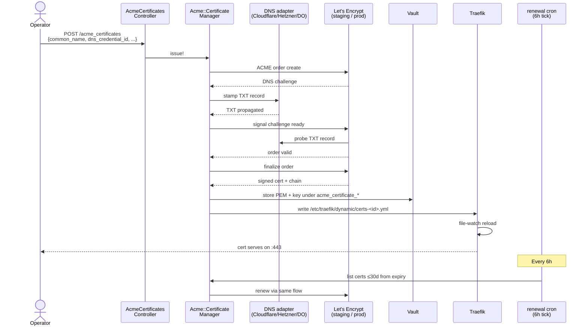

# ACME Certificate Issuance — Operator Runbook

Day-2 operator workflow for ACME DNS-01 cert lifecycle: provider setup,
Vault credential layout, single + multi-SAN issuance, renewal/revocation,
LAN-preference endpoint discovery, Traefik termination, failover.

**Audience:** SREs operating public-facing TLS, platform deployment
engineers, security operators.

**Companion docs:**
- [`acme-smoke.md`](./acme-smoke.md) — P2.5.7 acceptance smoke test (6 live scenarios)
- [`vault-credential-restoration.md`](./vault-credential-restoration.md) — Vault DR for ACME credential restoration

> **MCP coverage note:** ACME cert management currently flows through the
> REST API (`/api/v1/system/acme_certificates`, `/api/v1/system/acme_dns_credentials`)
> and the operator UI. The `platform.system_acme_*` MCP wrappers shown in
> this runbook are **aspirational** — they're not yet in the
> [`MCP_API_REFERENCE.md`](../MCP_API_REFERENCE.md) registry. For
> operator scripts that need cert management today, use `curl` against
> the REST endpoints. The MCP examples below illustrate the intended
> shape once those wrappers ship.

## Architecture summary

Powernode bundles `powernode-acme` (a Go binary, embedded in the platform
image) that drives DNS-01 challenges via per-provider adapters. Cert
material persists to Vault under `acme_certificate_pem/<cert-id>` and
`acme_certificate_key/<cert-id>`. Traefik (the production reverse proxy)
file-watches `/etc/traefik/dynamic/` for changes and reloads without
dropping connections.



## Provider matrix

| Provider | Status | Token scope |
|----------|--------|-------------|
| Cloudflare | Production | `Zone:Zone:Read` + `Zone:DNS:Edit`, scoped to the target zone |
| Hetzner | Production | DNS API token (read+write) for the zone |
| DigitalOcean | Production | Personal access token with read+write to DNS |
| Route53 | Stub-only | (not production-ready; needs AWS-SDK adapter completion) |

To add a provider: implement a Go adapter in
`extensions/system/server/vendor/powernode-acme/internal/dns/` mirroring
the existing cloudflare/hetzner/do adapters. Each adapter implements
`Stamp(domain, txt_value, ttl) → error` + `Cleanup(domain) → error`.

## Vault credential layout

Each DNS provider credential lives in Vault KV v2 under
`acme_dns_credentials/<credential-id>` with this payload:

| Key | Example | Notes |
|-----|---------|-------|
| `provider` | `cloudflare` | matches adapter name in `powernode-acme` |
| `api_token` | `dnsv-1-cf-...` | bearer token; provider-specific format |
| `account_id` | (optional) | Cloudflare account scoping |
| `zone_id` | (optional) | preselect single zone for token-scoped credentials |

The credential is rotated via the same Vault rotation flow as everything
else (per `docs/credential-restoration.md`).

## Step 1 — Configure a DNS provider credential

Via UI: `/app/system/acme` → "DNS Credentials" tab → New → fill provider
+ token → "Test Connectivity" → save.

Via MCP:

```javascript
platform.system_acme_create_dns_credential({
  name: "cloudflare-prod",
  provider: "cloudflare",
  api_token: "dnsv-1-cf-..."
})
// → { credential: { id, status: "ready", verified_at: "..." } }
```

**Expected outcome:** the controller invokes the adapter's `Verify` call
which lists zones the token can access. Verification failures surface in
the UI before the credential is usable.

## Step 2 — Issue a single-SAN cert

Via UI: "Certificates" tab → "Request Certificate" → fill common_name +
pick credential → submit. Watch the status pill cycle
`pending → validating → valid` (~30s on LE staging, ~60–180s on prod).

Via MCP:

```javascript
platform.system_acme_request_certificate({
  common_name: "api.example.com",
  dns_credential_id: "<credential-id>",
  issuer: "letsencrypt-prod"        // or "letsencrypt-staging" for testing
})
// → { certificate: { id, status: "pending", ... } }

// Poll for completion
platform.system_acme_get_certificate({ id: "<cert-id>" })
// → { certificate: { status: "valid", expires_at: "...", ... } }
```

**Expected outcome:** cert + private key stored in Vault; Traefik dynamic
config updated; HTTPS endpoint serves the cert.

## Step 3 — Issue a multi-SAN cert

```javascript
platform.system_acme_request_certificate({
  common_name: "api.example.com",
  subject_alt_names: [
    "api.example.com",
    "api-staging.example.com",
    "metrics.example.com"
  ],
  dns_credential_id: "<credential-id>"
})
```

**Expected outcome:** one cert covering all SANs; the DNS challenge runs
once per SAN sequentially. Total duration scales linearly with SAN count.

## Step 4 — Renew (manual or automatic)

**Automatic:** the renewal worker (`acme_certificate_renewal`, Sidekiq
cron every 6h) finds certs within 30 days of expiry and re-runs the
issuance flow. No operator action required.

**Manual:** UI cert detail → "Renew" button, or:

```javascript
platform.system_acme_renew_certificate({ id: "<cert-id>" })
```

Expected service disruption during reload: **<1 second** (Traefik file-watch
reload is non-disruptive). For ironclad zero-disruption renewals on Tier-1
services, pre-stage the new cert under a different filename, swap atomically
at a low-traffic window.

## Step 5 — Revoke

```javascript
platform.system_acme_revoke_certificate({
  id: "<cert-id>",
  reason: "key_compromise"     // or "superseded", "cessation_of_operation"
})
// → { certificate: { status: "revoked", revoked_at: "..." } }
```

**Expected outcome:**

- Cert marked `revoked` in DB with `revoked_at` timestamp
- On-disk PEM + key files removed from `/etc/traefik/certs/`
- Traefik dynamic config no longer references the cert
- LE's OCSP responder eventually marks the cert revoked (propagation delay)

Revocation is **irreversible** — to re-enable, issue a new cert. Don't
revoke for routine rotation; just renew.

## Step 6 — LAN-preference endpoint discovery

For federation peers reachable on both LAN and public WAN, prefer the LAN
endpoint to avoid NAT'd egress. The `EndpointProber` walks each peer's
`endpoints_jsonb` in priority order.

```mermaid
sequenceDiagram
    participant Hub1 as Hub 1 (initiator)
    participant Prober as EndpointProber
    participant LAN as LAN endpoint<br/>(priority 1)
    participant SDWAN as SDWAN endpoint<br/>(priority 2)
    participant WAN as WAN endpoint<br/>(priority 3)
    participant Hub2 as Hub 2 (target)

    Hub1->>Prober: probe!(peer: hub2)
    Prober->>LAN: connect with 200ms timeout
    alt LAN reachable
        LAN->>Hub2: 200 OK
        LAN-->>Prober: success
        Prober-->>Hub1: use LAN; mark last_verified_at
    else LAN unreachable
        LAN--XProber: timeout
        Prober->>SDWAN: connect with 200ms timeout
        alt SDWAN reachable
            SDWAN-->>Prober: success
            Prober-->>Hub1: use SDWAN; mark LAN failure
        else SDWAN unreachable
            Prober->>WAN: connect (no tight timeout)
            WAN-->>Prober: success
            Prober-->>Hub1: use WAN; mark both faster paths failed
        end
    end

    note over Prober,Hub2: Total: <500ms on LAN failure to find next-priority endpoint
```

Operator workflow:

```javascript
// Edit a federation peer's endpoints
// ⚠️ aspirational MCP — currently edit endpoints via REST /api/v1/system/sdwan/federation_peers/<id>
platform.system_sdwan_update_federation_peer({
  id: "<peer-id>",
  endpoints: [
    { scope: "lan", url: "https://hub2.lan.example.com", priority: 1 },
    { scope: "sdwan", url: "https://[fd00:abcd:2::100]:8443", priority: 2 },
    { scope: "wan", url: "https://hub2.public.example.com", priority: 3 }
  ]
})

// ⚠️ aspirational MCP — endpoint prober runs on schedule (no manual trigger MCP yet)
platform.system_sdwan_probe_federation_peer({ id: "<peer-id>" })
```

## Step 7 — Traefik termination + dynamic config

Traefik production config lives at `/etc/traefik/traefik.yml`. Dynamic
provider config lives at `/etc/traefik/dynamic/` (Powernode writes
per-cert YAML files here). The provider entry:

```yaml
providers:
  file:
    directory: /etc/traefik/dynamic
    watch: true
```

`watch: true` makes Traefik file-poll the directory; new cert files are
picked up without restart.

For mTLS termination at the proxy (per
`docs/federation/NETWORK_TRUST.md`), additional middleware is needed:

```yaml
http:
  middlewares:
    require-mtls:
      passTLSClientCert:
        info:
          subject:
            sans: true
    inject-instance-header:
      # custom Lua plugin parses subject SAN → X-Calling-Instance
      plugin: powernode-instance-header
```

Production rollout of mTLS termination is partially shipped — see
`project_reverse_proxy_state` memory for current state.

## Step 8 — Endpoint failover scenarios

When a federation peer's LAN endpoint becomes unreachable mid-session:

1. EndpointProber's next scheduled probe detects the failure
   (`last_failure_at` stamped)
2. Subsequent connection attempts use the next-priority endpoint
3. Operator dashboard shows the degraded state via
   `system_sdwan_get_federation_peer`'s `endpoints` array (each endpoint
   has `last_verified_at` + `last_failure_at`)

For sub-500ms failover during active sessions, set
`endpoint_probe_interval_seconds` lower on the peer (default 300s).

## Common failure modes

**Cert stuck at `pending`** — ACME order created but DNS challenge never
satisfied. Three sub-cases:

- DNS provider token scope insufficient — re-test connectivity (Step 1)
- DNS propagation slow (especially Cloudflare with proxied records) — wait 60s and retry, or disable proxying for the challenge subdomain
- LE rate limit hit (50 certs / week / domain on prod) — switch to
  staging for testing or wait for the rate window

**Cert stuck at `validating`** — challenge created, LE can't verify TXT
record. Verify the TXT is in DNS:

```bash
dig +short TXT _acme-challenge.api.example.com
```

If empty, the adapter's `Stamp` failed silently. Check Sidekiq logs:

```bash
journalctl -u powernode-worker@default | grep -i acme
```

**Renewal worker isn't running** — check Sidekiq cron registration:

```bash
curl -s http://localhost:4567/api/v1/sidekiq/cron | jq '.[] | select(.name | contains("acme"))'
# → should show acme_certificate_renewal with next_run_at populated
```

If missing, restart `powernode-worker@default` (it registers cron entries on boot).

**Traefik doesn't reload after issue/renew** — file-watcher is broken or
the file wasn't written to the right path. Verify:

```bash
ls -la /etc/traefik/dynamic/  # files should appear here
sudo systemctl reload traefik  # forces reload
journalctl -u traefik | grep -i "loaded configuration"
```

**Multi-SAN issuance succeeds for some SANs but fails for others** —
mixed-zone certs. The current adapter is per-credential, so all SANs
must be in zones the same token can edit. Either:

- Split into per-zone certs
- Use a Cloudflare account-level token that covers all zones

**`endpoints_jsonb` ignored / wrong endpoint used** — probe interval
not yet expired. Either wait (`endpoint_probe_interval_seconds`) or force
a probe via `system_sdwan_probe_federation_peer`.

**OCSP staple stale after revoke** — OCSP propagation is hours, not
minutes. Verify the cert is revoked in DB; OCSP responders eventually
catch up. For immediate enforcement, rely on the platform's removal of
the cert from Traefik (which is instant), not OCSP.

## DR scenarios

**Vault lost, certs in DB intact** — restore Vault (per
`vault-credential-restoration.md`); if the Vault snapshot is older than
some cert's issuance, that cert's PEM+key are gone. Either restore newer
Vault snapshot or **re-issue affected certs** (ACME is cheap).

**DB lost, Vault intact** — restore DB. `AcmeCertificate` rows reference
Vault paths; the next renewal cycle will populate `expires_at`. For
emergency certs not in DB, query Vault directly and re-create the DB
row.

**Both lost** — re-issue everything. ACME certs are designed to be
disposable; only the private keys are sensitive (and ACME keys themselves
auto-rotate on every issue).

## Cross-references

- [`acme-smoke.md`](./acme-smoke.md) — P2.5.7 acceptance smoke (6 scenarios)
- [`vault-credential-restoration.md`](./vault-credential-restoration.md) — Vault DR procedure
- [`../credential-restoration.md`](../credential-restoration.md) — design-level credential lifecycle
- [`../federation/NETWORK_TRUST.md`](../federation/NETWORK_TRUST.md) — sovereign auth handshake; cert is the mTLS material
- `extensions/system/server/app/services/acme/certificate_manager.rb` — issuance + renewal + revocation entry point
- `extensions/system/server/app/services/federation/endpoint_prober.rb` — LAN-preference probe logic
