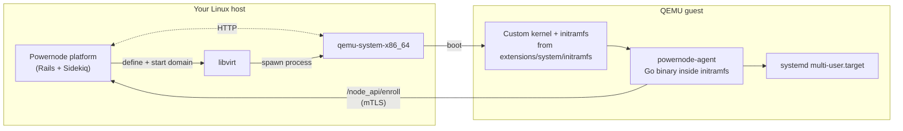

# Tutorial 01 — First boot (single-node QEMU)

> **What you'll learn:** Boot your first Powernode node end-to-end on
> local QEMU — from a clean database through a running VM that's enrolled
> with the platform and reachable on the LAN.
>
> **Time:** ~30 min (first run, cold caches) / ~5 min (subsequent runs)
>
> **Builds on:** Nothing — this is the starting point.
>
> **Sets you up for:** [Tutorial 02 — Your first custom module](./02-first-module.md)
> (forthcoming in Phase A2). Tutorial 02 assumes you have a running node
> from this tutorial and the catalog seeded.

## What you're building



By the end of this tutorial, you'll have:

- A built kernel + initramfs at `extensions/system/initramfs/build/`
- A seeded node-module catalog (architectures, platforms, providers, modules, templates)
- A NodeInstance row in the database with status `running`
- A live QEMU VM reachable on the LAN (or via slirp NAT, depending on network mode)
- An enrolled agent heartbeating back to the platform

## Concept refresher

A **NodeInstance** is the Powernode unit-of-deployment: a VM (or container, or
bare-metal node) provisioned according to a **NodeTemplate** that composes
priority-ordered **NodeModules** for a chosen **NodeArchitecture** + **NodePlatform**.

For local development, the **LocalQemuProvider** lets you provision against
a host's libvirt instead of cloud. It has three runner modes:

- **LibvirtRunner (`real`)** — boots an actual VM via libvirt + QEMU
- **RecorderRunner (`local`)** — records what would happen, no VM starts (fast iteration)
- **DisabledRunner (`disabled`)** — error-fast for production environments where local QEMU shouldn't be reachable

This tutorial uses `real` mode end-to-end.

## Prerequisites

| Requirement | How |
|---|---|
| Linux host (Ubuntu 24.04+ recommended) | — |
| ≥8 GB RAM, ≥40 GB free disk | — |
| QEMU + libvirt | `sudo apt install qemu-system-x86 libvirt-daemon-system libvirt-clients virtinst` |
| dracut | `sudo apt install dracut dracut-network` |
| Boot tools | `sudo apt install mmdebstrap fsverity xorriso skopeo erofs-utils` |
| Sigstore tools | Place `cosign`, `syft`, `grype`, `oras` in `~/.local/bin/` |
| Go toolchain (≥1.22) | `sudo apt install golang-go` |
| dracut module symlink | `sudo ln -sfn $PWD/extensions/system/initramfs/modules.d/90powernode /usr/lib/dracut/modules.d/90powernode` |
| Powernode platform running locally | Rails server on port 3000 + Sidekiq worker — see parent CLAUDE.md service-management section |

`/dev/kvm` is **optional** — without it, QEMU runs in TCG software-emulation
mode. Reaches `multi-user.target` in ~30 s instead of ~3–5 s.

## Step 1 — Build the agent

```bash
cd extensions/system/agent
go mod tidy
make build-amd64
mkdir -p ../initramfs/scripts
cp dist/powernode-agent-linux-amd64 ../initramfs/scripts/powernode-agent-amd64
```

**Expected outcome:** `dist/powernode-agent-linux-amd64` exists (~20 MB
static binary). The copy into `initramfs/scripts/` is what the initramfs
build will pick up in step 2.

## Step 2 — Build the kernel + initramfs

```bash
cd extensions/system/initramfs
bash build.sh --arch amd64 --variants kernel-initrd
```

**Expected outcome:** ~5–15 min runtime on cold cache. Produces
`build/amd64/kernel-initrd/{kernel,initramfs.cpio.zst,SHA256SUMS}`.
The kernel is your host's running kernel (taken from `/boot/vmlinuz-*`);
the initramfs is a dracut-built image with the 90powernode module + the
agent binary baked in.

## Step 3 — Seed the node-module catalog

```bash
cd ../../../server
bundle exec rails runner \
  "load Rails.root.join('../extensions/system/server/db/seeds/node_module_catalog.rb')"
```

**Expected outcome:** The script reports each row it creates (using
`find_or_create_by`, so it's idempotent). Creates:

- 1 NodeArchitecture (`amd64`)
- 1 NodePlatform (`ubuntu-24.04-lts`)
- 1 Provider (`smoke-local-qemu`, type `local_qemu`) + ProviderConnection + ProviderRegion + ProviderInstanceType rows
- 5 NodeModules (`system-base`, `security-hardening`, `chrony`, `apache`, `nginx`)
- 4 NodeTemplates (`base`, `hardened`, `web-apache`, `web-nginx`)

You can re-run anytime; existing rows are skipped.

## Step 4 — Provision a NodeInstance

```bash
POWERNODE_LIBVIRT_MODE=real \
POWERNODE_LIBVIRT_URI=qemu:///session \
POWERNODE_IMAGE_BASE=$(realpath ../extensions/system/initramfs/build) \
POWERNODE_FWCFG_DIR=/tmp/powernode-fwcfg \
POWERNODE_SERIAL_LOG_DIR=/tmp/smoke-serial \
SMOKE_NODE_NAME=first-boot-1 \
SMOKE_INSTANCE_NAME=first-boot-1-vm \
bundle exec rails runner \
  "load Rails.root.join('../extensions/system/server/db/seeds/smoke_test_provision.rb')"
```

**Expected outcome:** The seed reports each step:

```
[smoke_test_provision] Seeding account + user...
[smoke_test_provision] Seeded NodeArchitecture: amd64
[smoke_test_provision] Seeded NodePlatform: ubuntu-24.04-amd64
[smoke_test_provision] Created Node: first-boot-1
[smoke_test_provision] Provisioning instance...
[smoke_test_provision] Task pending → provisioning (libvirt domain creating)
[smoke_test_provision] Task provisioning → running (kernel boot detected)
[smoke_test_provision] ✅ Smoke complete in 4m 12s
```

Total runtime: ~3–5 min with KVM, ~15 min on TCG (no `/dev/kvm`).

## Step 5 — Watch the kernel boot live

In another terminal:

```bash
tail -f /tmp/smoke-serial/domain-serial.log
```

**Expected outcome:** You'll see:

1. The kernel command line — `lockdown=integrity ima_appraise=enforce powernode.boot=1 ...`
2. dracut unpacking the initramfs
3. systemd-networkd configuring the virtio NIC
4. The agent's boot output (cloud-discovery, fw-cfg parse, mTLS handshake attempt)
5. systemd reaching `multi-user.target`

## Verification

Three independent ways to confirm the VM is running:

**Via MCP / REST API** (needs a JWT):

```bash
JWT=$(curl -s -X POST http://localhost:3000/api/v1/auth/login \
  -H "Content-Type: application/json" \
  -d '{"email":"admin@powernode.org","password":"<your-password>"}' \
  | python3 -c "import sys,json; print(json.load(sys.stdin)['data']['access_token'])")

curl -s http://localhost:3000/api/v1/system/instances \
  -H "Authorization: Bearer $JWT" | jq '.data.instances[] | {id, status, last_heartbeat_at}'
# → [{ "id": "01...", "status": "running", "last_heartbeat_at": "2026-05-17T...Z" }]
```

**Via libvirt:**

```bash
virsh -c qemu:///session list
# → first-boot-1-vm   running

# Console into the running VM
virsh -c qemu:///session console first-boot-1-vm
# → login prompt (Ctrl-] to exit)
```

**Via FleetEvent log** — the platform recorded every step:

```bash
bundle exec rails runner '
  puts System::FleetEvent.where("created_at > ?", 1.hour.ago).order(:created_at).map { |e|
    [e.created_at.iso8601, e.kind, e.severity].join(" | ")
  }.join("\n")
'
# → ...
# → system.instance.provisioned   | info
# → system.libvirt.domain_started | info
# → system.kernel.booted          | info
# → system.agent.enrolled         | info
# → system.heartbeat.received     | info
```

## Cleanup

Leaves the system in a known state for [Tutorial 02](./02-first-module.md):
the catalog stays seeded, but the VM is torn down.

```bash
# Terminate via the platform (preferred — drives lifecycle correctly)
curl -X POST http://localhost:3000/api/v1/system/instances/<id>/terminate \
  -H "Authorization: Bearer $JWT"

# Or destroy the libvirt domain directly (faster, bypasses platform lifecycle)
virsh -c qemu:///session destroy first-boot-1-vm
virsh -c qemu:///session undefine first-boot-1-vm --nvram
```

If you want a totally clean slate (drop the catalog too):

```bash
bundle exec rails runner '
  System::NodeInstance.where(name: ["first-boot-1-vm"]).destroy_all
  System::Node.where(name: ["first-boot-1"]).destroy_all
'
```

## Troubleshooting

**`MissingNetbootImageError`** — `POWERNODE_IMAGE_BASE` doesn't point at the
M3 artifact directory. Verify `ls $POWERNODE_IMAGE_BASE` shows `amd64/`
with `kernel-initrd/` inside. Re-run Step 2 if not.

**`virsh start` fails with `failed to create tun device: Operation not permitted`** —
`qemu-bridge-helper` is missing `CAP_NET_ADMIN`. Either:

```bash
sudo setcap cap_net_admin+ep /usr/lib/qemu/qemu-bridge-helper
```

…or install the systemd unit that re-applies this on every boot:

```bash
sudo scripts/systemd/powernode-installer.sh install
```

**Kernel boots but agent never enrolls** — most common cause is the VM
can't reach the platform on port 3000. Two sub-cases:

- `POWERNODE_NETWORK_MODE=user` (default for session URI): VM has slirp NAT,
  reaches host via 10.0.2.2. Default `POWERNODE_PLATFORM_URL=http://localhost:3000`
  resolves to 10.0.2.2 from inside the VM, which is what you want.
- `POWERNODE_NETWORK_MODE=bridge`: VM has a LAN IP. `POWERNODE_PLATFORM_URL`
  must be set to the host's LAN IP, not `localhost`. Re-run Step 4 with
  e.g. `POWERNODE_PLATFORM_URL=http://192.168.1.50:3000`.

**TCG is unbearably slow (>1 min to multi-user.target)** — confirm with
`grep -m1 -oE 'vmx|svm' /proc/cpuinfo`. If empty, you're on a host without
VT-x/AMD-V; enable virtualization in BIOS or — if you're on nested-virt —
enable VMX on the L0 hypervisor and cold-boot the L1.

**Build script picks an orphaned kernel** — set `KERNEL_VERSION` env to
override which `/lib/modules/<ver>` the build uses. Default is the running
kernel (`uname -r`), then newest kernel with both `/boot/vmlinuz-*` and
`/lib/modules/*`.

## What's next

- **[Tutorial 02 — Your first custom module](./02-first-module.md)**
  (forthcoming) — build, sign, and publish your own NodeModule, then
  assign it to a Template and provision a node that runs it.
- **[`../SMOKE_TEST.md`](../SMOKE_TEST.md)** — the platform-level smoke
  catalog. This tutorial walked `smoke_test_provision.rb` (Pass 1). The
  other passes exercise container runtimes, SDWAN, federation, ACME, and
  storage.
- **[`../runbooks/node-provisioning.md`](../runbooks/node-provisioning.md)** —
  the full lifecycle reference for production node operations (drain,
  decommission, recover from stuck states).
- **[`../ARCHITECTURE.md`](../ARCHITECTURE.md)** §2 — deeper read on the
  Node + NodeInstance lifecycle, AASM state machines, and the polymorphic
  Task model.
