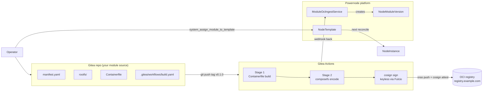

# Tutorial 02 — Your first custom module

> **What you'll learn:** Author, sign, publish, and assign a custom NodeModule — the full module supply chain from blank git repo to a Module showing up on a NodeInstance.
>
> **Time:** ~45 min (most of which is waiting for CI)
>
> **Builds on:** [Tutorial 01](./01-first-boot.md) — needs the catalog seeded and the platform running. The VM from Tutorial 01 doesn't need to be live for this tutorial; we'll provision a fresh one in step 9.
>
> **Sets you up for:** [Tutorial 03 — Docker runtime](./03-docker-runtime.md) (uses a real module — `docker-engine` — to provision Docker; the workflow you learn here is how you'd author your own runtime variant).

## What you're building



By the end you'll have published `my-redis` as a versioned, signed, lifecycle-tracked module assignable to any NodeTemplate.

## Concept refresher

A **NodeModule** is a versioned, signed unit of filesystem + package state.
Each module ships:

- **`manifest.yaml`** — authoring-time hints (name, license, packages, file globs)
- **`rootfs/`** — files copied verbatim into the module's filesystem layer
- **`Containerfile`** — Stage 1 of CI; installs packages + copies rootfs

The platform composes a NodeInstance's root filesystem from priority-ordered
module composefs layers (see [Tutorial 01](./01-first-boot.md) overlay-union
diagram). Each layer is content-addressed, fs-verity-hashed, cosign-signed —
tamper-detected at file-open time.

**Authority note:** the four glob-spec fields (`mask`, `file_spec`,
`package_spec`, `dependency_spec`) on the `System::NodeModule` *platform
record* are authoritative for builds. The repo's `manifest.yaml` only seeds
those fields on first import; subsequent edits happen via the platform UI / API.

## Prerequisites

| Requirement | How |
|---|---|
| Tutorial 01 completed | Catalog seeded |
| Gitea account with permission to create repos | E.g. `registry.example.com/<account>/modules/...` |
| `docker` + `oras` + `cosign` CLIs | `apt install docker.io; curl -L <release>/oras_*.tar.gz \| tar xz; curl -L <release>/cosign-linux-amd64 -o ~/.local/bin/cosign && chmod +x ~/.local/bin/cosign` |
| Gitea Actions runner labeled `ubuntu-24.04` | (self-hosted; multi-arch needs `ubuntu-24.04-arm` too) |
| A NodeTemplate to assign your module to | Use `base` or `hardened` from Tutorial 01's catalog |

## Step 1 — Clone the canonical template

```bash
git clone git@registry.example.com:powernode/templates/module-repo.git my-redis-module
cd my-redis-module
rm -rf .git
git init
git remote add origin git@registry.example.com:<account>/modules/my-redis-module.git
```

**Expected outcome:** clean working tree with `Containerfile`,
`manifest.yaml`, `rootfs/.gitkeep`, and `.gitea/workflows/build.yaml`. The
template is the canonical layout — never deviate from it; the platform's
ingest path expects exactly this shape.

## Step 2 — Edit `manifest.yaml`

```yaml
schema_version: 1

identity:
  name: my-redis
  category: userland
  variety: subscription
  description: Redis 7.4 with TLS + persistence
  cosign_identity_regexp: '^https://registry\.example\.com/<account>/modules/my-redis-module@.*$'
  cosign_issuer_regexp:   '^https://gitea\.ipnode\.org$'

package_spec:
  - redis-server
  - redis-tools

file_spec:
  include:
    - "/etc/redis/**"
    - "/var/lib/redis/.gitkeep"
  exclude:
    - "/etc/redis/sentinel.conf"

protected_spec:
  - "/etc/redis/redis.conf"          # this module owns the main config

dependency_spec:
  - name: system-base
  - name: security-hardening
```

**Expected outcome:** YAML validates against `MODULE_MANIFEST_COMPLETE_SCHEMA.md`.
Cosign identity regex must match exactly the path your Gitea Actions runs from —
mismatches cause ingestion to reject the artifact post-build.

## Step 3 — Add the rootfs tree

```bash
mkdir -p rootfs/etc/redis rootfs/var/lib/redis
touch rootfs/var/lib/redis/.gitkeep
```

Write `rootfs/etc/redis/redis.conf`:

```ini
bind 0.0.0.0 ::
port 6379
protected-mode yes
tls-port 6380
tls-cert-file /etc/redis/tls/server.crt
tls-key-file  /etc/redis/tls/server.key
tls-ca-cert-file /etc/redis/tls/ca.crt
appendonly yes
dir /var/lib/redis
```

**Expected outcome:** Files under `rootfs/` will be copied verbatim into the
module's composefs layer at build time. `.gitkeep` is the convention for
empty directories — composefs needs the dir to exist in the artifact, even
empty.

## Step 4 — Validate the manifest locally

```bash
# Until system_validate_module_manifest ships (currently in MCP gap backlog):
docker run --rm -v "$PWD:/work:ro" ghcr.io/powernode/module-builder:latest --dry-run
```

**Expected outcome:** dry-run reports any schema violations, glob-spec
conflicts, or missing required fields without building artifacts. Fix
warnings here — they'll fail later much more expensively.

## Step 5 — Register the module on the platform

```javascript
// Via MCP (or the operator UI at /app/system/modules/new):
platform.system_create_module_from_package({
  name: "my-redis",
  category_slug: "userland",
  variety: "subscription",
  gitea_repo_full_name: "<account>/modules/my-redis-module"
})
// → { module: { id, webhook_secret: "<one-time-displayed-secret>", ... } }
```

**Copy the `webhook_secret` immediately** — it's displayed once and used to
HMAC-sign the build-completion webhook back from Gitea Actions to the platform.

In Gitea: open repo → Settings → Actions → Secrets → add `POWERNODE_WEBHOOK_SECRET`
with the value from above.

## Step 6 — Push to Gitea

```bash
git add manifest.yaml Containerfile rootfs/ .gitea/
git commit -m "feat: my-redis module v0.1.0"
git tag v0.1.0
git push origin develop --tags
```

**Expected outcome:** tag push triggers the workflow in `.gitea/workflows/build.yaml`.
Watch via MCP:

```javascript
platform.list_gitea_workflow_runs({
  owner: "<account>",
  repo: "modules/my-redis-module"
})
// → { runs: [{ id, status: "in_progress", ... }] }
```

## Step 7 — Wait for CI

The workflow runs:

1. **Stage 1 (Containerfile build)** — pulls the Ubuntu 24.04 base at the
   pinned digest, installs `package_spec`, copies `rootfs/` to `/work/`
2. **Stage 2 (composefs encode)** — converts `/work/` to a content-addressed
   composefs blob set with fs-verity root hash
3. **syft + grype** — generates SBOM + VEX; the SBOM is ingested by the
   platform's CVE pipeline
4. **cosign keyless sign** — Sigstore Fulcio issues an ephemeral cert bound
   to the Gitea Actions OIDC token; signs the OCI manifest
5. **`oras push`** — pushes to `registry.example.com/<account>/modules/my-redis-module:v0.1.0`
6. **Webhook** — POSTs to platform's `/api/v1/system/webhooks/gitea/module`
   with HMAC signed by `POWERNODE_WEBHOOK_SECRET`

**Expected outcome:** ~5–8 min runtime. Workflow shows `success`. The
platform's `ModuleOciIngestService` polls the registry and creates a
`NodeModuleVersion` row in `lifecycle_state: draft`.

## Step 8 — Verify ingestion

```javascript
platform.system_list_module_versions({ module_name: "my-redis" })
// → { versions: [{
//      id: "v-redis-0.1.0",
//      version_string: "0.1.0",
//      lifecycle_state: "draft",
//      composefs_digest: "sha256:abc...",
//      fsverity_root_hash: "sha256:def...",
//      cosign_verified: true,
//      ...
//    }] }
```

**Expected outcome:** the version row exists, signature verified, lifecycle
is `draft`. Promote through staging → blessed → live as you verify the module
behaves correctly:

```javascript
platform.system_promote_module_version({ id: "v-redis-0.1.0", to: "staging" })
// Test on a non-prod NodeInstance
platform.system_promote_module_version({ id: "v-redis-0.1.0", to: "blessed" })
// Operator review passed; module is recommendable
platform.system_promote_module_version({ id: "v-redis-0.1.0", to: "live" })
// Now eligible for fleet-wide rollout
```

Promotion to `live` is often `require_approval` — check `module_promote_to_live`
intervention policy.

## Step 9 — Assign to a Template + provision

```javascript
platform.system_assign_module_to_template({
  template_id: "<base-or-hardened-template-id>",
  module_name: "my-redis"
})

// Provision a fresh instance from that template
platform.system_create_node({ hostname: "redis-test-1", node_template_id: "<template-id>", ... })
platform.system_provision_instance({ node_id: ... })
// Wait ~3-5 min for KVM boot + module reconcile
```

**Expected outcome:** instance reaches `status: running` and the module
appears in `running_module_digests`.

## Verification

```javascript
platform.system_get_instance({ id: "<instance-id>" })
// → { instance: {
//      running_module_digests: { "my-redis": "sha256:abc...", "system-base": "...", ... },
//      ...
//    }}

platform.system_drift_report({ instance_id: "<id>" })
// → { drift: false }
```

If you can reach the instance over SDWAN (set up during Tutorial 01):

```bash
ssh ops@<instance-host-address>
systemctl status redis-server.service
# → active (running)
redis-cli ping
# → PONG
```

## Cleanup

Leaves the catalog seeded with `my-redis` for future reference, but
removes the test instance:

```javascript
platform.system_terminate_instance({ id: "<instance-id>" })

// Unassign so the next instance from this template doesn't get the test module
platform.system_unassign_module_from_template({
  template_id: "<template-id>",
  module_name: "my-redis"
})

// (Optional) archive the module if you don't want it visible in the catalog
platform.system_delete_module({ name: "my-redis" })   // cascade-deletes versions
```

## Troubleshooting

**Workflow fails at cosign step with `unable to fetch token from OIDC issuer`** —
Gitea Actions OIDC isn't configured. In Gitea: Admin Panel → Settings →
enable Actions OIDC; check `.gitea/workflows/build.yaml` has `id-token: write`
permissions.

**Workflow succeeds but no NodeModuleVersion row appears** — webhook failed
to authenticate. Two common causes:

- `POWERNODE_WEBHOOK_SECRET` doesn't match `NodeModule.webhook_secret` (regenerate via Settings → Actions → Secrets and re-paste)
- Platform's webhook controller IP-banned the Gitea runner (check
  `journalctl -u powernode-backend@default | grep gitea_module`)

**`cosign_verified: false`** in version row — identity / issuer regex mismatch.
Edit the module record's regex fields to match the Gitea Actions OIDC subject
exactly. Re-trigger workflow.

**Instance reconciles but module doesn't appear in `running_module_digests`** —
agent's heartbeat is reporting a different list than what's assigned. Two
sub-cases:

- Module dependency missing on the platform side (your `dependency_spec` references a module that's not in `staging`+)
- Agent failed to verify fs-verity root hash on download (check agent logs via serial console; look for "fsverity verification failed")

**`PoolEmptyError` on provision** — you're using an InstancePool template but
the pool's empty. Either wait for replenishment (~5 min) or create a fresh
non-pool NodeInstance.

## What's next

- **[Tutorial 03 — Container runtime — Docker](./03-docker-runtime.md)** —
  the `docker-engine` module is just a module like the one you built. Now
  you'll assign it to a node and watch the platform manage `dockerd`.
- **[`runbooks/module-authoring.md`](../runbooks/module-authoring.md)** —
  full reference: variety types, dependent module hierarchies, config
  overlays, advanced glob semantics.
- **[`templates/example-modules/`](../../templates/example-modules/)** —
  seven working examples (apache, chrony, nginx, security-hardening,
  system-base, rpi4-firmware) you can study for patterns.
- **[`MODULE_MANIFEST_COMPLETE_SCHEMA.md`](../MODULE_MANIFEST_COMPLETE_SCHEMA.md)** —
  every manifest field explained.
