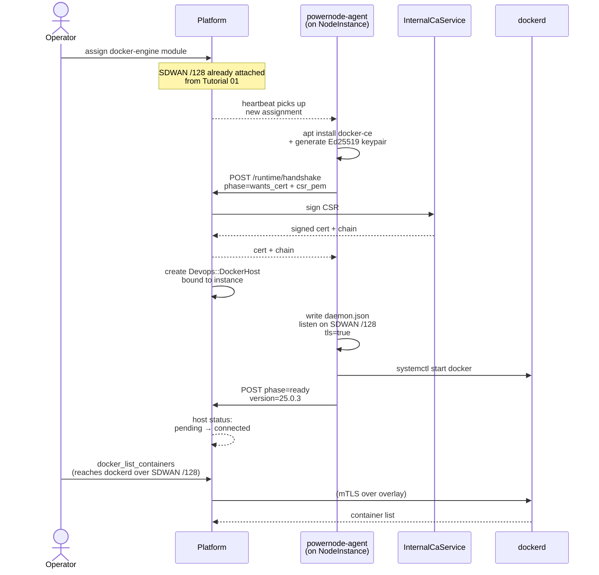

# Tutorial 03 — Container runtime — Docker

> **What you'll learn:** Provision a managed Docker daemon on a NodeInstance —
> the platform handles TLS provisioning via Vault-backed InternalCaService,
> binds the daemon to the SDWAN overlay /128, and exposes the host through
> the operator API.
>
> **Time:** ~15 min
>
> **Builds on:** [Tutorial 01](./01-first-boot.md) (running node + catalog seeded) and
> [Tutorial 02](./02-first-module.md) (you've published a module — you understand the
> module → instance assignment pattern). For this tutorial we use the
> shipped `docker-engine` module instead of a custom one.
>
> **Sets you up for:** [Tutorial 04 — K3s cluster](./04-k3s-cluster.md) — the same
> handshake pattern you'll see here applies to K3s, just with different
> phase names.

## What you're building



By the end you'll have a managed Docker daemon you can drive via MCP
(`docker_*` actions) or directly via the Docker CLI with the right TLS
material.

## Concept refresher

**Phase 1 Docker** is the System extension's first container runtime: each
managed daemon runs inside a NodeInstance, listens on **only** the SDWAN
overlay `/128` (no public socket, no Unix socket exposed beyond the
instance), and authenticates clients via mTLS. The CA hierarchy is rooted
in `InternalCaService` (Vault PKI when available; fixture PEM in dev).

The daemon is provisioned via the `runtime/handshake` API — a stateless
phase machine the agent walks through (`wants_cert` → `wants_config` →
`ready`) on heartbeat ticks. The platform creates the corresponding
`Devops::DockerHost` row when the agent posts `wants_cert`.

Crucially, the trust boundary is **SDWAN network membership**, not just
TLS daemon credentials. A Docker host on SDWAN network A cannot be reached
from a peer on network B even if it has valid TLS material, because the
network paths don't intersect.

## Prerequisites

| Requirement | How |
|---|---|
| Working NodeInstance from Tutorial 01 (or a fresh one) | `platform.system_provision_instance` |
| SDWAN peer attached to that instance | `platform.system_sdwan_attach_peer` — the daemon needs a /128 to bind to. Required; provisioning errors `MissingSdwanPeerError` if missing. |
| `docker-engine` module promoted to `live` (or `blessed` with override) | Default catalog from Tutorial 01 includes it |
| Operator permission `system.docker_provision` | Default for admin users |

## Step 1 — Confirm SDWAN attachment

```javascript
platform.system_sdwan_list_peers({ network_id: "<your-network>" })
// → { peers: [{ id, node_instance_id: "<your-instance>", overlay_address: "fd00:abcd:1::42", ... }] }
```

**Expected outcome:** your instance has a `/128` allocated. If not,
attach one:

```javascript
platform.system_sdwan_attach_peer({
  network_id: "<network-id>",
  node_instance_id: "<instance-id>"
})
```

## Step 2 — Assign the `docker-engine` module

```javascript
// Find the template the instance was provisioned from
platform.system_get_instance({ id: "<instance-id>" })
// → { instance: { node_template_id: "<template-id>", ... } }

// Assign the module
platform.system_assign_module_to_template({
  template_id: "<template-id>",
  module_name: "docker-engine"
})
```

**Expected outcome:** assignment row created. On the next agent heartbeat
(within ~60s), the agent picks up the new module and starts installing
`docker-ce`.

## Step 3 — Watch the handshake

```javascript
platform.recent_events({ kind_prefix: "system.docker", limit: 20 })
// → events: [
//      { kind: "system.docker.module.assigned",      ... },
//      { kind: "system.docker.runtime.installing",   ... },
//      { kind: "system.docker.handshake.wants_cert", ... },
//      { kind: "system.docker.handshake.cert_signed", ... },
//      { kind: "system.docker.handshake.ready",      ... },
//      { kind: "system.docker.provisioned",          ... }
//    ]
```

**Expected outcome:** ~2–3 min wall clock for the full sequence on a warm
instance. The new `Devops::DockerHost` appears:

```javascript
platform.docker_list_hosts()
// → { hosts: [{
//      id: "host-<uuid>",
//      node_instance_id: "<instance-id>",
//      api_endpoint: "tcp://[fd00:abcd:1::42]:2376",
//      status: "connected",
//      version: "25.0.3"
//    }] }
```

## Step 4 — Pull and run a container

```javascript
platform.docker_pull_image({
  host_id: "host-<uuid>",
  image: "nginx:1.27-alpine"
})
// → { image: { id, repo_tags: ["nginx:1.27-alpine"], size: 22000000 } }

platform.docker_create_container({
  host_id: "host-<uuid>",
  image: "nginx:1.27-alpine",
  name: "hello-nginx",
  ports: [{ host: 8080, container: 80 }],
  detach: true
})
// → { container: { id, status: "running", ... } }
```

**Expected outcome:** container is reachable on the instance's overlay
`/128:8080` from any peer on the same SDWAN network.

## Verification

Three independent ways to confirm:

**Via MCP**:

```javascript
platform.docker_list_containers({ host_id: "host-<uuid>" })
// → { containers: [{ id, image: "nginx:1.27-alpine", status: "Up 30 seconds", ... }] }
```

**Via container HTTP** (from an operator workstation peer on the same network):

```bash
curl http://[fd00:abcd:1::42]:8080
# → <!DOCTYPE html>... (nginx default welcome page)
```

**Via Docker CLI** (if you've exported the operator client cert from the
platform):

```bash
docker --tlsverify \
  --tlscacert ~/.powernode/operator-ca.pem \
  --tlscert ~/.powernode/operator-cert.pem \
  --tlskey ~/.powernode/operator-key.pem \
  -H tcp://[fd00:abcd:1::42]:2376 \
  ps
```

(operator cert export procedure is in `docs/runbooks/node-provisioning.md`)

## Cleanup

```javascript
platform.docker_delete_container({ host_id: "host-<uuid>", container_id: "<id>", force: true })
platform.docker_delete_image({ host_id: "host-<uuid>", image_id: "nginx:1.27-alpine" })

// Decommission the managed daemon (drops cert, stops dockerd)
platform.system_decommission_docker_runtime({ host_id: "host-<uuid>" })

// Optionally unassign the module from the template
platform.system_unassign_module_from_template({
  template_id: "<template-id>",
  module_name: "docker-engine"
})
```

## Troubleshooting

**`MissingSdwanPeerError` on assignment** — the instance has no SDWAN peer
attached. The daemon needs a `/128` to bind to (it doesn't listen on `0.0.0.0`).
Run Step 1's attach command first.

**Handshake stuck at `wants_cert`** — `InternalCaService` is failing. Check
which adapter is active:

```javascript
platform.platform_provisioning_status()
// → { ca_adapter: "LocalCaAdapter" | "VaultCaAdapter", ... }
```

If `VaultCaAdapter`, verify Vault's `pki_int` mount is reachable and the
`node` role exists. Per `project_vault_pki_state` memory, dev environments
typically run on `LocalCaAdapter` (fixture PEM) — that's expected.

**Handshake fails at `wants_config`** — the agent received the cert but
can't write `daemon.json`. SSH to the instance and check
`journalctl -u powernode-agent.service` for permissions errors. Common cause:
`/etc/docker/` is missing or owned by a non-root user.

**Docker daemon starts but `status` stuck at `pending`** — daemon isn't
returning the `ready` phase. Three sub-cases:

- Daemon listening on wrong address (check `ss -tlnp | grep dockerd` on the instance — should be `[fd00:...]:2376`, not `0.0.0.0:2376`)
- mTLS misconfigured (daemon refuses connections without client cert; check `journalctl -u docker.service`)
- `daemon.json` syntax error (run `dockerd --validate` on the instance)

**Cannot reach the daemon from operator workstation** — your workstation
peer isn't on the same SDWAN network as the docker host. Use:

```javascript
platform.system_sdwan_create_access_grant({
  network_id: "<host's network>",
  device_name_hint: "ops-laptop"
})
```

…then import the resulting WireGuard config on your laptop.

## What's next

- **[Tutorial 04 — K3s cluster](./04-k3s-cluster.md)** — same handshake
  pattern, different runtime: K3s control plane via `k3s-server` module +
  workers via `k3s-agent`.
- **[`CONTAINER_RUNTIMES.md`](../CONTAINER_RUNTIMES.md)** — Phase 1 + Phase 2
  full operator guide with troubleshooting trees.
- **[`USE_CASE_MATRIX.md`](../USE_CASE_MATRIX.md)** — what works / doesn't
  for 10 NodeInstance container scenarios, including limitations of Phase 1
  Docker (single-host only — no cross-host Swarm).
- **[`SMOKE_TEST.md`](../SMOKE_TEST.md) Pass 2** — `smoke_test_docker_runtime.rb`
  exercises the same handshake at the platform layer without a live VM.
