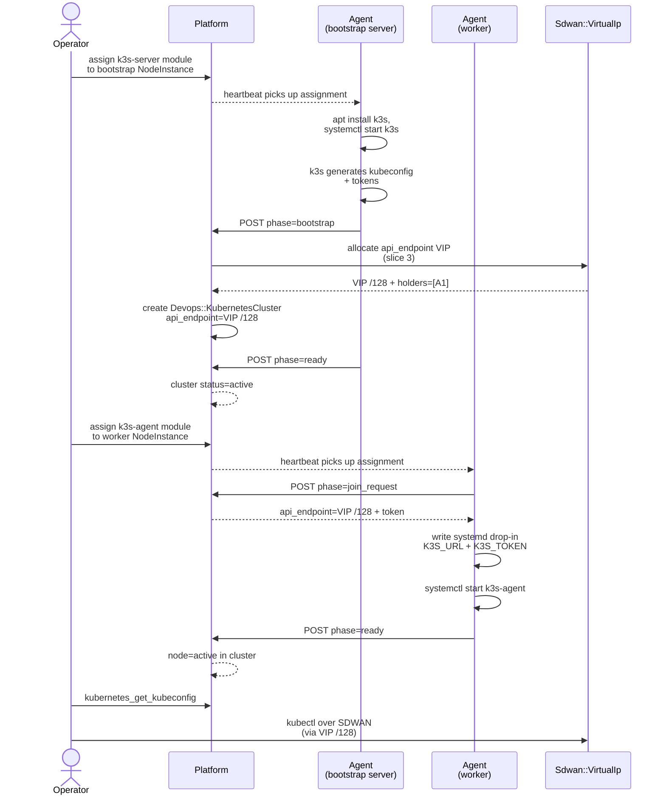

# Tutorial 04 — Container runtime — K3s cluster

> **What you'll learn:** Provision a K3s control plane + worker on Powernode
> NodeInstances. The platform auto-bootstraps `k3s-server`, allocates a
> SDWAN-backed `api_endpoint` VIP (slice 3 — survives bootstrap-node loss
> via automatic failover), and joins workers with `target_cluster_id`.
>
> **Time:** ~25 min (with two NodeInstances)
>
> **Builds on:** [Tutorial 03](./03-docker-runtime.md) — you understand the runtime
> handshake pattern. K3s uses the same machinery with different phase
> names (`bootstrap` and `join_request` instead of `wants_cert`).
>
> **Sets you up for:** [Tutorial 05 — Multi-cluster K3s + SDWAN isolation](./05-multi-cluster-k3s.md).

## What you're building



By the end you'll have a working K3s cluster with one control-plane + one
worker, addressable via a VIP that survives control-plane failover.

## Concept refresher

**Phase 2 K3s** uses the same `runtime/handshake` machinery as Phase 1
Docker but with two new phases:

- `bootstrap` — k3s installed, kubeconfig + tokens generated; platform
  creates the `KubernetesCluster` row
- `join_request` — worker agent asks for the `api_endpoint + token` to join

**The `api_endpoint` is a slice 3 first-class `Sdwan::VirtualIp`** with the
bootstrap server as its primary holder. When the bootstrap server is lost
or drained, the VIP automatically migrates to another `k3s-server`-bearing
peer in the cluster, and worker `K3S_URL` keeps resolving — no kubectl /
operator action required. (Single-server cluster: VIP failover has nowhere
to go; for production HA you want ≥2 servers.)

**`metadata.target_cluster_id`** is the mandatory tag on `k3s-agent`
assignments in multi-cluster accounts — without it, the agent picks the
first cluster it finds, which is wrong if you have more than one.

## Prerequisites

| Requirement | How |
|---|---|
| Tutorial 03 worked | You understand runtime handshake + SDWAN /128 binding |
| ≥2 NodeInstances available | Provision via Tutorial 01 if needed |
| Both instances have SDWAN peers on the same network | `system_sdwan_attach_peer` |
| `k3s-server` + `k3s-agent` modules promoted to `live` | Default in Tutorial 01 catalog |
| Operator permission `system.kubernetes_provision` | Default for admins |

## Step 1 — Provision the bootstrap server

If you don't already have a NodeInstance ready:

```javascript
platform.system_create_node({
  hostname: "k3s-server-1",
  node_template_id: "<base-or-k3s-server-template>",
  ...
})
platform.system_provision_instance({ node_id: ... })
platform.system_sdwan_attach_peer({ network_id, node_instance_id })
```

**Expected outcome:** instance is `running` and has an SDWAN `/128`.

## Step 2 — Assign the `k3s-server` module

```javascript
platform.system_assign_module_to_template({
  template_id: "<template-id>",
  module_name: "k3s-server"
})
```

**Expected outcome:** within ~60s, the agent picks up the new assignment
and installs k3s. The bootstrap handshake completes in ~30–60s after that.

Watch via:

```javascript
platform.recent_events({ kind_prefix: "system.k3s", limit: 20 })
// → events: [
//      { kind: "system.k3s.module.assigned",       ... },
//      { kind: "system.k3s.runtime.installing",    ... },
//      { kind: "system.k3s.handshake.bootstrap",   ... },
//      { kind: "system.sdwan.virtual_ip.allocated", payload: { vip: "fd00:abcd:1::100", purpose: "k3s_api_endpoint" } },
//      { kind: "system.k3s.cluster.bootstrapped",  ... },
//      { kind: "system.k3s.handshake.ready",       ... }
//    ]
```

## Step 3 — Verify the cluster

```javascript
platform.kubernetes_list_clusters()
// → { clusters: [{
//      id: "cluster-<uuid>",
//      name: "k3s-cluster-1",
//      flavor: "k3s",
//      status: "active",
//      api_endpoint: "https://[fd00:abcd:1::100]:6443",
//      node_count: 1
//    }] }
```

**Expected outcome:** `status: active`. The `api_endpoint` is the
VIP-backed `/128`, not the bootstrap server's instance `/128` — that's
what gives you slice 3 failover.

## Step 4 — Provision the worker

```javascript
platform.system_create_node({
  hostname: "k3s-worker-1",
  node_template_id: "<worker-template>",
  ...
})
platform.system_provision_instance({ node_id: ... })
platform.system_sdwan_attach_peer({ network_id, node_instance_id })
```

## Step 5 — Assign `k3s-agent` with target_cluster_id

```javascript
platform.system_assign_module_to_template({
  template_id: "<worker-template>",
  module_name: "k3s-agent",
  config: {
    target_cluster_id: "<cluster-id-from-step-3>"
  }
})
```

**Expected outcome:** `target_cluster_id` is mandatory when more than one
cluster exists in the account. Within ~60s the agent picks up the
assignment, requests the join token, and joins:

```javascript
platform.recent_events({ kind_prefix: "system.k3s.handshake.join", limit: 5 })
// → { kind: "system.k3s.handshake.join_request", ... }
// → { kind: "system.k3s.handshake.join_token_issued", ... }
// → { kind: "system.k3s.handshake.ready", ... }
```

## Step 6 — Retrieve kubeconfig + use kubectl

```javascript
platform.kubernetes_get_kubeconfig({ cluster_id: "cluster-<uuid>" })
// → { kubeconfig: "apiVersion: v1\nclusters:\n- cluster:\n    server: https://[fd00:abcd:1::100]:6443\n...",
//     api_endpoint: "https://[fd00:abcd:1::100]:6443" }
```

Save it locally (you need SDWAN access from your operator workstation —
import a WireGuard config via `system_sdwan_create_access_grant` if you
haven't already):

```bash
mkdir -p ~/.kube
platform.kubernetes_get_kubeconfig({ cluster_id }) | jq -r '.data.kubeconfig' > ~/.kube/k3s.yaml
chmod 600 ~/.kube/k3s.yaml

kubectl --kubeconfig ~/.kube/k3s.yaml get nodes
# → NAME           STATUS   ROLES                  AGE   VERSION
#   k3s-server-1   Ready    control-plane,master   5m    v1.30.5+k3s1
#   k3s-worker-1   Ready    <none>                 1m    v1.30.5+k3s1
```

## Verification

**Cluster status via MCP:**

```javascript
platform.kubernetes_list_nodes({ cluster_id: "cluster-<uuid>" })
// → { nodes: [
//      { instance_id, role: "control-plane", status: "ready", version: "v1.30.5+k3s1" },
//      { instance_id, role: "worker",        status: "ready", version: "v1.30.5+k3s1" }
//    ] }
```

**Sanity check pod scheduling:**

```bash
kubectl --kubeconfig ~/.kube/k3s.yaml run hello \
  --image nginx:1.27-alpine --port 80 --restart Never
kubectl --kubeconfig ~/.kube/k3s.yaml get pod hello -w
# → hello   0/1   ContainerCreating
# → hello   1/1   Running
```

**VIP failover (advanced):** drain the bootstrap server and watch the VIP
migrate:

```javascript
platform.system_drain_instance({ id: "<bootstrap-instance-id>" })
// Within ~10s, VIP migrates to next k3s-server-bearing peer (if any)
platform.system_sdwan_get_virtual_ip({ name: "k3s_api_endpoint" })
// → { virtual_ip: { holders: [<different instance>], ... } }

kubectl --kubeconfig ~/.kube/k3s.yaml get nodes
# Still works — the VIP /128 now resolves to a different host
```

(Single-server cluster: drain causes outage; this is why production wants ≥2 servers.)

## Cleanup

```javascript
platform.kubernetes_decommission_cluster({ cluster_id: "cluster-<uuid>" })
// Cascade-deletes KubernetesNode rows; releases VIP; underlying NodeInstances NOT terminated

platform.system_terminate_instance({ id: "<bootstrap-instance>" })
platform.system_terminate_instance({ id: "<worker-instance>" })
```

## Troubleshooting

**Cluster stuck at `status: bootstrapping`** — the bootstrap server's k3s
isn't healthy. SSH to the instance and check `systemctl status k3s` and
`journalctl -u k3s.service`. Common causes:

- `/dev/kvm`-related: cgroup v2 needs a kernel with the right config (Ubuntu 24.04 is fine; some bare-metal kernels disable it)
- DNS: K3s needs working DNS resolution to pull container images. Check `resolvectl status` inside the instance.

**VIP not allocated** — `system.sdwan.virtual_ip.allocated` event never
fires. The cluster status falls back to using the bootstrap server's
instance `/128` as `api_endpoint` (no failover). Check `SdwanManager` agent
logs:

```javascript
platform.agent_introspect({ agent_id: "sdwan_manager_agent" })
```

**Worker stuck at `join_request`** — most common cause is wrong
`target_cluster_id`. The agent tries to join and gets a 404. Check:

```javascript
// ⚠️ aspirational — use platform.system_get_template({ id: template_id }) and inspect module_assignments[]
platform.system_get_template({ id: "<template-id>" })
// Verify the k3s-agent assignment's config.target_cluster_id matches an existing cluster
```

**`kubectl` from operator workstation hangs** — your workstation isn't on
the same SDWAN network. Either:

- Add an access grant: `platform.system_sdwan_create_access_grant({ network_id, ... })`
- Use a federation peer if the cluster is on a remote account (see Tutorial 11)

**Pods can't reach each other across nodes** — flannel CNI uses the host's
primary NIC by default, not SDWAN. To switch to ovn-kubernetes CNI (encrypted
pod traffic over OVN tunnels), bootstrap the cluster with the `cni_plugin`
override:

```javascript
platform.system_provision_instance({
  node_id: "<bootstrap-node-id>",
  // ... usual args ...
  // The provisioner reads cni_plugin from the template/operator hint
  // and validates against the bootstrap node's network_profile.
})
```

The provisioner auto-defaults the CNI from `network_profile`: heavyweight
nodes (≥4 GB RAM) get `ovn_kubernetes`; lightweight nodes get `flannel`.
Explicit overrides are validated — passing `ovn_kubernetes` on a lightweight
node raises `CniProfileMismatchError`. See [`CONTAINER_RUNTIMES.md` §"CNI
selection (Phase O4)"](../CONTAINER_RUNTIMES.md#cni-selection-phase-o4--shipped)
for the full table.

## Pod traffic over SDWAN (encrypted pod-to-pod)

For flannel clusters, you can route pod-to-pod traffic over the SDWAN
WireGuard overlay instead of the host's primary NIC. This is opt-in per
SDWAN network.

**Set `pod_subnet_prefix` on the SDWAN network** (must not overlap the
SDWAN /64, peer LAN subnets, VIP CIDRs, or another network's
`pod_subnet_prefix`):

```javascript
platform.system_sdwan_create_network({
  name: "k3s-prod-net",
  pod_subnet_prefix: "10.42.0.0/16",     // flannel default size
  routing_mode: "ibgp"                   // recommended for >2 hosts (direct peer-to-peer)
})
```

**Bootstrap the cluster with `cni_plugin: "flannel"`** on a NodeInstance
peered to this network. The provisioner stamps the cluster's metadata
with `pod_cidr` + `sdwan_network_id`; the agent then receives extra
flannel args (`--flannel-iface=wg-sdwan-<handle>`,
`--flannel-backend=host-gw`, `--cluster-cidr=10.42.0.0/16`) at install
time. K3s starts flannel in host-gw mode, which installs per-node /24
routes pointing at each node's overlay IP. The kernel routes those
overlay IPs through the existing WG tunnels via the SDWAN AllowedIPs.

**Verify pod traffic on the WG interface** (live smoke):

```bash
# On node A (kubectl gives you the WG iface name from --flannel-iface output)
kubectl get pods -A -o wide                          # find pods on node A + node B
tcpdump -i wg-sdwan-<handle> 'host <pod-IP-node-B>'  # should show traffic during pod-to-pod test
```

**Migration of an existing flannel cluster**: setting `pod_subnet_prefix`
on a network that already has running flannel clusters triggers the
agent's reconcile loop to re-install k3s with the new flags on next
heartbeat (~60 s). This causes a brief 30–60 s pod-network outage per
node as k3s restarts. The operator's act of setting the field IS the
explicit opt-in; if you can't tolerate the outage, drain workloads first
or wait for a maintenance window.

**Immutability**: `pod_subnet_prefix` cannot change once any cluster
references the network — k3s pod CIDR is immutable post-bootstrap.
Destroy + rebuild the cluster to migrate to a different pod CIDR.

**Agent binary requirement**: the new `--flannel-iface` / `--flannel-backend=host-gw` / `--cluster-cidr` arguments are consumed by the on-node Go agent's `k3sd` package. Existing NodeInstances running an older agent binary will ignore the new fields (the JSON is zero-value-safe — unknown fields are skipped). **For the feature to take effect on existing instances**, the agent binary must be rebuilt + the initramfs republished + instances rebooted (or re-provisioned) so they pick up the new binary. New instances provisioned after the agent binary rebuild get the feature automatically. The agent binary is built via the system extension's CI; see `extensions/system/agent/Makefile` for the build flow and `runbooks/disk-image-ci.md` for the initramfs republish path.

ovn-Kubernetes ignores `pod_subnet_prefix` (its OVN layer owns the
pod-network); setting the field on an ovn-K8s path emits a
`system.cluster_bootstrap.pod_subnet_prefix_ignored` warning event but
otherwise bootstraps normally.

## What's next

- **[Tutorial 05 — Multi-cluster K3s + SDWAN isolation](./05-multi-cluster-k3s.md)** —
  multiple clusters with per-tenant networks; `target_cluster_id` and
  cross-tenant trust boundaries.
- **[`runbooks/multi-cluster-k3s.md`](../runbooks/multi-cluster-k3s.md)** —
  patterns for production multi-cluster: HA control plane (≥3 servers),
  zone-aware scheduling, kubeconfig distribution.
- **[`CONTAINER_RUNTIMES.md`](../CONTAINER_RUNTIMES.md)** — Phase 2 K3s
  full lifecycle reference + Phase 3 (kubeadm HA control plane) roadmap.
- **[`SMOKE_TEST.md`](../SMOKE_TEST.md) Pass 2** — `smoke_test_k3s_runtime.rb`
  and `smoke_test_ovn_k8s_cni.rb` exercise the same handshake at the
  platform layer without a live K3s install.
