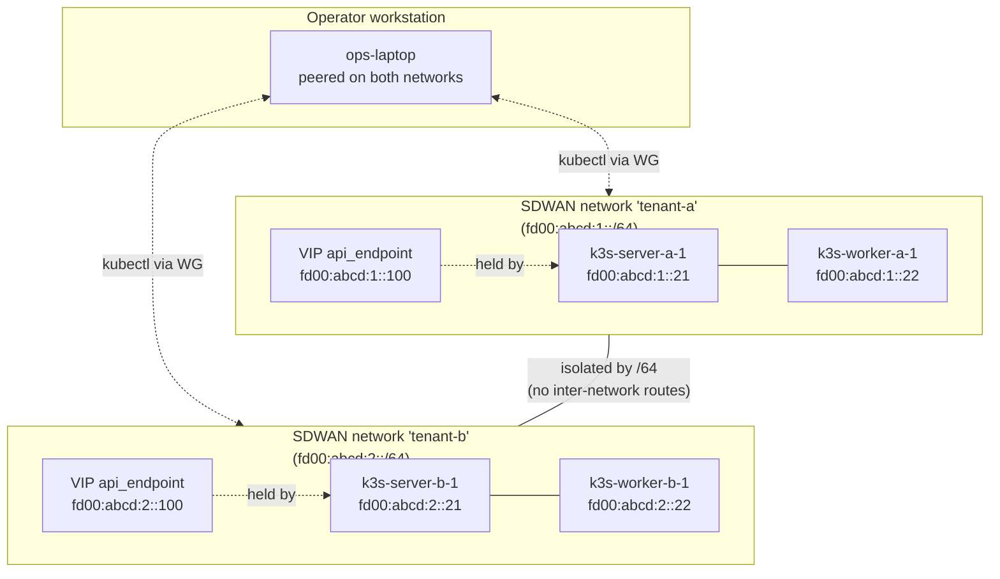

# Tutorial 05 — Multi-cluster K3s with SDWAN isolation

> **What you'll learn:** Run multiple K3s clusters in the same account with
> per-tenant SDWAN networks providing the trust boundary. Tenant clusters
> can't see or reach each other's apiservers; the operator can manage both
> from a workstation peered into both networks.
>
> **Time:** ~40 min (provisioning two clusters)
>
> **Builds on:** [Tutorial 04](./04-k3s-cluster.md) — you have one working K3s
> cluster. This tutorial provisions a second one in a parallel network
> and verifies isolation.
>
> **Sets you up for:** [Tutorial 06 — Rolling module upgrade](./06-rolling-upgrade.md) —
> rolling upgrades become more interesting when you have multiple production
> clusters to coordinate across.

## What you're building



Two parallel clusters, mutual isolation enforced at the SDWAN layer
(different `/64` prefixes with no inter-network routes).

## Concept refresher

**The trust boundary is SDWAN network membership.** Even if both clusters
have publicly-routable management addresses (the apiserver `/128`),
routing is contained within each SDWAN network — no cross-network
reachability without an explicit federation peer or operator-granted
access.

**`metadata.target_cluster_id` is mandatory** when more than one cluster
exists in the account. Without it, `k3s-agent` picks the first cluster
returned by the API, which is wrong if you have more than one.

**Multi-account vs multi-tenant within account:** for true SaaS-style
multi-tenancy where tenants must not see each other's resources at all
(billing, audit, etc.), give each tenant their own Powernode account. The
pattern in this tutorial — multiple SDWAN networks within one account — is
right for **internal tenant isolation** (dev / staging / prod, or
team-vs-team within one org). For cross-org isolation use federation
peers (Tutorial 11).

## Prerequisites

| Requirement | How |
|---|---|
| Tutorial 04 completed | You have one running K3s cluster (we'll call it `tenant-a`) |
| 2 more NodeInstances available (or reuse cluster A's for testing) | `platform.system_provision_instance` |
| Operator account is on both SDWAN networks (or you accept needing to peer in) | `system_sdwan_create_access_grant` |

## Step 1 — Create the second SDWAN network

```javascript
platform.system_sdwan_create_network({
  name: "tenant-b",
  description: "Tenant B's isolated cluster",
  routing_mode: "static"            // or "ibgp" for production HA
})
// → { network: { id: "net-tenant-b", prefix: "fd00:abcd:2::/64", ... } }
```

**Expected outcome:** different `/64` than tenant-a's network. The two `/64`s
have no overlapping address space and no inter-network routes (verify with
`system_sdwan_get_routing_summary` once peers are attached).

## Step 2 — Provision tenant B's nodes + attach to network

```javascript
// Bootstrap server for tenant B
platform.system_create_node({
  hostname: "k3s-server-b-1",
  node_template_id: "<base-template>",
  metadata: { tenant: "b" }
})
platform.system_provision_instance({ node_id: ... })
platform.system_sdwan_attach_peer({
  network_id: "net-tenant-b",
  node_instance_id: "<k3s-server-b-1-instance>"
})

// Worker
platform.system_create_node({
  hostname: "k3s-worker-b-1",
  node_template_id: "<base-template>",
  metadata: { tenant: "b" }
})
platform.system_provision_instance({ node_id: ... })
platform.system_sdwan_attach_peer({
  network_id: "net-tenant-b",
  node_instance_id: "<k3s-worker-b-1-instance>"
})
```

**Expected outcome:** both instances have `/128`s from tenant-b's `/64`.

## Step 3 — Assign `k3s-server` to tenant B's bootstrap

```bash
# ⚠️ Template + instance management are REST-only today; the
# system_create_template / system_update_instance MCP wrappers are
# aspirational. Use these REST endpoints:

curl -X POST http://localhost:3000/api/v1/system/node_templates \
  -H "Authorization: Bearer $JWT" -H "Content-Type: application/json" \
  -d '{"node_template": {"name": "tenant-b-k3s-server"}}'

# Then assign the k3s-server module via the MCP action that DOES exist:
# platform.system_assign_module_to_template({ template_id, module_name: "k3s-server" })

# Bind the bootstrap instance to that template via REST PATCH:
curl -X PATCH http://localhost:3000/api/v1/system/instances/<k3s-server-b-1-instance> \
  -H "Authorization: Bearer $JWT" -H "Content-Type: application/json" \
  -d '{"instance": {"node_template_id": "<tenant-b-k3s-server-template-id>"}}'
```

**Expected outcome:** within ~60s the agent picks up the new template
(triggers handshake, allocates VIP, creates cluster). Watch via:

```javascript
platform.recent_events({ kind_prefix: "system.k3s", limit: 20 })
// → look for the cluster.bootstrapped event in tenant-b's network
```

## Step 4 — Join tenant B's worker

```javascript
// Get tenant B's cluster_id (just bootstrapped)
platform.kubernetes_list_clusters()
// → 2 clusters now: cluster-a-id, cluster-b-id

// ⚠️ same REST-only pattern as the bootstrap template:
//   POST /api/v1/system/node_templates  + system_assign_module_to_template + PATCH /api/v1/system/instances/<id>
platform.system_create_template({
  name: "tenant-b-k3s-worker",
  module_assignments: [{
    module_name: "k3s-agent",
    config: { target_cluster_id: "<cluster-b-id>" }       // MANDATORY
  }]
})

platform.system_update_instance({
  id: "<k3s-worker-b-1-instance>",
  node_template_id: "<tenant-b-k3s-worker-template-id>"
})
```

**Expected outcome:** worker joins **cluster B**, not cluster A. Verify:

```javascript
platform.kubernetes_list_nodes({ cluster_id: "<cluster-b-id>" })
// → 2 nodes (bootstrap + worker)

platform.kubernetes_list_nodes({ cluster_id: "<cluster-a-id>" })
// → unchanged (1 bootstrap + 1 worker from Tutorial 04)
```

If you forget `target_cluster_id`, the worker joins whichever cluster the
platform's first lookup returns — which could be either. The agent posts
a warning event (`system.k3s.handshake.join_target_ambiguous`) in this case.

## Step 5 — Verify isolation

From an operator workstation peered into **both** networks (set up via
`system_sdwan_create_access_grant` for each), both clusters are reachable:

```bash
platform.kubernetes_get_kubeconfig({ cluster_id: "<cluster-a-id>" }) | jq -r '.data.kubeconfig' > ~/.kube/cluster-a.yaml
platform.kubernetes_get_kubeconfig({ cluster_id: "<cluster-b-id>" }) | jq -r '.data.kubeconfig' > ~/.kube/cluster-b.yaml

kubectl --kubeconfig ~/.kube/cluster-a.yaml get nodes
# Works — apiserver at fd00:abcd:1::100:6443

kubectl --kubeconfig ~/.kube/cluster-b.yaml get nodes
# Works — apiserver at fd00:abcd:2::100:6443
```

But from tenant-a's k3s-server, tenant-b's apiserver is unreachable:

```bash
# SSH (or system_execute_task) to k3s-server-a-1:
nc -zv fd00:abcd:2::100 6443
# → connection timed out / network unreachable
```

The two `/64`s have no inter-network routes — the platform's routing
compiler intentionally omits them.

## Step 6 — Layer firewall rules within each network

Even within a tenant, you may want intra-tenant isolation (e.g., only the
operator workstation can reach the apiserver — not the worker):

```javascript
// Within tenant-b: default-deny ingress to apiserver
platform.system_sdwan_create_firewall_rule({
  network_id: "net-tenant-b",
  direction: "ingress",
  action: "drop",
  selector: { kind: "vip", vip_name: "k3s_api_endpoint" },
  protocol: "tcp",
  port_range: "6443"
})

// Explicit allow for the workstation
platform.system_sdwan_create_firewall_rule({
  network_id: "net-tenant-b",
  direction: "ingress",
  action: "accept",
  selector: { kind: "peer_tag", tag: "operator-ws" },
  protocol: "tcp",
  port_range: "6443"
})
```

Now only the workstation's `/128` can reach the apiserver; workers can
join (because they have a different code path through the kubelet) but
arbitrary peers can't `kubectl` directly.

## Verification

**Cluster count:**

```javascript
platform.kubernetes_list_clusters()
// → 2 clusters, each status=active
```

**Isolation between clusters:**

```bash
# From k3s-server-a-1 (over SSH or system_execute_task):
ping6 fd00:abcd:2::100   # apiserver B — should fail with "Destination unreachable"
ping6 fd00:abcd:2::21    # k3s-server-b-1 — also unreachable
```

**Routing compiler agrees:**

```javascript
platform.system_sdwan_get_routing_summary({ network_id: "net-tenant-a" })
// → { static_routes: [/* tenant-a internal only */], bgp_routes: [], ... }
// No routes mention fd00:abcd:2::/64
```

## Cleanup

```javascript
platform.kubernetes_decommission_cluster({ cluster_id: "<cluster-b-id>" })
platform.system_terminate_instance({ id: "<k3s-server-b-1-instance>" })
platform.system_terminate_instance({ id: "<k3s-worker-b-1-instance>" })
platform.system_sdwan_delete_network({ id: "net-tenant-b" })

// Optionally remove the tenant-b templates
platform.system_delete_template({ id: "<tenant-b-k3s-server-template-id>" })
platform.system_delete_template({ id: "<tenant-b-k3s-worker-template-id>" })
```

## Troubleshooting

**Worker joined the wrong cluster** — almost always missing or wrong
`target_cluster_id`. Decommission the wrong-cluster join, fix the config
in the template's module assignment, re-trigger reconcile:

```javascript
platform.kubernetes_decommission_cluster({ cluster_id: "<wrong-cluster>" })   // if it's a single node
// or carefully remove just the misjoined node via kubectl drain + delete

// Update assignment
platform.system_assign_module_to_template({
  template_id, module_name: "k3s-agent",
  config: { target_cluster_id: "<correct-cluster-id>" }     // overwrites prior
})
```

**Cross-tenant traffic accidentally works** — check both networks aren't
sharing a federation peer or a route policy that imports `/64`s across.
Inspect with:

```javascript
platform.system_sdwan_get_routing_summary({ network_id: "net-tenant-a" })
// If you see fd00:abcd:2::/64 listed under bgp_routes, you have a federation peer importing tenant-b's prefix
```

**Operator workstation works on one network but not the other** — your
WireGuard config has only one `[Peer]` section. Re-import both access
grants; the resulting config should have one peer block per network.

**Pod-to-pod traffic leaks across clusters via host primary NIC** — flannel
CNI uses the host NIC, not SDWAN. For SDWAN-isolated pod traffic between
tenants, bootstrap each tenant's cluster with `cni_plugin: ovn_kubernetes`
(Phase O4 — auto-defaulted for `network_profile: heavyweight` nodes,
explicit override on lightweight nodes raises `CniProfileMismatchError`).
See [`CONTAINER_RUNTIMES.md` §"CNI selection (Phase O4)"](../CONTAINER_RUNTIMES.md#cni-selection-phase-o4--shipped)
for the full decision table. Mixing CNI plugins across clusters in the same
SDWAN network is supported — each cluster's pod CIDR is independent.

## What's next

- **[Tutorial 06 — Rolling module upgrade with canary](./06-rolling-upgrade.md)** —
  now that you have multiple clusters, rolling upgrades become non-trivial:
  upgrade one cluster as a canary before rolling out to the other.
- **[`runbooks/sdwan-network-setup.md`](../runbooks/sdwan-network-setup.md)** —
  full SDWAN reference: route policies, virtual IPs, firewall rules,
  multi-VRF.
- **[`USE_CASE_MATRIX.md`](../USE_CASE_MATRIX.md)** — use case 6
  (multi-tenant container farm) for the SaaS variant where tenants are
  separate accounts entirely.
- **[`SMOKE_TEST.md`](../SMOKE_TEST.md) Pass 3** — `smoke_test_ovn_models.rb`,
  `smoke_test_multi_vrf.rb`, `smoke_test_ovn_k8s_cni.rb` validate the
  SDWAN topology compiler that's doing the isolation work.
