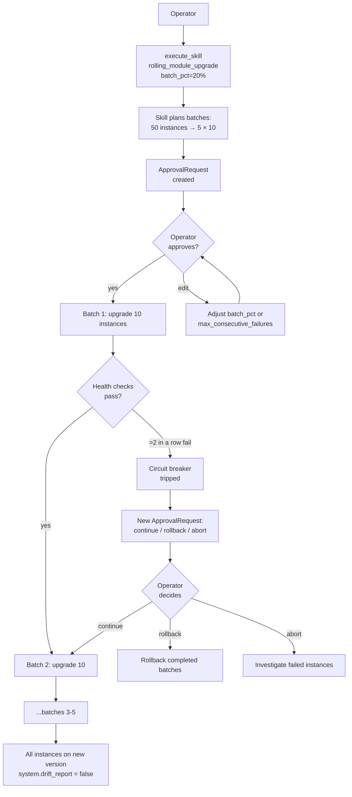

# Tutorial 06 — Rolling module upgrade with canary

> **What you'll learn:** Upgrade a module version across a fleet in batches,
> with health-check gates between batches and an automatic circuit breaker
> that pauses for operator review when too many instances fail in a row.
>
> **Time:** ~30 min (most of which is watching batches complete)
>
> **Builds on:** [Tutorial 02](./02-first-module.md) (you understand module
> versions + promotion) and [Tutorial 03](./03-docker-runtime.md) (you have a
> running fleet of instances with modules assigned).
>
> **Sets you up for:** [Tutorial 07 — CVE response](./07-cve-response.md) —
> CVE remediation orchestrates the same `rolling_module_upgrade` skill
> across affected modules.

## What you're building



By the end you'll have upgraded a module (e.g., `nginx` 1.24 → 1.26)
across a 50-instance fleet with zero unsafe rollouts.

## Concept refresher

**`rolling_module_upgrade`** is a skill executor (see
[`SKILL_EXECUTORS.md`](../SKILL_EXECUTORS.md)) that:

1. Plans a batched sequence based on `batch_pct` (default 20%)
2. Creates an `ApprovalRequest` per Fleet Autonomy intervention policy
   (`system.fleet_rolling_upgrade` is `require_approval`)
3. On approval, walks batches one at a time
4. After each batch, runs health checks (default: instance heartbeats with
   new module digest in `running_module_digests`)
5. Tracks consecutive failures; trips circuit breaker at
   `max_consecutive_failures` (default 2)
6. On trip: emits `module.upgrade.circuit_breaker_tripped` event + creates
   a continuation ApprovalRequest with options `continue_anyway` /
   `rollback_completed_batches` / `abort`

**Why batch?** Limits blast radius. A bad version reaches at most
`batch_pct` of the fleet before the circuit trips.

**Why approval?** Even with healthy batches, the rollout itself is a
controlled production change — operator should sign off on timing.

## Prerequisites

| Requirement | How |
|---|---|
| Existing fleet ≥10 NodeInstances assigned a common module (e.g., `nginx 1.24.0`) | Provision via Tutorial 01 + assign via Tutorial 02 pattern |
| New version (`nginx 1.26.0`) published + promoted to `blessed` or `live` | Tutorial 02 step 6–8 |
| Operator permission `system.fleet_rolling_upgrade` (often paired with approval rights) | Default for admin users |

## Step 1 — Identify the upgrade target

```javascript
platform.system_list_module_versions({ module_name: "nginx" })
// → { versions: [
//      { id: "v-1.24.0", lifecycle_state: "live", ... },
//      { id: "v-1.26.0", lifecycle_state: "blessed", ... }
//    ] }

platform.system_list_instances({ template_id: "<edge-template>" })
// → { instances: [{ id, status: "running", running_module_digests: { nginx: "sha256:..." } }, ...50] }
```

**Expected outcome:** confirm 50 instances running v1.24.0 and v1.26.0
available for promotion.

## Step 2 — Plan the upgrade (dry-run via skill)

```javascript
platform.execute_skill({
  skill: "system-rolling-module-upgrade",
  inputs: {
    template_id: "<edge-template>",
    module_id: "<nginx-module-id>",
    target_version_id: "v-1.26.0",
    batch_pct: 20,
    max_consecutive_failures: 2,
    health_timeout_sec: 300
  }
})
// → {
//      total_instances: 50,
//      batch_size: 10,
//      batch_count: 5,
//      estimated_total_seconds: 1500,
//      circuit_breaker: { max_consecutive_failures: 2 },
//      batches: [
//        { index: 0, instance_ids: [...10], phase: "pending" },
//        ...
//      ],
//      approval_request_id: "<id>"
//    }
```

**Expected outcome:** plan shows 5 batches of 10 instances each, ~25 min
total (5 batches × 5 min health window).

## Step 3 — Approve the plan

Operator opens `/app/approvals` UI → reviews the plan → optionally edits
`batch_pct` (smaller for Tier-1 services) or `max_consecutive_failures`
(1 for stricter stop-on-fail) → clicks Approve.

Once approved, the autonomy reconciler picks up the plan on its next
60s tick and starts executing.

## Step 4 — Watch progress

```javascript
platform.recent_events({ kind_prefix: "module.upgrade", limit: 100 })
// → events: [
//      { kind: "module.upgrade.batch_started", batch_index: 0, instance_count: 10, ... },
//      { kind: "module.upgrade.instance_started", instance_id, target_version, ... },
//      { kind: "module.upgrade.instance_health_check", instance_id, healthy: true, ... },
//      { kind: "module.upgrade.batch_completed", batch_index: 0, healthy_count: 10, failed_count: 0, ... },
//      { kind: "module.upgrade.batch_started", batch_index: 1, ... }
//    ]
```

Or via UI: `/app/system/operations` → "Active rolling upgrades" panel
shows batch status + per-instance progress.

## Step 5 — Circuit breaker scenario (drill)

To rehearse circuit breaker behavior, deliberately publish a broken
version (e.g., nginx with a syntax error in its config):

1. Build & publish `nginx 1.26.0-broken` via Tutorial 02
2. Run Step 2 with `target_version_id: "v-1.26.0-broken"`
3. After 2 instances in batch 1 fail health checks:

```javascript
// Reconciler emits:
{ kind: "module.upgrade.circuit_breaker_tripped",
  batch_index: 1,
  failed_instance_ids: ["...", "..."],
  reason: "max_consecutive_failures (2) exceeded" }

// And creates an approval request:
{ approval_request: {
    type: "rolling_upgrade_continuation",
    options: ["continue_anyway", "rollback_completed_batches", "abort"]
}}
```

Operator decides:

- **`continue_anyway`** — ignore the trip, proceed (use only when failures are transient)
- **`rollback_completed_batches`** — restore previously-upgraded instances to v1.24.0 (use when the new version has a fundamental flaw)
- **`abort`** — stop here; investigate failed instances manually

## Verification

After all batches complete:

```javascript
platform.system_drift_report({ template_id: "<edge-template>" })
// → { drift: false }   (all instances now running v1.26.0)

platform.system_get_instance({ id: "<sample-instance>" })
// → { instance: { running_module_digests: { nginx: "sha256:<v1.26-digest>", ... } } }
```

## Extract a learning

```javascript
platform.create_learning({
  title: "nginx 1.24 → 1.26 rolling upgrade — batch_pct=20% works for edge fleet",
  category: "best_practice",
  content: "50-instance edge fleet: 20% batches × 5 batches × ~5min health window = 25 min total. Zero circuit breaker trips. Recommend keeping batch_pct=20% for similar-sized fleets; reduce to 10% for Tier-1 services with smaller blast radius tolerance.",
  tags: ["rolling-upgrade", "nginx", "batch-sizing"]
})
```

Future similar upgrades surface this learning in the
`rolling_module_upgrade` skill's reasoning.

## Cleanup

If you ran the circuit-breaker drill, restore the fleet to a known state:

```javascript
// If you chose abort/rollback, no further action needed
// If you chose continue_anyway and the version was actually broken, manually rollback:
platform.execute_skill({
  skill: "system-rolling-module-upgrade",
  inputs: {
    template_id, module_id, target_version_id: "v-1.24.0",
    batch_pct: 50               // faster rollback
  }
})
```

## Troubleshooting

**Approval never appears** — check that `system.fleet_rolling_upgrade` is
in the agent's intervention policies and not blocked. Inspect:

```javascript
platform.agent_introspect({ agent_id: "fleet_autonomy_agent" })
// Look for "intervention_policies" containing system.fleet_rolling_upgrade
```

**Batch never starts after approval** — autonomy reconciler is paused or
its tick isn't running. Check:

```bash
sudo systemctl status powernode-worker@default
journalctl -u powernode-worker@default | grep fleet_autonomy
```

**Health checks always fail** — default health check requires the instance
to heartbeat with new digest in `running_module_digests`. If your
heartbeat is broken (Tutorial 03 troubleshooting covers diagnosis) or
your agent is offline, every batch fails. Fix the underlying connectivity
first.

**`max_consecutive_failures: 2` trips on transient network blips** — if
your instances flap between healthy/unhealthy due to network conditions,
either raise the threshold or fix the underlying networking (the
threshold is a symptom, not the cause).

**Rollback doesn't fully restore previous version** — the rollback path
re-runs `rolling_module_upgrade` with the previous version as target.
If that version has been GC'd (lifecycle_state: archived), rollback
fails. Don't archive old versions until you're certain you'll never roll
back.

## What's next

- **[Tutorial 07 — CVE response](./07-cve-response.md)** — uses
  `rolling_module_upgrade` as the actual remediation; CVE response is
  essentially "automated rolling upgrade triggered by a CVE signal."
- **[Tutorial 08 — Instance pools](./08-instance-pool.md)** — for
  stateless workloads, **pool replacement** is often safer than in-place
  upgrade: terminate old instance, claim a fresh new-version one from the
  pool. Pools cut blast radius further.
- **[`SKILL_EXECUTORS.md`](../SKILL_EXECUTORS.md)** §`rolling_module_upgrade` —
  full skill input/output reference.
- **[`FLEET_SENSORS.md`](../FLEET_SENSORS.md)** — `system.fleet_rolling_upgrade`
  intervention policy.
