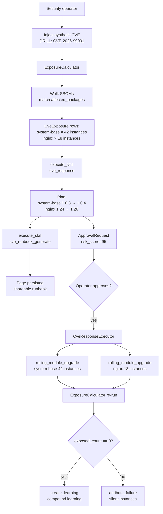

# Tutorial 07 — CVE response end-to-end

> **What you'll learn:** Drive the full CVE response pipeline on a synthetic
> CVE — exposure calculation, AI-generated runbook, operator approval,
> orchestrated remediation via rolling upgrades, verification, learning
> capture.
>
> **Time:** ~75 min (mostly waiting for batched remediation)
>
> **Builds on:** [Tutorial 06](./06-rolling-upgrade.md) — CVE remediation
> orchestrates the same `rolling_module_upgrade` skill across all affected
> modules. You should have the rolling upgrade machinery working end-to-end
> first.
>
> **Sets you up for:** [Tutorial 09 — Honeypot canary](./09-honeypot-canary.md) —
> different defensive posture (detection of unauthorized access vs. patching
> of known vulnerabilities); both use the same autonomy + approval rails.

## What you're building



By the end you'll have rehearsed the CVE response flow against a
synthetic CVE and produced a learning that compounds for the team.

## Concept refresher

**The CVE response pipeline** has 4 stages:

1. **Ingest** — CVE records come from NVD (hourly `SystemCveFeedJob`) or
   are injected manually for drills. Match keys are `affected_packages`
   (name + version range).
2. **Expose** — `ExposureCalculator` walks each `NodeModule`'s SBOM
   (ingested per Tutorial 02 from cosign attestations) and computes
   per-instance exposure. Output is one `CveExposure` row per
   (CVE, NodeInstance) pair.
3. **Triage** — `cve_response` skill builds a remediation plan: for each
   affected module, what version bump removes the exposure, batched by
   instance count.
4. **Remediate** — `CveResponseExecutor` orchestrates one
   `rolling_module_upgrade` per affected module. Parallel when modules
   are independent; sequenced when dependency_spec requires it.

**`requires_approval` always fires for risk_score ≥ 50.** Lower-risk CVEs
can have auto-remediation policies, but production deployments typically
gate everything.

**Why drills matter:** the muscle memory of CVE response is what saves
time during a real incident. Quarterly drills produce learnings that
compound.

## Prerequisites

| Requirement | How |
|---|---|
| Tutorial 06 completed | You understand rolling upgrade + circuit breaker behavior |
| Fleet using `system-base` and/or `nginx` modules with SBOMs ingested | Tutorial 02 covers SBOM ingestion via Stage 2 CI |
| Operator with `system.cve_remediate` approval rights | Default for admin users |
| (Optional) `Ai::Concierge` configured for runbook generation | See AI agents in CLAUDE.md |

## Step 1 — Inject a synthetic CVE

For drills, inject directly (real CVEs come from NVD feed automatically):

```javascript
platform.system_create_cve({
  cve_id: "DRILL-CVE-2026-99001",
  severity: "critical",
  cvss_score: 9.8,
  affected_packages: [{ name: "openssl", version: "<3.1.4" }],
  summary: "DRILL: Synthetic OpenSSL TLS handshake RCE",
  published_at: "2026-05-17T00:00:00Z"
})
// → { cve: { id, ... } }
```

**Expected outcome:** CVE row created in `severity: critical`.

> **Drill naming convention:** always prefix synthetic CVE IDs with `DRILL-`
> so they're never confused with real NVD records in audit logs and
> learnings.

## Step 2 — Calculate exposure

The platform runs `ExposureCalculator` automatically on new CVE rows
(via the `system_cve_feed` worker), but for a fresh drill you can
trigger it directly:

```javascript
platform.system_get_cve_exposure({ cve_id: "DRILL-CVE-2026-99001" })
// → {
//      exposed_modules: [
//        { id: "mod-system-base", name: "system-base", version: "1.0.3", assignment_count: 42 },
//        { id: "mod-nginx",       name: "nginx",       version: "1.24.0", assignment_count: 18 }
//      ],
//      exposed_instance_count: 60,
//      total_fleet_size: 150,
//      exposure_pct: 40.0
//    }
```

**Expected outcome:** 40% fleet exposure — needs a coordinated response.

## Step 3 — Triage with the `cve_response` skill

```javascript
platform.execute_skill({
  skill: "system-cve-response",
  inputs: {
    cve_id: "DRILL-CVE-2026-99001"
  }
})
// → {
//      cve_id: "DRILL-CVE-2026-99001",
//      risk_score: 95,
//      exposed_modules: [...],
//      exposed_instance_count: 60,
//      remediation_plan: {
//        actions: [
//          { module: "system-base", from: "1.0.3", to: "1.0.4", instance_count: 42, batch_size: 4, estimated_seconds: 2520 },
//          { module: "nginx",       from: "1.24.0", to: "1.26.0", instance_count: 18, batch_size: 2, estimated_seconds: 1080 }
//        ],
//        estimated_seconds: 3600
//      },
//      requires_approval: true
//    }
```

**Expected outcome:** 1-hour total remediation estimate; 2 parallel
module upgrades.

## Step 4 — Generate operator runbook

```javascript
platform.execute_skill({
  skill: "system-cve-runbook-generate",
  inputs: {
    cve_id: "DRILL-CVE-2026-99001",
    persist_as_page: true
  }
})
// → { runbook_markdown: "# DRILL-CVE-2026-99001 — Remediation Runbook\n\n...",
//     persisted_page_id: "page-..." }
```

**Expected outcome:** runbook surfaces:

- Exposed module list + version-bump targets
- Step-by-step remediation actions (with command snippets)
- Verification procedures (post-fix exposure recompute)
- Communication template for stakeholders

Page is shareable with the security team via `/app/wiki` or Slack.

## Step 5 — Approval

Operator opens `/app/approvals` → sees the proposed plan + risk_score (95)
+ generated runbook from Step 4 → optionally adjusts `batch_size` per
module (smaller for control-plane modules; larger for stateless) → clicks
Approve.

Once approved, autonomy reconciler executes the plan.

## Step 6 — Watch the remediation

```javascript
platform.recent_events({ kind_prefix: "cve", limit: 50 })
// → cve.remediation_started, cve.remediation_module_started, cve.module_remediation_completed, ...

platform.recent_events({ kind_prefix: "module.upgrade", limit: 100 })
// → standard rolling upgrade events from Tutorial 06
```

Or via UI: `/app/system/operations` → CVE response panel shows progress
per module.

## Verification

After all batches complete (~1 hour):

```javascript
platform.system_get_cve_exposure({ cve_id: "DRILL-CVE-2026-99001" })
// → { exposed_instance_count: 0, exposed_modules: [], ... }
```

**Expected outcome:** zero exposure. If non-zero, some instances were
silent during the upgrade window:

```javascript
platform.execute_skill({
  skill: "system-attribute-failure",
  inputs: { instance_id: "<silent-instance>" }
})
// → diagnoses why this instance didn't reconcile
```

## Extract a learning

```javascript
platform.create_learning({
  title: "DRILL: DRILL-CVE-2026-99001 OpenSSL response — 60-instance scope",
  category: "discovery",
  content: "Synthetic critical CVE drill. Exposure correctly identified 60 instances across system-base + nginx. Total fix duration: 58 min. system-base bump (1.0.3→1.0.4) ran first per remediation plan (42 instances, 4-batch, 0 failures). nginx (1.24→1.26) ran in parallel after first 2 batches of system-base completed (per dependency_spec). Zero circuit breaker trips. Lessons: parallel module upgrades work when modules are independent; sequencing was correct via DependencyResolutionService.",
  tags: ["cve-drill", "openssl", "incident-response", "rolling-upgrade"],
  related_entities: [
    { type: "cve", id: "DRILL-CVE-2026-99001" },
    { type: "module", name: "system-base" },
    { type: "module", name: "nginx" }
  ]
})
```

## Cleanup (drill only)

```javascript
platform.system_delete_cve({ cve_id: "DRILL-CVE-2026-99001" })
```

For a real CVE, **do not delete** — keep the record for audit. The
CveExposure rows transition to `remediated` and stay queryable.

## Troubleshooting

**`system_create_cve` / `system_get_cve_exposure` / `system_delete_cve`
return "action not found"** — these MCP actions ship at different times;
some may still be in the gap backlog. Workarounds:

- Insert CVE via Rails console: `cd server && bundle exec rails console`
  then `System::Cve.create!(cve_id: "DRILL-...", severity: "critical", ...)`
- Query exposure via direct model: `System::CveExposure.where(cve_id: ...)`
- Delete via console: `System::Cve.find_by(cve_id: ...).destroy`

**Triage skill returns `risk_score: 0`** — SBOM ingestion isn't seeing the
affected packages. Verify:

- Module CI has the syft step (Tutorial 02 step 7)
- The webhook landed (`platform.recent_events({ kind_prefix: "system.sbom.ingested" })`)
- Package names in your `affected_packages` match exactly what syft emitted

**Operator approval queue empty after triage** — `cve_response` skill ran
but didn't create the ApprovalRequest. Check the agent's intervention
policy for `system.cve_remediate`:

```javascript
platform.agent_introspect({ agent_id: "cve_responder_agent" })
```

If the policy says `auto_approve` for low-severity CVEs and your
synthetic is `critical`, it should always require approval — file an
issue if not.

**Remediation completes but exposure recompute still shows non-zero** —
race condition or silent instances. Cross-check:

```javascript
platform.system_list_instances({
  template_id: "<affected-template>",
  exclude_running_module_digest: "<new-digest>"
})
// → instances that still report the old digest
```

For each one, run `attribute_failure` to find out why it didn't reconcile.

**Container image CVEs aren't detected** — `cve_response` matches against
`NodeModule.package_spec` (i.e., OS packages), not container image
contents. For images, use external scanners (Trivy, Grype) per Use Case
10 in `USE_CASE_MATRIX.md`.

## What's next

- **[Tutorial 08 — Instance pools](./08-instance-pool.md)** — for stateless
  workloads, the pool-replacement remediation strategy (terminate old,
  claim new-version from pool) is faster and safer than in-place upgrade.
- **[`runbooks/cve-response.md`](../runbooks/cve-response.md)** — full
  operator CVE runbook with SBOM-aware matching details.
- **[`SKILL_EXECUTORS.md`](../SKILL_EXECUTORS.md)** — `cve_response`,
  `cve_runbook_generate`, `cve_remediation_orchestration` reference.
- **CVE Responder agent** — autonomous remediation agent that runs this
  pipeline on every CVE feed update; see CLAUDE.md AI agents section.
- **Run drills quarterly** — every drill produces a learning that
  compounds. Real incidents reuse the muscle memory.
