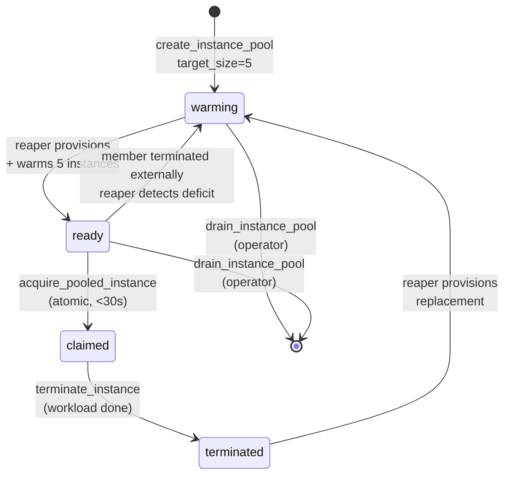

# Tutorial 08 — Instance pools for bursty batch workloads

> **What you'll learn:** Set up a pre-warmed `System::InstancePool` that
> cuts ephemeral provisioning latency from 5–10 min cold-boot to <30 s
> claim — critical for ML training bursts, CI runner fleets, or any
> bursty batch pattern.
>
> **Time:** ~30 min (pool warm-up dominates)
>
> **Builds on:** [Tutorial 03](./03-docker-runtime.md) — pool members are usually
> Docker hosts (or other runtime-bearing instances), so you need the
> runtime handshake working first.
>
> **Sets you up for:** Production ML training, CI runner pools, scheduled
> burst workloads.

## What you're building



By the end you'll have a 5-member ML training pool ready for sub-30-second
GPU instance claims.

## Concept refresher

**`System::InstancePool`** is a registry that keeps `target_size` warm
NodeInstances ready for atomic claim. The reaper job (Sidekiq cron, every
60s) monitors deficits and provisions replacements.

**Atomic acquisition** uses Postgres `SELECT FOR UPDATE SKIP LOCKED` —
multiple operators can claim concurrently without race conditions, and a
claim either succeeds or returns `PoolEmptyError` immediately.

**Why pools cut latency:** the W (warmup latency) dominates ephemeral
provisioning — kernel boot + initramfs + agent enroll + first heartbeat.
Pre-warming amortizes that cost across the pool's lifetime instead of
paying it per-claim.

**Cost trade-off:** warm members cost the same as active members. Higher
`target_size` = lower latency + higher idle cost. Tune based on whether
latency or cost matters more.

## Prerequisites

| Requirement | How |
|---|---|
| A NodeTemplate configured for ephemeral instances (`lifecycle_class: ephemeral`) with a runtime module assigned (e.g. `docker-engine`) | Tutorial 02 + Tutorial 03 |
| Provider quota for ≥10 instances of the chosen instance type | Check provider quota dashboard |
| Operator permission `system.instance_pool_manage` | Default for admins |

## Step 1 — Create the pool

```javascript
platform.system_create_instance_pool({
  name: "ml-training-pool",
  description: "Warm pool for daily ML training bursts",
  template_id: "<ml-docker-template-id>",
  provider_region_id: "region-aws-us-east-1",
  provider_instance_type_id: "type-g4dn-xlarge",      // GPU instance type
  target_size: 5,
  min_size: 2,
  max_size: 10,
  warmup_grace_seconds: 600
})
// → { instance_pool: { id: "pool-ml-1", status: "warming", member_count: 0, ... } }
```

**Expected outcome:** pool row created in `status: warming`. The reaper
job sees `member_count < target_size` on its next tick and begins
provisioning 5 instances in parallel.

## Step 2 — Wait for warm-up

```javascript
platform.system_get_instance_pool({ id: "pool-ml-1" })
// → {
//      instance_pool: { ..., status: "warming", member_count: 5 },
//      members: [
//        { instance_id, status: "warming", warming_started_at, ... },
//        ... 4 more
//      ]
//    }
```

After ~5 min (parallel bootstrap of 5 instances):

```javascript
// → {
//      instance_pool: { ..., status: "ready", member_count: 5 },
//      members: [
//        { instance_id, status: "ready", warmed_at, ... },
//        ... 4 more
//      ]
//    }
```

**Expected outcome:** all 5 members `ready` and idle. Inspect any one
member via `system_get_instance` — you'll see it's a fully bootstrapped
NodeInstance with the runtime handshake complete.

## Step 3 — Claim instances for a burst

```javascript
// Atomic claim — uses SELECT FOR UPDATE SKIP LOCKED
const job1 = platform.system_acquire_pooled_instance({
  pool_id: "pool-ml-1",
  acquired_by: "ml-team-alice",
  acquired_for: "training-run-2026-05-17-A"
})
// → { instance: { id, status: "running", ... }, claim_id }
// elapsed: <30s (because instance was already warm)

const job2 = platform.system_acquire_pooled_instance({ pool_id: "pool-ml-1", ... })
const job3 = platform.system_acquire_pooled_instance({ pool_id: "pool-ml-1", ... })

// Pool now has member_count: 2 (3 of 5 claimed); reaper sees deficit
```

**Expected outcome:** each claim returns in <30s; pool status becomes
`replenishing` as the reaper provisions 3 fresh members in the background.

## Step 4 — Use the claimed instances

Claimed instances are standard NodeInstances — drive them via MCP or SSH:

```javascript
// Run a workload via Docker MCP (the runtime module is already attached)
platform.docker_pull_image({
  host_id: "<host-id-on-claimed-instance>",
  image: "tensorflow:latest-gpu"
})
platform.docker_create_container({
  host_id: "<host-id>",
  image: "tensorflow:latest-gpu",
  command: ["python", "/training-script.py"],
  env: ["DATASET_S3=s3://..."],
  detach: true
})
```

Or SSH for break-glass:

```bash
ssh ops@<instance-host-address>      # SDWAN /128 from system_get_instance
```

## Step 5 — Watch replenishment

```javascript
platform.recent_events({ kind_prefix: "pool", limit: 50 })
// → events: [
//      { kind: "pool.member_claimed",     pool_id, instance_id, acquired_by, ... },
//      { kind: "pool.member_provisioned", pool_id, instance_id, ... },
//      { kind: "pool.member_warmed",      pool_id, instance_id, ... },
//      ... (after each replacement warms up)
//    ]
```

**Expected outcome:** within ~5 min of claim, the pool is back to
`target_size: 5` members, all `ready`.

## Step 6 — Terminate when workload done

After the training job completes:

```javascript
platform.system_terminate_instance({ id: "<claimed-instance-id>" })
// → cascade FK cleanup; pool reaper detects deficit; provisions replacement
```

For ephemeral / stateless workloads, **prefer terminate over return** —
the instance is single-use; the pool keeps replenishing fresh members.

## Verification

```javascript
platform.system_get_instance_pool({ id: "pool-ml-1" })
// → { instance_pool: { status: "ready", member_count: 5 }, ... }

platform.recent_events({ kind_prefix: "pool.member", limit: 10 })
// → recent claims + replenishments
```

## Cleanup

Drain the pool when no longer needed:

```javascript
platform.system_drain_instance_pool({
  id: "pool-ml-1",
  terminate_members: true            // destroy all warm members
})
// → { drained: true, terminated_count: 5 }

// Then delete the pool record
platform.system_delete_instance_pool({ id: "pool-ml-1" })
```

## Sizing for your workload

| Pattern | Recommended sizing |
|---------|--------------------|
| 1 claim / hour (low burst) | `min_size: 1, target_size: 2, max_size: 5` |
| 5 claims / minute (CI runner) | `min_size: 5, target_size: 10–15, max_size: 25` |
| Burst-then-quiet (ML training, scheduled) | Use **scheduled scale-up**: increase `target_size` via cron/MCP before the burst window; decrease after. Cost optimization beats idle warm members. |

## Troubleshooting

**`PoolEmptyError` during burst** — claim rate exceeded replenishment.
Two fixes:

- Increase `target_size` (immediate, costs more)
- Pre-bake a NodePlatform disk image (Tutorial 12) to cut W (warmup latency)
  per-instance, so the reaper replenishes faster

**Members stuck `warming` >10 min** — bootstrap failed. Diagnose with:

```javascript
platform.execute_skill({
  skill: "system-attribute-failure",
  inputs: { instance_id: "<stuck-warming-instance>" }
})
```

**Reaper not replenishing** — Sidekiq queue backed up or worker
unhealthy. Check:

```bash
sudo systemctl status powernode-worker@default
sudo systemctl restart powernode-worker@default       # safe; ~30s drain
```

(Wait 30s before checking status — see `feedback_service_restarts` memory.)

**Members drift in version** — pool members are provisioned from the
pool's Template. If the template gets a new module assignment, only NEW
members get the change. Existing warm members keep the prior version
until claimed-and-replaced. For consistent fleet versioning, drain the
pool after each template change.

**`max_size` reached but more claims pending** — by design — pool refuses
to grow past max. Either raise `max_size` or use a separate pool for the
overflow. Don't bypass the limit; it's the cost-protection.

## What's next

- **[Tutorial 09 — Honeypot canary](./09-honeypot-canary.md)** — different
  defensive surface; canary modules detect lateral movement / credential
  abuse via decoy assets that should never be accessed.
- **[`runbooks/instance-pool-tuning.md`](../runbooks/instance-pool-tuning.md)** —
  full reference: sizing patterns, reaping behavior, drain procedures.
- **[`USE_CASE_MATRIX.md`](../USE_CASE_MATRIX.md)** — use cases 4 (bursty
  batch) + 5 (CI runner pool).
- **[Tutorial 06 — Rolling upgrade](./06-rolling-upgrade.md)** — for the
  stateful counterpart (in-place upgrade vs pool replacement).
