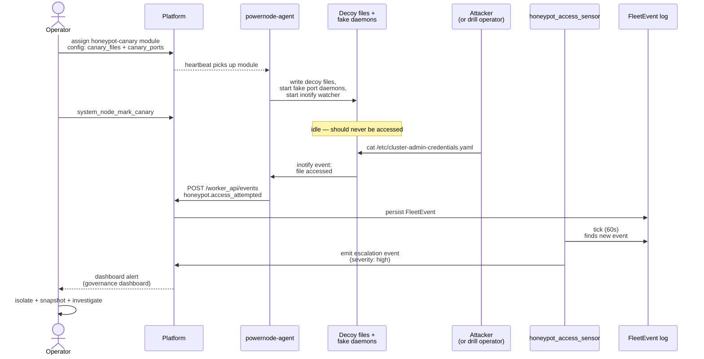

# Tutorial 09 — Honeypot canaries

> **What you'll learn:** Deploy a honeypot canary module that creates decoy
> assets on a NodeInstance, simulate unauthorized access, watch the
> `honeypot_access_sensor` fire, and escalate through the operator
> dashboard.
>
> **Time:** ~20 min
>
> **Builds on:** [Tutorial 01](./01-first-boot.md) — needs a running NodeInstance
> you can SSH to (via SDWAN) for the simulation step.
>
> **Sets you up for:** [Tutorial 10 — GitOps fleet](./10-gitops-fleet.md) —
> declarative management; you can codify "every prod node gets a honeypot
> module" in `fleet.yaml`.

## What you're building



By the end you'll have a working canary-based detection layer and a
documented response procedure.

## Concept refresher

A **honeypot canary** is a fake asset placed on a NodeInstance — a file,
a service, a credential — that no legitimate process should ever access.
When it IS accessed, the agent emits `honeypot.access_attempted` to the
platform's `FleetEvent` log. The `honeypot_access_sensor` (see
[`FLEET_SENSORS.md`](../FLEET_SENSORS.md)) picks this up on its next tick
(60s) and triggers operator escalation.

Common canary types:

- **File canaries** — files in `/etc/`, `/var/lib/`, `~/` with provocative
  names (e.g., `/etc/cluster-credentials.yaml`); accessed via `inotifywait` watcher
- **Service canaries** — fake daemons on tempting ports (21 / FTP, 23 / Telnet)
  that log connection attempts
- **Credential canaries** — fake API keys / SSH keys / DB creds with
  external alerting (e.g., a fake AWS key wired to CloudTrail)

**Why canaries work:** legitimate workloads never need to read
`/etc/cluster-admin-credentials.yaml`. Anything that does is by
definition unauthorized. Low false-positive rate, high signal-to-noise.

**The trust boundary:** sensor lives in the platform; agent emits the
event from the instance. Tampering with the agent on a compromised
instance can suppress the alert — defense in depth via SDWAN
segmentation + immutable initramfs + fs-verity makes that hard.

## Prerequisites

| Requirement | How |
|---|---|
| A NodeInstance you can SSH to (via SDWAN) | Tutorial 01 + `system_sdwan_create_access_grant` |
| Operator with `system.honeypot.read` permission | Default for admins |
| `honeypot-canary` module in catalog (promoted ≥ blessed) | Ships in default catalog |

## Step 1 — Assign the canary module

```javascript
platform.system_assign_module_to_template({
  template_id: "<honeypot-template-id>",      // or your existing template
  module_name: "honeypot-canary",
  config: {
    canary_files: [
      "/etc/cluster-admin-credentials.yaml",
      "/var/lib/secret-keys.json"
    ],
    canary_ports: [21, 23],
    alert_severity: "high"
  }
})
```

**Expected outcome:** within ~60s, the assigned NodeInstance has:

- `/etc/cluster-admin-credentials.yaml` — fake YAML with fake creds (looks real)
- `/var/lib/secret-keys.json` — fake key bundle
- A daemon on ports 21 + 23 that logs connection attempts
- An inotify watcher on the canary files

## Step 2 — Mark the canary "active"

```javascript
platform.system_module_mark_canary({
  module_id: "<canary-module-id>"
})
```

**Expected outcome:** governance dashboard tile shows the canary as
actively monitored. Future access events route through the configured
intervention policy (default: notify-and-proceed for `high` severity).

## Step 3 — Simulate unauthorized access (drill)

SSH to the NodeInstance (or use `system_execute_task` if SSH isn't
configured):

```bash
# Simulate a file read
cat /etc/cluster-admin-credentials.yaml
# → fake YAML content

# Simulate a port scan
nmap -p 21,23 fd00:abcd:1::42
# → connects to fake daemon
```

**Expected outcome:** within seconds, the agent's inotify watcher
detects the read and posts to platform.

## Step 4 — Observe sensor firing

```javascript
platform.recent_events({ kind: "honeypot.access_attempted", limit: 10 })
// → events: [{
//      kind: "honeypot.access_attempted",
//      severity: "high",
//      payload: {
//        node_instance_id: "...",
//        canary_path: "/etc/cluster-admin-credentials.yaml",
//        accessing_process: "bash",
//        accessing_user: "root",
//        accessed_at: "2026-05-17T13:42:01Z"
//      },
//      correlation_id: "..."
//    }]
```

Within 60s, `honeypot_access_sensor` runs in the autonomy reconciler.
It:

1. Sees the `honeypot.access_attempted` event
2. Generates an escalation FleetEvent (severity: high)
3. Per intervention policy, surfaces in operator dashboard

## Step 5 — Operator response

```javascript
platform.governance_dashboard()
// → { alerts: [{
//      kind: "honeypot.access_attempted",
//      severity: "high",
//      affected_resources: ["instance:<id>"],
//      ...
//    }] }
```

Recommended response (the muscle memory you're building):

1. **Isolate** — `platform.system_sdwan_create_firewall_rule` to drop
   traffic to the affected instance pending forensics
2. **Snapshot** — provider snapshot of the instance disk for evidence
3. **Investigate** — `attribute_failure` to enumerate recent module/config
   changes; correlate with `journalctl` inside the instance
4. **Decide** — re-image, terminate, or restore from a known-good state

## Verification

**Event recorded:**

```javascript
platform.recent_events({ kind: "honeypot.access_attempted" })
// → at least one event with the right canary_path
```

**Escalation visible:**

```javascript
platform.governance_dashboard()
// → alerts array includes the honeypot.access_attempted entry
```

**Sensor active:**

```javascript
platform.agent_introspect({ agent_id: "fleet_autonomy_agent" })
// → recent_executions include honeypot_access_sensor ticks
```

## Document the response

```javascript
platform.create_learning({
  title: "DRILL: Honeypot canary triggered on instance X — handler procedure",
  category: "discovery",
  content: "Drill rehearsal of canary detection. Operator response: isolate via firewall rule (5s), snapshot via provider API (2 min), attribute_failure run (60s), decision to re-image. Total MTTD (mean time to detect) from cat → dashboard alert: ~75s (60s sensor tick + 15s propagation). MTTR (mean time to remediate) for drill: ~5 min — acceptable for non-prod. Production target: sub-2-min MTTR via auto-isolate intervention policy.",
  tags: ["honeypot", "incident-response", "drill"],
  related_entities: [{ type: "instance", id: "..." }]
})
```

For **real incidents** (not drills), open an incident ticket via your IR
runbook. Honeypot triggers are never "noise" — investigate every one.

## Cleanup

```javascript
// Unassign the canary module (removes decoy files + stops watchers)
platform.system_unassign_module_from_template({
  template_id: "<template-id>",
  module_name: "honeypot-canary"
})

// Or terminate the test instance entirely
platform.system_terminate_instance({ id: "<test-instance-id>" })
```

## Troubleshooting

**Sensor never fires** — three sub-cases:

- Inotify watcher daemon isn't running on the instance. SSH and check:
  `systemctl status powernode-honeypot-watcher.service`
- Agent isn't posting events. Check
  `platform.recent_events({ kind_prefix: "system.heartbeat" })` —
  if heartbeats are missing, the agent's offline.
- Sensor is disabled in the agent's intervention policy. Check via
  `platform.agent_introspect`.

**False positives from legitimate processes** — backup jobs, security
scanners, or operators reading canary paths during diagnostics. Two
fixes:

- Tune `canary_files` to genuinely never-touched paths
- Add an exception in the sensor: `accessing_process IN ('rsync', 'tripwire')`

**Multi-instance correlation** — if multiple instances trigger canaries
within minutes, lateral movement is likely; escalate to incident
immediately. Watch via:

```javascript
platform.recent_events({
  kind: "honeypot.access_attempted",
  since: "1 hour ago"
})
// → if >1 instance in the list, escalate
```

**Drill vs real** — always tag drill events explicitly (learning title
prefixed with `DRILL:`); never confuse drill response with real IR.

**Sub-minute alerts** — `honeypot_access_sensor` runs every 60s. For
faster propagation, push directly via WebSocket or escalate via
`send_proactive_notification`.

## What's next

- **[Tutorial 10 — GitOps fleet](./10-gitops-fleet.md)** — codify "every
  prod node gets honeypot-canary" in `fleet.yaml` so new nodes are
  automatically instrumented.
- **[`FLEET_SENSORS.md`](../FLEET_SENSORS.md)** — `honeypot_access_sensor`
  reference + the 11 other sensors that watch your fleet.
- **[`ARCHITECTURE.md`](../ARCHITECTURE.md)** §7 — Honeypot canary
  subsystem design.
- **Run drills quarterly** — same logic as CVE drills (Tutorial 07):
  muscle memory is what matters.
