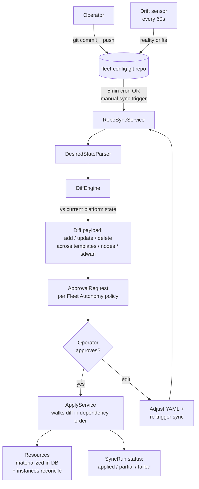

# Tutorial 10 — GitOps-managed fleet via fleet.yaml

> **What you'll learn:** Declare your fleet's desired state in `fleet.yaml`,
> commit to git, let the GitOps reconciler compute the diff against
> reality, approve through the standard intervention policy, apply.
> Replaces ad-hoc MCP calls with PR-based change control.
>
> **Time:** ~45 min (mostly diff review)
>
> **Builds on:** [Tutorial 02](./02-first-module.md) (you've authored a module
> and understand the lifecycle promotion model) and
> [Tutorial 06](./06-rolling-upgrade.md) (you understand how the platform applies
> changes in batches with approval gates).
>
> **Sets you up for:** [Tutorial 11 — Multi-region federation](./11-federation.md) —
> federation peers can be declared in `fleet.yaml` alongside everything
> else.

## What you're building



By the end you'll have your fleet's desired state codified in git, with
PR review as the gating mechanism for fleet changes.

## Concept refresher

**`fleet.yaml`** declares the desired state for an Account:

- **Templates** — which modules compose each template
- **Nodes** — what should exist, in which region, with which template
- **SDWAN networks + peers + VIPs** — the overlay topology

The reconciler walks this and computes the delta against current
platform state. Each delta becomes an `Ai::AgentProposal` requiring
operator approval (per `system.gitops_*` intervention policy in the Fleet
Autonomy agent).

**Implementation status (honest, as of 2026-05-17):**

| Capability | Status |
|---|---|
| Parse `fleet.yaml` from a git repo | Shipped (`DesiredStateParser`) |
| Compute diff against current state | Shipped (`DiffEngine`) |
| Reconciler opens proposals per change | Shipped (`Reconciler`) |
| MCP actions: register / sync / get_sync_run / get_drift_report | Shipped (gap remediation slices closed) |
| Proposal-apply path (post-approval execution) | Partial — designed; full ApplyService landing in follow-up |
| Drift sensor (alert when reality drifts from git) | Partial — periodic compare designed |
| Operator UI for diff review + approval | Partial — generic `ApprovalRequest` UI works; GitOps-specific drill-in panel forthcoming |

**For now**, GitOps is best treated as **declarative + diff-aware** — the
source-of-truth comparison is useful for audit + PR review even before
full automated apply. Use approved proposals as a checklist to drive
standard MCP actions manually until ApplyService lands.

**Why GitOps:** git history is the audit trail; PR review is the change
control; reconciler convergence catches drift. Replaces "operator runs
imperative commands and hopes the snapshot reflects intent."

## Prerequisites

| Requirement | How |
|---|---|
| A Gitea repo (or any git remote) for the fleet config | `platform.create_gitea_repository` |
| Operator with `system.gitops.read` + `system.gitops.write` permissions | Default for admins |
| A running Powernode platform with at least one Account configured | Default |
| (Optional) Tutorial 02 module authoring done | Helps you understand the templates section of fleet.yaml |

## Step 1 — Author `fleet.yaml`

```yaml
# fleet.yaml
version: 1
account: "<account-id>"

templates:
  - name: edge-base
    node_platform: ubuntu-24.04-amd64
    architecture: amd64
    modules:
      - system-base
      - security-hardening
      - chrony

  - name: edge-cdn
    extends: edge-base
    modules:
      - nginx
    metadata:
      purpose: "edge-cdn"

nodes:
  - hostname: edge-tokyo-01
    template: edge-cdn
    region: ap-tokyo-1
    instance_type: t3-medium
    lifecycle_class: persistent
  - hostname: edge-tokyo-02
    template: edge-cdn
    region: ap-tokyo-1
    instance_type: t3-medium
    lifecycle_class: persistent
  - hostname: edge-london-01
    template: edge-cdn
    region: eu-west-2
    instance_type: t3-medium
    lifecycle_class: persistent

sdwan:
  networks:
    - name: edge-fabric
      routing_mode: ibgp
      peers:
        - host: edge-tokyo-01
          publicly_reachable: true
        - host: edge-tokyo-02
        - host: edge-london-01
          publicly_reachable: true
      virtual_ips:
        - name: cdn-frontend
          primary_holder: edge-tokyo-01
          failover_holders: [edge-tokyo-02, edge-london-01]
```

**Expected outcome:** YAML validates locally (run a YAML linter; full
schema docs in `docs/runbooks/gitops-reconciliation.md` forthcoming as
part of Phase A4).

## Step 2 — Register the GitOps repo

```javascript
// Create the repo first
platform.create_gitea_repository({
  owner: "<account>",
  repo: "fleet-config",
  private: true
})

// Push fleet.yaml to it via git
// ...

// Register with the platform's reconciler
platform.system_gitops_register_repository({
  repo_url: "git@registry.example.com:<account>/fleet-config.git",
  branch: "main",
  ssh_credential_id: "<vault-cred-id>",
  reconcile_interval_seconds: 300
})
// → { repository: { id: "gitops-repo-1", status: "syncing", ... } }
```

**Expected outcome:** repo registered; reconciler will pull on its
configured interval (default 5 min) and any time `system_gitops_sync_repository`
is invoked.

## Step 3 — Trigger a sync

```javascript
platform.system_gitops_sync_repository({
  repository_id: "gitops-repo-1"
})
// → { sync_run: { id, status: "in_progress", ... } }
```

The reconciler:

1. Pulls latest from `main`
2. Parses `fleet.yaml` via `DesiredStateParser`
3. Loads current platform state (templates + nodes + sdwan)
4. Runs `DiffEngine` to compute the delta
5. Opens `Ai::AgentProposal` per change

## Step 4 — Review the diff

```javascript
platform.system_gitops_get_sync_run({
  sync_run_id: "<run-id>"
})
// → {
//      diff: {
//        templates: { add: ["edge-cdn"], update: [], delete: [] },
//        nodes:     { add: ["edge-tokyo-01", "edge-tokyo-02", "edge-london-01"], update: [], delete: [] },
//        sdwan: {
//          networks:    { add: ["edge-fabric"], ... },
//          peers:       { add: [...] },
//          virtual_ips: { add: ["cdn-frontend"] }
//        }
//      },
//      proposals: [
//        { id: "prop-1", action: "create_template", payload: { name: "edge-cdn", ... }, status: "pending_approval" },
//        ...
//      ],
//      status: "diff_ready"
//    }
```

**Expected outcome:** human-readable diff + per-change proposals awaiting
approval.

## Step 5 — Approve the diff

Operator opens `/app/approvals` UI:

1. Reviews each proposal (PR-style summary)
2. Optionally edits parts of the plan (e.g., comments out one node before apply)
3. Click Approve on each (or bulk-approve if `Ai::ApprovalRequest` UI supports it)

## Step 6 — Apply (currently partial)

**Once ApplyService lands** (M-D2-3 finalization, follow-up to A1+A2), the
reconciler picks up approved proposals on its next tick and executes them
in dependency order: Templates → Nodes → SDWAN networks → peer attaches →
VIPs.

**Until ApplyService lands** (current state), the approved proposals
serve as an authoritative checklist for the operator to execute via
standard MCP actions:

```javascript
// For each approved proposal, the action is in proposal.payload.
// Note: not all create/update actions exist as MCP yet (e.g. template +
// instance management is REST-only today). Use the appropriate
// /api/v1/system/* REST endpoint per proposal.kind.
platform.system_create_node({ ...proposal.payload })            // exists
// platform.system_create_template({ ... })                     // ⚠️ aspirational — use POST /api/v1/system/node_templates
// platform.system_update_instance({ ... })                     // ⚠️ aspirational — use PATCH /api/v1/system/instances/:id
```

This still gives you the audit trail + PR review benefits; only the
auto-apply convenience is deferred.

## Step 7 — Verify convergence

```javascript
platform.system_gitops_get_sync_run({ sync_run_id })
// → {
//      status: "applied",                    // or "applied_manually" in the interim
//      applied_actions: [...],
//      failed_actions: [],
//      drift_after_apply: {}                 // should be empty
//    }
```

## Step 8 — Operate via PRs from now on

To make any fleet change:

1. Operator clones the fleet-config repo
2. Edits `fleet.yaml` (add a node, change a template, adjust SDWAN routes)
3. Opens a PR
4. Team reviews; PR is approved + merged
5. Reconciler picks up the change on next tick (or manual sync)
6. Operator approves proposals in Powernode UI
7. Changes apply

## Verification

```javascript
platform.system_gitops_get_drift_report({ repository_id: "gitops-repo-1" })
// → { drift: false }   (when reality matches git)
```

When drift exists (reality diverges from git — e.g., an operator made an
imperative change), drift_sensor (when shipped) will emit
`gitops.drift_detected` FleetEvents; operator must either commit the
change back to git or reconcile it away.

## Cleanup

```bash
# ⚠️ system_gitops_unregister_repository MCP wrapper is aspirational —
# use the REST endpoint directly:
curl -X DELETE http://localhost:3000/api/v1/system/gitops_repositories/<id> \
  -H "Authorization: Bearer $JWT"
# → repo removed from reconcile cycle; underlying git repo unaffected
```

## Troubleshooting

**`DesiredStateParser` fails with "schema validation error"** — `fleet.yaml`
doesn't match the expected schema. Check the schema doc at
`docs/runbooks/gitops-reconciliation.md` (forthcoming) or look at the
parser source: `app/services/system/gitops/desired_state_parser.rb`.

**Diff shows changes you didn't make** — drift between platform state and
git source-of-truth. Either:

- Commit the drift back to git (accept that imperative changes
  happened): edit `fleet.yaml` to match current state, commit, push.
- Reconcile away the drift (treat git as authoritative): approve the
  proposals that revert the imperative changes.

**SSH credential resolution fails** — `ssh_credential_id` doesn't resolve
in Vault. Verify credential exists:

```javascript
platform.list_vault_credentials({ scope: "system" })
// → check the credential exists and was rotated correctly
```

**Module versions in fleet.yaml not pinned, surprise upgrades happen** —
pin specific versions in `fleet.yaml` (e.g., `- nginx@1.26.0`) instead
of just `- nginx`. The latter lets the reconciler use the latest
`live`-state version, which may change.

**Conflicting concurrent PRs** — git's merge mechanics handle these;
resolve in PRs before they reach the reconciler. Don't let two operators
push competing fleet.yaml versions and expect the reconciler to pick
the right one.

## What's next

- **[Tutorial 11 — Multi-region federation](./11-federation.md)** — codify
  federation peer declarations in `fleet.yaml` alongside the rest of the
  fleet topology.
- **`docs/runbooks/gitops-reconciliation.md`** (forthcoming in Phase A4) —
  full operator runbook with schema details, advanced patterns, DR
  scenarios.
- **`docs/gitops.md`** — current GitOps reconciler design reference.
- **[`SMOKE_TEST.md`](../SMOKE_TEST.md)** — once `smoke_test_gitops_reconciler.rb`
  lands (M-D2-3 finalization), it'll exercise this flow at the platform
  layer.
