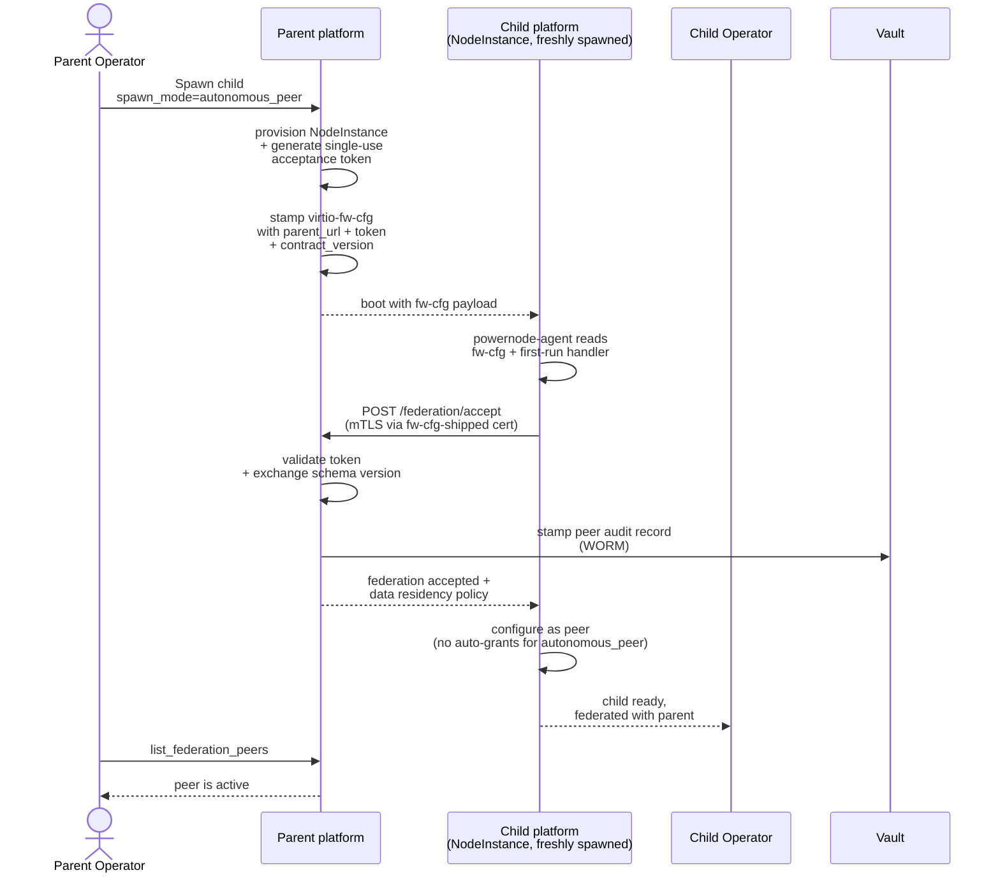

# Tutorial 11 — Multi-region federation

> **What you'll learn:** Federate two Powernode platforms across accounts /
> regions / organizations — three spawn modes (managed_child,
> autonomous_peer, cluster_member), the propose → accept → activate
> handshake, and the P9.x guarantees layered on top (data residency,
> WORM audit, schema-version negotiation, multi-hop migration chains).
>
> **Time:** ~60 min (spawning a child + handshake completion)
>
> **Builds on:** [Tutorial 04](./04-k3s-cluster.md) (single-cluster baseline) and
> [Tutorial 10](./10-gitops-fleet.md) (declarative management — you can codify
> federation peer declarations alongside the rest of fleet.yaml).
>
> **Sets you up for:** Production multi-region deployments, HA via
> cluster_member peers, partner integrations via autonomous_peer mode.

## What you're building



By the end you'll have a child platform federated with the parent, with
the audit trail + schema negotiation in place.

## Concept refresher

**Spawning** is when a parent platform provisions a brand-new child as a
NodeInstance and completes federation handshake at boot — child comes
online already federated. Contrasts with out-of-band peering where two
pre-existing platforms exchange tokens manually.

**Three spawn modes** (per `docs/federation/SPAWN_MODES.md`):

| Mode | Relationship | Auto-grant to parent | Shared infrastructure | Use case |
|------|--------------|----------------------|------------------------|----------|
| `managed_child` | Parent-administered | Yes — operator scope (read/write/admin), 365-day TTL | None | Dev/test sandbox, branch deployments, fleet of similar platforms |
| `autonomous_peer` | Equal peers | No — parent has only the peering | None | Partner platform you'll federate with but not administer |
| `cluster_member` | HA cluster member | No auto-grant | PG streaming replication slot + Redis VIP from parent's primary | Horizontal scale + HA |

**P9.x guarantees** that ship on top:

- **P9.1 — Auto-policy capability sweep:** sensible defaults issued at
  accept-time based on spawn_mode; operators can tighten further.
- **P9.2 — Schema-version negotiation:** parent + child exchange
  `contract_version`; mismatches block peering with a clear error,
  preventing silent protocol drift.
- **P9.3 — Per-peer WORM audit shipping:** every cross-account action
  flows through a per-peer write-once audit log. Tamper-evident.
- **P9.4 — Data residency enforcement:** declare per-peer constraints
  (e.g., "EU-residency: traffic for these resources must not cross
  outside EU"); platform enforces at federation-aware MCP boundaries.
- **P9.5 — Multi-hop migration chains:** when peers federate across
  multiple hops (A → B → C), migrations applied at A propagate down the
  chain with explicit operator gates at each hop.

> **MCP coverage note:** the `platform.system_sdwan_set_data_residency`
> and `platform.system_sdwan_get_audit_log` MCP wrappers shown in this
> tutorial are **aspirational** — they're not yet in
> [`MCP_API_REFERENCE.md`](../MCP_API_REFERENCE.md). The underlying P9.x
> backend logic exists; the MCP surface is the wrapping work. For
> production today, use the REST endpoints at
> `/api/v1/system/sdwan/federation_peers/:id/audit_log` and
> `/api/v1/system/sdwan/federation_peers/:id/data_residency`.

**Emancipation** (managed_child → autonomous_peer): the child operator
can revoke the parent's grant at any time, downgrading the relationship
without breaking federation.

## Prerequisites

| Requirement | How |
|---|---|
| Tutorial 04 worked (parent has a working K3s + SDWAN setup) | Implies platform + node + SDWAN |
| Sufficient capacity to provision a second NodeInstance (the child platform itself) | Provider quota |
| Operator with `system.federation.spawn` permission | Default for admins |
| Both networks publicly-reachable (or both behind same NAT with port forward) | For cross-account spawns; intra-account works on local SDWAN |

## Step 1 — Spawn the child platform

This tutorial uses `autonomous_peer` mode (simplest + most general; see [`docs/federation/SPAWN_MODES.md`](../federation/SPAWN_MODES.md) for the full mode comparison).

**Important: spawning a child platform is distinct from proposing an out-of-band federation peer.** The `system_sdwan_propose_federation_peer` MCP action proposes a *peer record* (no spawn, no platform provisioning — used when both platforms already exist and just need to peer). To spawn a *new* child platform, hit the children-spawn REST endpoint (`POST /api/v1/system/federation/children/spawn`), which routes into `System::SpawnPlatformService.spawn!` to provision the child NodeInstance, stamp its fw-cfg with parent identity + acceptance token, and create the parent-side `System::FederationPeer` row.

```bash
# Parent platform — spawn the child
curl -X POST https://parent.example.org/api/v1/system/federation/children/spawn \
  -H "Authorization: Bearer $PARENT_JWT" \
  -H "Content-Type: application/json" \
  -d '{
    "spawn_mode": "autonomous_peer",
    "child_template_id": "<powernode-hub-template-id>",
    "child_provider_region_id": "region-...",
    "child_provider_instance_type_id": "type-...",
    "child_hostname": "child-platform-1"
  }'

# → {
#     "federation_peer": { "id": "...", "status": "proposed", "spawn_role": "parent",
#                          "spawn_mode": "autonomous_peer", ... },
#     "child_instance_id": "...",
#     "acceptance_token": "<one-time-displayed>"
#   }
```

**Note on `proposed_routes` / `proposed_capabilities`:** these are not part of the spawn-time payload today. Cross-peer route announcements + capability grants are configured *after* the child boots + completes its handshake (see Step 4 for route grants, [`federation/NETWORK_TRUST.md`](../federation/NETWORK_TRUST.md) for capability grants).

**No MCP wrapper for spawn (yet):** the spawn endpoint is REST-only today. The closely-named `system_sdwan_propose_federation_peer` MCP is for the *propose-existing-peer* path, not spawn.

**Expected outcome:** parent-side row created in `status: "proposed"`; child NodeInstance provisioning starts; acceptance token displayed once.

> **Token handling:** the `acceptance_token` is shown once — never logged,
> never persisted in plaintext. If you lose it before the handshake
> completes, revoke the peer (`system_sdwan_revoke_federation_peer`) and
> propose again.

## Step 2 — Watch the child boot + handshake

```javascript
platform.recent_events({ kind_prefix: "system.federation", limit: 20 })
// → events: [
//      { kind: "system.federation.peer.proposed",   ... },
//      { kind: "system.instance.provisioned",       payload: { spawn_child_of: peer_id }, ... },
//      { kind: "system.federation.spawn.fwcfg_stamped", ... },
//      { kind: "system.federation.handshake.received",  ... },
//      { kind: "system.federation.schema_negotiated",   payload: { agreed_version: "1.0" }, ... },
//      { kind: "system.federation.peer.accepted",       ... },
//      { kind: "system.federation.peer.active",         ... }
//    ]
```

**Expected outcome:** ~5–10 min wall clock for full sequence on a warm
instance + reachable parent. Final state: parent + child both see the
peer as `active`.

## Step 3 — Verify the peering

```javascript
platform.system_sdwan_list_federation_peers()
// → { peers: [{
//      id: "...",
//      spawn_role: "parent",
//      spawn_mode: "autonomous_peer",
//      status: "active",
//      remote_platform_url: "https://child-platform-1.fd00:abcd:2::21",
//      contract_version: "1.0",
//      ...
//    }] }
```

From the child platform side (login to its operator UI):

```javascript
platform.system_sdwan_list_federation_peers()
// → { peers: [{
//      spawn_role: "child",
//      spawn_mode: "autonomous_peer",
//      status: "active",
//      remote_platform_url: "https://parent.fd00:abcd:1::21",
//      ...
//    }] }
```

**Expected outcome:** symmetric view of the peering on both sides.

## Step 4 — Apply data residency (P9.4)

```javascript
platform.system_sdwan_set_data_residency({
  federation_peer_id: "...",
  policy: {
    resource_kinds: ["secrets", "credentials"],
    constraint: "must_not_leave_region",
    region: "eu-west-1"
  }
})
```

**Expected outcome:** future federated MCP calls touching
`secrets` / `credentials` resources scoped to that peer are blocked if
they'd cause the data to leave EU. Policy is enforced at federation-aware
controllers, audit-logged via the WORM log (P9.3).

## Step 5 — Verify WORM audit (P9.3)

```javascript
platform.system_sdwan_get_audit_log({ federation_peer_id: "..." })
// → { entries: [
//      { sequence: 1, action: "federation.proposed",  at: "...", actor: "parent_op", ... },
//      { sequence: 2, action: "federation.accepted",  at: "...", actor: "child_handshake", ... },
//      { sequence: 3, action: "data_residency.set",   at: "...", actor: "parent_op", payload: {...} },
//      ...
//    ] }
```

**Expected outcome:** monotonically-increasing sequence, immutable
entries (any attempt to update a row is rejected at the DB level).

## Step 6 — Apply firewall rules at the federation boundary

Federation traffic should be tightly controlled:

```javascript
// Default deny all ingress from federation peers
platform.system_sdwan_create_firewall_rule({
  network_id: "<parent-network>",
  direction: "ingress",
  action: "drop",
  selector: { kind: "federation_peer", federation_peer_id: "..." },
  protocol: "any"
})

// Explicit allow only the agreed services
platform.system_sdwan_create_firewall_rule({
  network_id: "<parent-network>",
  direction: "ingress",
  action: "accept",
  selector: { kind: "federation_peer", federation_peer_id: "..." },
  protocol: "tcp",
  port_range: "443"
})
```

## Step 7 — Use the federation

```bash
# From a parent peer, reach a child peer
curl -k https://[fd00:abcd:2::42]/healthz
# → response from child's service (over federated SDWAN)
```

Or via MCP:

```javascript
platform.system_sdwan_get_routing_summary({ network_id: "<parent-network>" })
// → bgp_routes includes "fd00:abcd:2::/64 source=federation:<peer-id>"
```

## Verification

**Peering active:**

```javascript
platform.system_sdwan_list_federation_peers()   // both sides report active
```

**Routes propagated:**

```javascript
platform.system_sdwan_get_routing_summary({ network_id })
// → bgp_routes includes the remote /64
```

**Audit log shipping:**

```javascript
platform.system_sdwan_get_audit_log({ federation_peer_id })
// → entries growing per cross-account action
```

## Cleanup

```javascript
platform.system_sdwan_revoke_federation_peer({ id: "..." })
// → status: revoked; routes withdrawn from BGP; firewall rules unaffected (operator cleanup)

// Terminate the child platform instance if no longer needed
platform.system_terminate_instance({ id: "<child-instance>" })
```

## Troubleshooting

**Child boots but handshake never completes** — the child can't reach the
parent's `/federation/accept` endpoint. Three common causes:

- Parent's federation listener isn't reachable from the child's overlay
  (check `system_sdwan_get_routing_summary` on both sides)
- Acceptance token expired (default 30 min); revoke + re-propose
- mTLS chain mismatch (child's spawn fw-cfg carries the parent's CA;
  check it matches what InternalCaService currently issues)

**Schema negotiation fails** — parent + child are on incompatible
`contract_version`. Upgrade one side (or both) to a compatible version
before re-spawning. Mismatch is intentional protection against silent
protocol drift.

**`managed_child` spawn but operator can't see child resources** — the
parent-side auto-grant lands at accept; the symmetric child-side grant
lands on child's first-run completion. If the child first-run errored,
the child-side grant doesn't exist. Verify via child's grants list;
manually issue if needed.

**`cluster_member` replica lag growing** — PG physical replication
streaming has fallen behind. Check the parent primary's `pg_stat_replication`:

```sql
SELECT slot_name, state, sent_lsn, replay_lsn, replay_lag FROM pg_stat_replication;
```

Common causes: network saturation between parent + child, WAL retention
too low, slot in `inactive` state because child is down.

**Data residency policy violation surfaced as 403** — operator
attempted a cross-region action prohibited by the policy. Either:

- Tighten scope so the action stays in-region
- Relax the policy (operator-side change)
- Use an explicit override (audit-logged) for a one-off

## What's next

- **[Tutorial 12 — Disk image CI](./12-disk-image-ci.md)** — for fleets of
  spawned children, you want a custom NodePlatform with pre-baked
  modules; disk image CI is how you build it.
- **[`docs/federation/SPAWN_MODES.md`](../federation/SPAWN_MODES.md)** —
  full spawn-mode reference (cluster_member PG replication slot
  internals, managed_child intervention policy cascade, emancipation).
- **[`docs/federation/NETWORK_TRUST.md`](../federation/NETWORK_TRUST.md)** —
  sovereign auth handshake details.
- **[`docs/federation/MIGRATION_DEVELOPER_GUIDE.md`](../federation/MIGRATION_DEVELOPER_GUIDE.md)** —
  multi-hop migration chains (P9.5) for federation-scoped schema changes.
- **[`docs/runbooks/federation-setup.md`](../runbooks/federation-setup.md)** —
  production-grade setup with HA + cross-org agreements.
- **[`docs/runbooks/federation-troubleshooting.md`](../runbooks/federation-troubleshooting.md)** —
  diagnostic procedures.
- **[`SMOKE_TEST.md`](../SMOKE_TEST.md) Pass 4** — `smoke_test_powernode_hub.rb`
  and `smoke_test_cluster_member_ha.rb` exercise the federation control
  plane at the platform layer.
