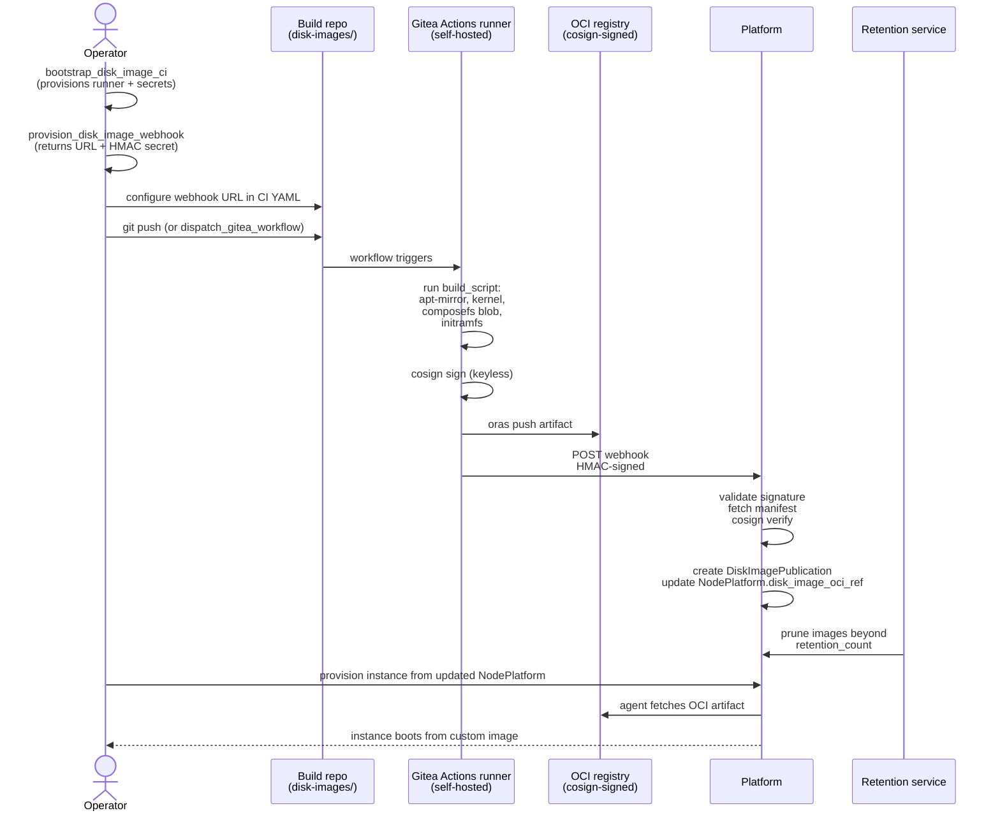

# Tutorial 12 — Disk image CI publication

> **What you'll learn:** Set up a continuous build pipeline that produces
> kernel + initramfs + composefs disk images for your custom NodePlatform,
> signs them with cosign, publishes as OCI artifacts, and propagates
> through retention. The same pattern Powernode uses to build its own
> shipped initramfs.
>
> **Time:** ~60 min (most of which is the first CI run)
>
> **Builds on:** [Tutorial 01](./01-first-boot.md) (you understand
> NodePlatform + initramfs build) and [Tutorial 02](./02-first-module.md)
> (module CI pattern — disk image CI is the same shape, different artifact
> type).
>
> **Sets you up for:** Building your own derived NodePlatforms for
> air-gapped environments, hardware variants, regulatory profiles.

## What you're building



By the end you'll have a working CI pipeline that publishes signed disk
images and a NodePlatform pointing at your custom artifact.

## Concept refresher

**Why disk image CI separate from module CI?**

- **Module CI** (Tutorial 02) produces composefs blobs assembled into
  layered rootfs at boot time. Per-module, lifecycle-tracked.
- **Disk image CI** produces the kernel + initramfs + base composefs
  blob — the unchangeable foundation a NodeInstance boots into.
  Per-platform, retention-managed.

A custom disk image is useful when:

- You need a different kernel (e.g., realtime patchset, custom drivers)
- You need a hardened base (e.g., FIPS-validated cryptographic library)
- You need air-gapped offline images
- You need hardware-specific firmware blobs in initramfs

**The CI architecture mirrors module CI:**

- Self-hosted Gitea Actions runner (provisioned via
  `bootstrap_disk_image_ci`)
- Cosign keyless signing via Sigstore Fulcio
- Webhook-back to the platform's `disk_image_built` controller
- HMAC-authenticated post-build callback
- Auto-prune via retention service

**Disk Image Manager agent** (per `docs/DISK_IMAGE_MANAGER_AGENT.md`)
runs every 5 minutes and operates on the publication backlog — promoting
images, applying retention, alerting on stuck builds.

## Prerequisites

| Requirement | How |
|---|---|
| Tutorial 01 + 02 worked | You understand initramfs build + cosign + module CI |
| Gitea account with admin to create repos under your account | Permission to create runners |
| `docker`, `oras`, `cosign` CLIs (already from Tutorial 02) | — |
| Provider quota for one additional NodeInstance (the runner) | Self-hosted runner runs on a Powernode-provisioned VM |
| Operator permission `system.disk_image_ci.bootstrap` | Default for admins |

## Step 1 — Bootstrap the CI worker

```javascript
platform.bootstrap_disk_image_ci({
  account_id: "<your-account-id>"
})
// → { task_id: "...", runner_repo: "<account>/disk-images", runner_status: "provisioning" }
```

**Expected outcome:** a `System::Task` of type `ci_worker_provision` is
created. The runner provisions as a NodeInstance, registers itself with
Gitea, and gets repository secrets for cosign + OCI registry auth.

Watch via:

```javascript
platform.system_list_ci_workers()
// → { workers: [{ id, status: "provisioning" → "ready", runner_repo, ... }] }
```

Wait for `status: "ready"` (~5 min).

## Step 2 — Provision the build webhook

```javascript
platform.provision_disk_image_webhook({
  node_platform_id: "<your-NodePlatform-id>"
})
// → {
//     webhook_url: "https://platform.example.com/api/v1/system/webhooks/disk_image_built",
//     webhook_secret: "<HMAC-secret-shown-once>"
//   }
```

**Expected outcome:** webhook URL + secret returned. Copy the secret
immediately — it's shown once and used to HMAC-sign the build-completion
callback.

## Step 3 — Author the build repo

The runner's repo (`<account>/disk-images` from Step 1) needs a
`.gitea/workflows/build-disk-image.yml` that:

1. Runs your `build_script` (apt-mirror + kernel pull + composefs encode + initramfs build)
2. Cosign signs the OCI manifest
3. POSTs the webhook with the OCI digest + SBOM

A minimal template:

```yaml
name: Build disk image
on:
  workflow_dispatch:
    inputs:
      platform_slug:
        type: string
  push:
    tags: ['v*']

jobs:
  build:
    runs-on: [self-hosted, disk-image-builder]
    permissions:
      id-token: write           # for cosign keyless
    steps:
      - uses: actions/checkout@v4

      - name: Run build script
        run: |
          bash build.sh \
            --arch amd64 \
            --variants kernel-initrd-composefs-oci

      - name: Cosign sign + push OCI
        env:
          OCI_REGISTRY: ${{ vars.POWERNODE_OCI_REGISTRY }}
        run: |
          oras push "$OCI_REGISTRY/<account>/disk-images/${{ inputs.platform_slug }}:$GITHUB_REF_NAME" \
            ./build/oci/manifest.json:application/vnd.powernode.disk_image.v1+manifest
          cosign sign --yes "$OCI_REGISTRY/<account>/disk-images/${{ inputs.platform_slug }}:$GITHUB_REF_NAME"

      - name: Notify platform
        env:
          WEBHOOK_URL: ${{ vars.POWERNODE_DISK_IMAGE_WEBHOOK_URL }}
          WEBHOOK_SECRET: ${{ secrets.POWERNODE_DISK_IMAGE_WEBHOOK_SECRET }}
        run: |
          # Compute HMAC + POST
          PAYLOAD=$(cat <<EOF
          { "platform_slug": "${{ inputs.platform_slug }}",
            "oci_ref": "$OCI_REGISTRY/<account>/disk-images/${{ inputs.platform_slug }}:$GITHUB_REF_NAME",
            "sbom_path": "build/sbom.spdx.json" }
          EOF
          )
          SIG=$(echo -n "$PAYLOAD" | openssl dgst -sha256 -hmac "$WEBHOOK_SECRET" -binary | base64)
          curl -X POST "$WEBHOOK_URL" \
            -H "X-Powernode-Signature: $SIG" \
            -H "Content-Type: application/json" \
            -d "$PAYLOAD"
```

**Configure secrets** in Gitea repo settings:

- `POWERNODE_DISK_IMAGE_WEBHOOK_SECRET` = the secret from Step 2
- Var `POWERNODE_DISK_IMAGE_WEBHOOK_URL` = the URL from Step 2
- Var `POWERNODE_OCI_REGISTRY` = e.g. `registry.example.com`

## Step 4 — Trigger a build

```javascript
platform.dispatch_gitea_workflow({
  account_id: "<account>",
  repo: "<account>/disk-images",
  workflow: "build-disk-image.yml",
  inputs: { platform_slug: "ubuntu-2404-custom" }
})
// → { run_id: "..." }
```

**Expected outcome:** workflow starts. Tail logs:

```javascript
platform.list_gitea_workflow_runs({
  account_id: "<account>",
  repo: "<account>/disk-images"
})
// → { runs: [{ id, status: "in_progress", ... }] }

platform.get_gitea_job_logs({ run_id: "<run-id>", job_id: "<job-id>" })
```

Total runtime: ~30–60 min on cold cache (apt-mirror + kernel build
dominate). Subsequent builds are much faster with cached layers.

## Step 5 — Watch ingestion

After the workflow's webhook step succeeds:

```javascript
platform.recent_events({ kind_prefix: "system.disk_image", limit: 20 })
// → events: [
//      { kind: "system.disk_image.webhook_received",   ... },
//      { kind: "system.disk_image.cosign_verified",    ... },
//      { kind: "system.disk_image.publication_created", payload: { id, oci_digest, ... } },
//      { kind: "system.disk_image.platform_updated",   payload: { node_platform_id, disk_image_oci_ref } }
//    ]
```

**Expected outcome:** `DiskImagePublication` row exists; `NodePlatform.disk_image_oci_ref`
points at the new OCI artifact.

## Step 6 — Set retention policy

```javascript
platform.system_set_disk_image_retention({
  node_platform_id: "<your-platform-id>",
  retention_count: 5,           // keep last 5 publications
  retention_days: 90            // OR keep everything <90 days old
})
```

**Expected outcome:** the Disk Image Manager agent (5-min tick) will
prune publications beyond these bounds on its next pass.

## Step 7 — Promote a publication to default

```javascript
platform.system_set_default_disk_image_publication({
  node_platform_id: "<your-platform-id>",
  publication_id: "<new-publication-id>"
})
```

**Expected outcome:** future provisions from this NodePlatform fetch the
new artifact at boot. Existing instances keep their boot image (immutable
at runtime).

## Verification

**Publication exists:**

```javascript
platform.system_list_disk_image_publications({ node_platform_id })
// → { publications: [{ id, oci_ref, oci_digest, cosign_verified: true, is_default: true, ... }] }
```

**New provision uses it:**

```javascript
platform.system_provision_instance({
  node_template_id: "<template-using-custom-platform>",
  node_id: ...
})
// → instance provisions; agent fetches OCI artifact at boot
```

```javascript
platform.system_get_instance({ id: "<new-instance>" })
// → { instance: { booted_from_oci_ref: "registry.example.com/.../...@sha256:...", ... } }
```

## Cleanup

```javascript
// Prune publications you no longer want
platform.system_set_disk_image_retention({
  node_platform_id,
  retention_count: 1            // keep only the current default
})

// Decommission the CI worker if no longer needed
platform.system_terminate_ci_worker({ id: "<worker-id>" })
```

## Troubleshooting

**Workflow fails at cosign step with OIDC token error** — Gitea Actions
OIDC isn't enabled. Same fix as Tutorial 02 — Admin Panel → Settings →
enable Actions OIDC; ensure `id-token: write` permission on the workflow.

**Webhook returns 401 / signature mismatch** — `WEBHOOK_SECRET` in Gitea
repo doesn't match what was returned from `provision_disk_image_webhook`.
Regenerate (re-call provision_disk_image_webhook — it rotates the secret)
and re-paste in Gitea.

**`cosign_verified: false`** in publication row — same as module CI:
identity / issuer regex mismatch on the NodePlatform record. Edit those
fields to match the Gitea Actions OIDC subject.

**Build runs but webhook never fires** — workflow last step (the curl)
failed silently. Add `set -e` to the bash script and check job logs.
Common cause: webhook URL has a typo (parent platform vs child).

**Disk Image Manager doesn't prune** — agent's intervention policy
requires approval for retention prunes (default in some setups). Check:

```javascript
platform.agent_introspect({ agent_id: "disk_image_manager_agent" })
// → look for system.disk_image.retention_prune policy
```

If `require_approval`, an `ApprovalRequest` per prune awaits in
`/app/approvals`. For non-prod, switch the policy to `auto_approve`.

**New instances still boot the old image** — `is_default` wasn't updated.
Verify via `system_list_disk_image_publications` and re-call
`system_set_default_disk_image_publication` if needed. Existing
instances **do not auto-reboot** to the new image — that's an
operator-driven roll (see Tutorial 06 rolling upgrade pattern with
`disk_image` as the upgrade target).

## What's next

- **[`DISK_IMAGE_CI.md`](../DISK_IMAGE_CI.md)** — full reference for
  the build pipeline + webhook + retention semantics.
- **[`DISK_IMAGE_MANAGER_AGENT.md`](../DISK_IMAGE_MANAGER_AGENT.md)** —
  the autonomous agent that manages publication lifecycle.
- **[`docs/runbooks/disk-image-ci.md`](../runbooks/disk-image-ci.md)** —
  operator workflow for production CI.
- **[`initramfs/README.md`](../../initramfs/README.md)** — the in-tree
  multi-arch initramfs builder this tutorial's CI script invokes.
- **[`SMOKE_TEST.md`](../SMOKE_TEST.md)** — Pass 1 boots an instance from
  a known initramfs build; once you have your own published images,
  smoke seeds work the same way against them.
