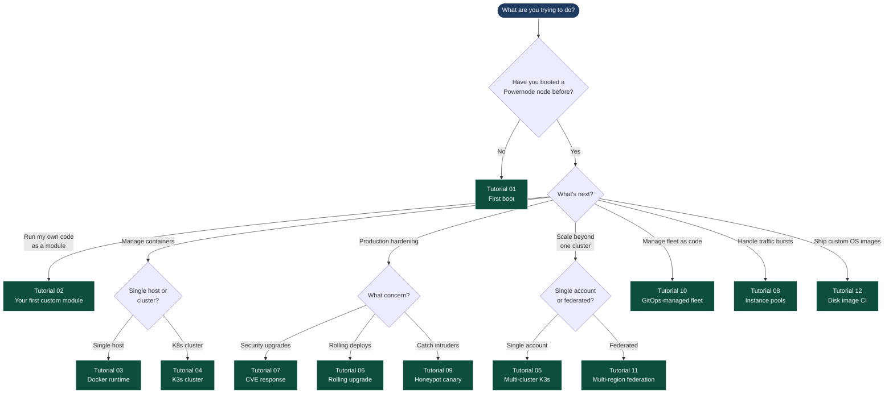

# Tutorial Decision Tree

Not sure where to start? Pick the leaf that matches your goal and follow
the path back up to know which tutorials precede it.

## Reading the tree

- **Tutorial 01** is the universal entry point — everything else assumes a
  working single-node boot. If you haven't done that yet, start there.
- Tutorials are dependency-ordered: each declares what came before in its
  "Builds on" header. If you land on Tutorial 07 (CVE response) without
  having done 02 + 03 + 06, the tutorial tells you where to backfill.
- Numbered order isn't strictly required — branches are independent. You
  can go 01 → 02 → 03 → 04 → 11 (skipping 05–10) if federation is your
  immediate goal.

## Recommended learning paths

**"I want a working development loop"** (~45 min):
01 → 02 → 03

**"I want to run a production K8s cluster"** (~2 h):
01 → 02 → 03 → 04 → 06 → 07

**"I want a multi-region federated platform"** (~4 h):
01 → 02 → 03 → 04 → 05 → 10 → 11

**"I want to operate the platform autonomously"** (~3 h):
01 → 02 → 06 → 09 → 10

## See also

- [`README.md`](./README.md) — the full sequence with builds-on graph
- [`../SMOKE_TEST.md`](../SMOKE_TEST.md) — what gets validated at the platform layer
- [`../USE_CASE_MATRIX.md`](../USE_CASE_MATRIX.md) — what works / what doesn't for 14 NodeInstance scenarios
